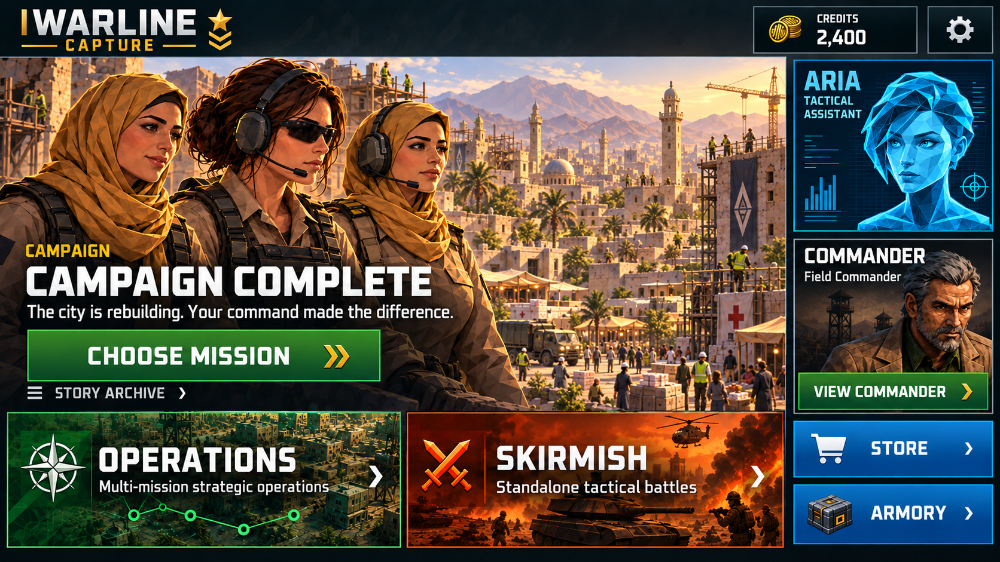

# Campaign completion home concept v01

Date: 2026-09-29
Status: Visual proposal awaiting user review; no runtime implementation.
Generator: Built-in ImageGen using existing project references.



## Proposed behavior

After the entire released campaign is completed, replace the next-mission hero with a dedicated aftermath illustration and explicit CAMPAIGN COMPLETE state. Choose Mission opens Campaign for replay; Story Archive gives access to completed story content. Operations and Skirmish remain accessible through their existing routes.

Suggested copy: “The city is rebuilding. Your command made the difference.”

For future variety, use a small authored pool of post-campaign scenes, each paired with a fitting caption. Keep completion status and action stable, rotate only on a new home visit, and avoid immediate repetition. Do not use arbitrary next-mission comics, randomized unrelated text, unearned rewards or promised future releases.

Distinguish full campaign completion from reaching the end of currently playable content or a missing next-mission asset. Neither of those alone establishes full completion.

## References and review limits

- Approved layout: ../../MenuHeaderMonetization/Mockups/home-campaign-header-v01.png
- Canonical story reference: ../../../../Assets/Game/Resources/FutureMissionComics/Bookends/Campaign_Epilogue.png
- Native ARIA reference: ../../../../Assets/Game/Art/UI/V3Shared/Portraits/ARIA_MainMenu_V3.png

The mockup has been visually inspected: completion text, Choose Mission, Story Archive and existing secondary actions are present. Generated portraits and the illustrative balance are not runtime assets or values. Reuse the original native ARIA and Commander assets exactly during implementation, and bind actual earned Credits. Render typography and controls natively; do not ship this flattened mockup.

Visual-direction approval is pending. No Unity execution, automated runtime check, normal-input playthrough or human/device acceptance was performed for this concept.

## Exact generation prompt

```text
Use case: ui-mockup.
Create a polished landscape 16:9 WARLINE CAPTURE home menu concept for the state after the entire campaign has been completed.
Reference roles: Image 1 is the approved campaign-led home layout, typography and controls. Image 2 is the canonical Campaign_Epilogue comic, source for the hero art, team identities, polygonal painterly comic style and recovering-city setting. Image 3 is the exact native ARIA portrait, whose face, hair, expression, cyan polygonal identity and aspect must be preserved; supersede the incorrect ARIA face in Image 1.
Preserve the approved home layout: slim dark WARLINE CAPTURE header with credits and gear; large left/main campaign hero; two large bottom mode cards OPERATIONS (green, subtitle Multi-mission strategic operations) and SKIRMISH (orange-red, subtitle Standalone tactical battles); right compact ARIA Tactical assistant card with exact portrait from Image 3, the existing male COMMANDER Field Commander portrait and VIEW COMMANDER action, then blue STORE and ARMORY buttons.
Replace only the mission hero content with an authored aftermath: recognizable same three teammates from epilogue, looking over a city recovering, civilians rebuilding, aid and life returning, golden morning light and hopeful restrained mood. Compose characters across upper/center hero region, leave lower-left scene with a subtle dark gradient for readable native-style copy, do not cover faces. Match existing faceted comic rendering closely.
Exact hero text: small gold 'CAMPAIGN'; large white 'CAMPAIGN COMPLETE'; supporting white sentence 'The city is rebuilding. Your command made the difference.' Large saturated green primary button 'CHOOSE MISSION' with gold chevron, smaller secondary text action 'STORY ARCHIVE' below or alongside with enough room.
Do not show a chapter/mission number, next mission, Continue Campaign, promised future chapters, new unlocks, statistics, fabricated rewards, store promotions, development notes, watermarks or speech bubbles.
Use industrial squared Oxanium-like typography, steel near-black panels, gold accents, generous mobile spacing and safe margins. Header balance is illustrative same as reference; all other UI preserved. Single full-screen visual-review mockup only.
```
