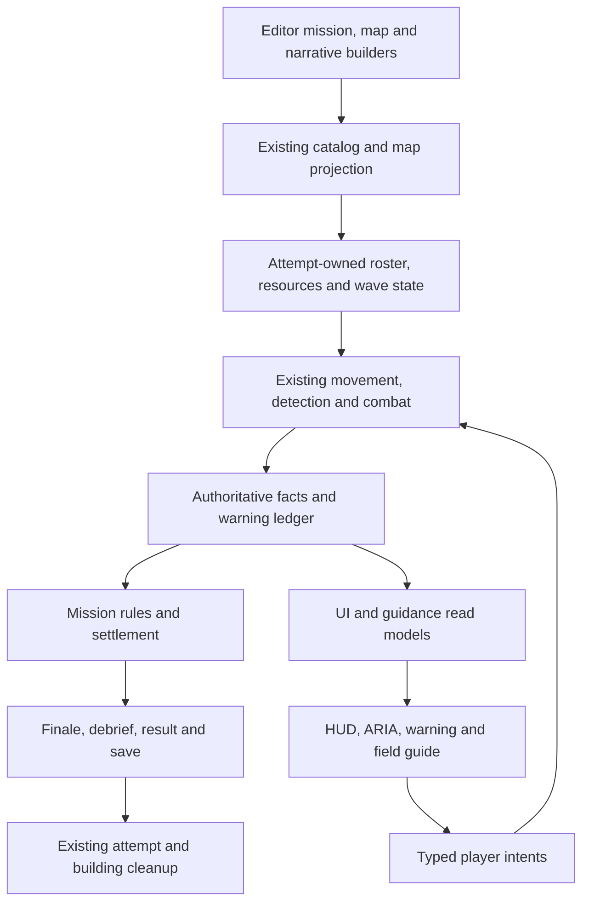

# M3 implemented architecture

Implementation checkpoint: 2026-09-09, `codex/m03-radar-warning`, based on `b6b8153d2`. This maps the current implementation to the production plan; it does not declare the outstanding QA gates passed. See [Editor QA index](editor_qa_index.md).

## Ownership

| Responsibility | Current owner / boundary | Invariant |
|---|---|---|
| Authoring | `M03RadarWarningConfigBuilder`, `M03RadarWarningMapBuilder`, `MissionDefenseDefinitionConfig` | Editor-generated mission/scenario/logical map; original physical map preserved. Eight rifles, one unarmed Ground Radar Tank, four civilians, seven finite hostiles. Twenty-two shared-map vehicle instances are dormant only during M3; cleanup restores only instances tagged by that attempt and preserves pre-existing Disabled state. |
| Immutable projection | `CampaignMissionCatalogProjection.Defense.cs` | Defense elements, typed guidance and camera tour enter the existing mission catalog blob; existing enum values remain stable. |
| Attempt and spawn | `CampaignMissionLaunchSystem`, `CampaignMissionSpawnSystem.Defense.cs` | Session, attempt ordinal and source version identify the attempt. Initial Barracks is free; budget initializes once. |
| Scheduled convoy | `CampaignMissionDelayedWaveSystem.Defense.cs`, `CampaignMissionPatrolOrderSystem` | Existing wave/movement owners activate two elements and issue real path orders; no teleport or scripted damage. |
| Combat and truth | `UnitEngagementSystem` and existing combat owners, `CampaignMissionAttemptFactProjectionSystem`, `CampaignMissionDefenseRuleUtility` | The ECB singleton query includes system entities, matching the installed Entities package, so automatic target acquisition actually updates; Hold acquires in-range hostiles and suppressed/neutral units remain excluded. Missing members are integrity faults; dead wrecks do not breach; core/post loss takes priority. Authored map defenses are dormant only for M3; purchased defenses remain active. |
| Warnings | `ThreatWarningResolveSystem`, existing `ThreatDetectionWarningSystem` adapters | Bounded attempt-owned ledger distinguishes scout reports from live Ground detection, confidence, source, contact time and resolution. UI dismissal does not delete active threat truth. An unread warning receives one amber attention reminder after 30 mission seconds; read/resolved state cancels it without escalating severity, replaying speech or moving the camera. |
| Progress projection | Existing `UiCampaignMissionProjectionSystem` and `CampaignMissionProgressStore` | Unchanged catalog, profile revision, settlement and requests skip disk reads. Successful repository writes/deletion invalidate across SaveService instances; replacement store identity forces a fresh projection. Failed writes do not publish a new revision. Out-of-process manual file edits require reloading the campaign store. |
| Radar Ping | `RadarPingRequestSystem` → existing Ground detector → `RadarPingState` | Two charges; 60 simulated seconds cooldown. Actual eligible sensor/coverage required. Valid empty scan consumes once; invalid/stale/duplicate requests cannot consume another charge. |
| Gameplay UI | `UiShellEcsGateway.MissionDefense.cs`, `MissionDefenseHudView`, `ThreatAlertV3PopupView.MissionDefense.cs` | Views issue typed intents and render authoritative read models. No combat outcome is owned by a button. |
| Guidance / ARIA | `CampaignMissionGuidanceProjectionSystem.Defense.cs`, existing assistant gateway and `MatchHudAssistantUiSystemHelper.Defense.cs` | Twelve typed lessons; real movement, Hold, Stop, purchases and production determine completion. Optional actions are skippable. SHOW ME uses existing highlighting; DO IT invokes bounded existing command surfaces. |
| Active-class commands | Existing selection command bar and `RtsSelectionImmediateSelectedUnitCommandSystem` | Group Hold/Stop can work without a single focused unit. The command boundary validates each living, owned, movable actor; an unarmed sensor cannot attack. |
| Field guide | `MissionFieldGuideConfig`, `MissionFieldGuideView`, `UiShellEcsGateway.FieldGuide.cs`, `MissionDefensePauseSystem` | Twelve topics and 57 canonical identities: 51 actual configs and six explicit unavailable future identities. One class asset handle; simulation freezes; exact prior popup/route returns. |
| Opening camera | `CampaignMissionPatrolOrderSystem.DefenseCamera.cs` → existing camera request owner | Capture initial RTS focus/perspective; smooth pan and zoom to authored targets; return to that pose before the mission clock starts. Skip, reduced motion and missing-target fallback use the same owner. |
| Optional focus | `MissionDefenseInteractionSystem` → existing camera request owner | Explicit warning focus captures the preceding tactical view once. RETURN VIEW is single-use and attempt-scoped; reduced motion makes the transition immediate. |
| Narrative | Existing `CampaignMissionDebriefCompositionSystemHelper` and FirstLaunch presentation owners | Opening/debrief use existing progression, caption, speaker, audio, transport and skip-confirmation paths. Locale/aspect refresh preserves progression and stops the old voice before rebinding. Large/Extra Large caption cards grow upward and keep the requested font size while the existing V3 layout continues to own width/aspect scaling; the 24-case Extra Large matrix passed with a single correctly localized header, and the Large matrix passed its caption bounds. |
| Comic residency | Existing `NarrativePanelAssetResidencyPresentationSystemHelper` | M3 narrative configs use Addressable sprite references and separately packed panel sources; at most current and next narrative panel handles. Menu preview, radio archive and result art remain separately scoped view bindings. |
| C01 radio clue | `M03RadioReportProjectionSystem` → existing assistant message/arbiter | Nonblocking, localized report with archive access. Once per attempt; pause preserves it, exit clears it, locale switch changes caption and voice event together. |
| Results / saves | Existing runtime, finale, result and `CampaignMissionProgressSettlementSystem` | Outcome freezes before presentation; debrief precedes Victory. Three stars reflect victory/civilians/post damage independently. First-clear and replay grants are idempotent; M04 availability does not imply a deployable M04 definition. A failed durable write projects a localized Retry Save result; the typed retry uses the canonical attempt/result and rejects duplicate, stale and already-settled requests. |
| Cleanup | `CampaignMissionLaunchSystem.DefenseCleanup.cs` → existing building delete/finalization owner | Retry/exit clears M3 membership, convoy, warning, queued Ping/interaction and camera state, removes this attempt's free/paid runtime buildings and produced units, preserves authored buildings and other ownership, releases guide/narrative handles and restores global input/time. Empty or inactive campaign sessions cannot activate the shared cinematic HUD lock in Skirmish. |

## Current authored decisions

- Mission `saga.ch01.m03.radar_warning`; scenario `scenario.ch01.m03.radar_warning`; logical map `opmap.ch01.convoy_approach_01`.
- Vanguard warning/activation/contact: 0/45/65 seconds. Main element: 100/140/165 seconds. Cinematics and explicit guide pause do not consume these simulated times.
- Starting reserve: 50,000 Credits and 100 Materials. Tower: 22,000/50; Barrier: 6,000/15; one four-rifle production order: 10,000/20. All three leave 12,000 Credits and 15 Materials.
- Ground Radar Tank uses the actual Ground detector kind and a 240-cell radius. The existing Air dish remains Air-only. M3 loaned vehicles are self-supplied rather than silently failing on an unavailable Fuel feature.
- First clear grants 400 XP, 2,000 Credits, Tower and Radar Ping; replay grants 300 Credits. Later permanent gates and undeployable M04 content remain explicit.
- Live grid QA corrected squad anchors to `(910,426)` and `(930,426)`, sensor to `(949,428)`, civilians to `(1060,428)` and evacuation to `(1085,465)`. Logical hash: `5f42dea696ff43c9f73ea64c39bf188bd66a605bf329efafaac02ae0bb384942`. All 20 actual spawn footprints and the 21-segment convoy route pass the loaded map's dynamic blockers.

## Validation boundary

Editor probes use an isolated temporary save profile, real menu deployment, actual UI listeners and existing command queues. Deliberate sensor damage in the recovery probe is labeled fault injection. Accelerated combat probes do not establish performance; the performance probe runs at normal simulation speed with captures disabled while sampling.

The final source-growth audit has 11 passing and six failing checks. Exact base/current attribution is retained in architecture_attribution.json: 14 reported paths are unchanged from base, and the remaining UIShellContentView identity guard was already violated at base and is also modified by M3. No ceiling, hash guard, exception or performance threshold has been relaxed. Voice generation is pending the already-presented ElevenLabs payload approval. Automated layout and combat evidence cannot establish human learning/fun ratings or independent fluent Persian listening review. Android is excluded by the user.
