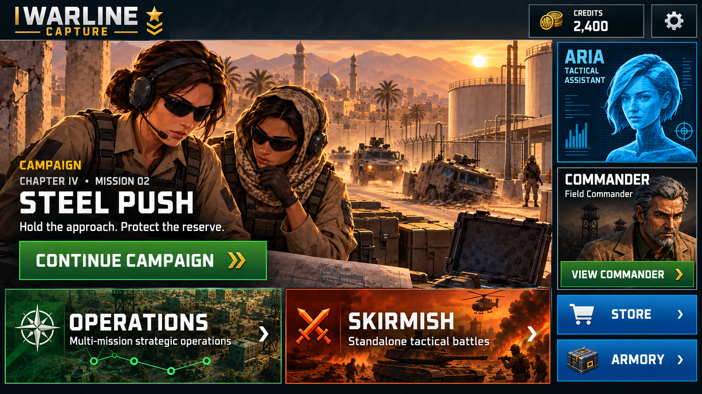

# Campaign-led home and updated header — mockup v01

Date: 2026-09-28
Status: approved as home/header layout direction on 2026-09-28, with explicit ARIA identity correction below; not implemented or runtime-validated by this document.
Generator: built-in ImageGen, reference-based edit.



## Direction

**ARIA portrait correction:** The user explicitly requires ARIA to keep her existing face and rejects the identity drift in this generated image. Reuse the exact native ARIA portrait asset, including her established hair, expression and cyan holographic treatment. Do not use or recreate the generated face shown here. Only ARIA panel placement/sizing is approved; preserve aspect ratio and recognizable framing. This correction takes precedence over the image and generation prompt.

Campaign intro artwork fills the primary home area. Continue Campaign opens Campaign focused on the appropriate playable mission; it does not deploy directly. Operations and Skirmish are larger, distinct mode cards. The existing commander moves to a dedicated right-hand card with View Commander. ARIA remains visible. Store and Armory are secondary.

The updated account header contains Credits and Settings, with Command and purchase-plus controls removed. The 2,400 balance is illustrative, not a live profile read or recommended starting grant. Runtime must bind actual earned Credits; no fabricated balance or loading flash. Steel Push is an illustrative returning-player mission, not the first-session destination. Existing cold-open → identity → M01 → debrief → headquarters flow remains authoritative.

Use the same accessible, released, playable mission to select both the artwork and Continue destination. Respect completion, ownership and readiness; do not fall back to unrelated mission art. Comic background crops must avoid spoilers and dialogue UI. Preserve original portrait assets in implementation; generated reinterpretations are composition references, not replacements.

## Review and implementation limits

This is a single English 16:9 composition study. After viewing it, the user instructed: “can you update the header handoff so the other agent also updates the main menu like this”. This approves the shown home/header direction and satisfies its visual-direction review under [AGENTS.md](../../../../AGENTS.md); do not request the same approval again. It does not approve unseen redesigns or establish implementation acceptance. No native screen, input flow, localization, device fit, billing or gameplay validation was performed. Persian, wider ratios, safe areas and enlarged text remain implementation checks.

Related implementation plan: [Menu/header handoff](../../../Monetization/Menu_Header_Remediation_Handoff_2026-09-28.md).

## Reference inputs

1. [Existing native home](../../../VisualLockLayered/SCN-02_MainMenuV3/iterations/iteration_12/main_menu_v3_runtime_16x9.png): logo, portraits and visual identity.
2. [Native Campaign selection](../../CH04M02SteelPush/VisualReview/en-return.png): typography, panel treatment and mobile controls.
3. [Steel Push intro](../../CH04M02SteelPush/VisualReview/en-comic-CH04M02_SteelPush-a-16x9.png): mission art.

References are saved project evidence, not newly captured runtime screens. Legacy resource values in reference inputs do not override the monetization plan.

## Exact generation prompt

```text
Use case: ui-mockup.
Edit the supplied WARLINE CAPTURE home-screen reference into one polished, high-fidelity landscape 16:9 game home-screen design for visual review, ideally 1920x1080. Full screen flat UI screenshot, no device frame, no presentation border, no annotations.
Input 1: existing native home screen; use its WARLINE CAPTURE logo, field commander portrait, cyan ARIA portrait, dark military panel styling and visual identity.
Input 2: actual Campaign selection UI; use its Oxanium-like squared condensed typography, readable white/gold type, crisp panel borders, large colorful mobile controls and spacing. Do NOT retain old Command currency.
Input 3: actual Steel Push intro comic screenshot; use the underlying illustrated desert oil-depot scene with the two radio-equipped female soldiers and armored vehicles as the main Campaign backdrop. Remove all original story playback, subtitle, speech and Next UI. Preserve recognizable art style and scene.
Primary change: campaign story is the visual centerpiece, not the oversized male commander. The male commander's portrait must appear ONLY inside a small dedicated commander card on the right, not in the background.
Layout:
1. Slim full-width dark header, about 11% of screen height. WARLINE CAPTURE logo on left. Right side: one modest gold coin tile labelled CREDITS with sample balance 2,400, followed by a clearly tappable gear Settings button. No COMMAND counter, no energy, no plus buttons, no price or purchase CTA, no premium badge. Preserve breathing room across header.
2. Below header, left/main area about 76% width: large uninterrupted cinematic Steel Push intro artwork covering the whole main area, not a tiny thumbnail. Let the scene and characters breathe. Place a restrained dark gradient at its lower-left for readable mission copy. Exact copy in this hero: small gold 'CAMPAIGN'; small white 'CHAPTER IV • MISSION 02'; large white title 'STEEL PUSH'; short line 'Hold the approach. Protect the reserve.' Below this a large saturated green rectangular action 'CONTINUE CAMPAIGN' with a gold chevron. This occupies the central vertical band above the other mode cards; keep faces visible and place text in scene negative space as much as possible.
3. Along bottom of main area, two equally sized substantial wide cards side by side, each about 34% screen width and 22% screen height, ample touch padding. They must look like distinct selectable GAME MODES, not mission objectives. Left card green with command-map / city art and a compass insignia: exact large title 'OPERATIONS', exact subtitle 'Multi-mission strategic operations', right arrow. Right card orange-red with tactical battle / tank art and crossed-weapons insignia: exact large title 'SKIRMISH', exact subtitle 'Standalone tactical battles', right arrow. Large titles and legible subtitles. Do not add a duplicate Campaign card.
4. Right column about 22% screen width separated by a narrow gutter: upper compact cyan ARIA portrait card in the existing art style, labelled 'ARIA' and 'Tactical assistant'. Under it a dedicated Commander card with the same recognizable existing grizzled male field-commander portrait, small cropped bust, exact title 'COMMANDER', name 'Field Commander' and a green action 'VIEW COMMANDER' with chevron. This is where the old CHANGE area used to be. Commander portrait should be subordinate to campaign scene, never oversized.
5. Bottom of right column only: two compact blue secondary buttons stacked, labelled 'STORE' and 'ARMORY' with existing-style icons. Keep these visibly less prominent than all 3 play-mode actions; do not use a full-width shopping footer.
Styling: Faithful WARLINE game UI, not a generic modern website. Squared condensed industrial type, very readable white uppercase headings, gold Campaign accents, cyan ARIA, saturated green actions, orange-red Skirmish, steel-edged near-black translucent panels. Warm painterly low-poly comic art as existing assets. Clean hierarchy, mobile landscape safe margins, generous hit areas, crisp aligned grids, minimal ornament, no tiny text, no decorative charts, no invented resource counters.
Treat this as an illustrative returning-player home state. Do not put 'mockup', 'prototype', developer labels or notes inside player UI. No ads, timers, mission-count sales promises, locked badges, store prices or purchase prompts. Render ONLY the final single home-screen mockup.
```
