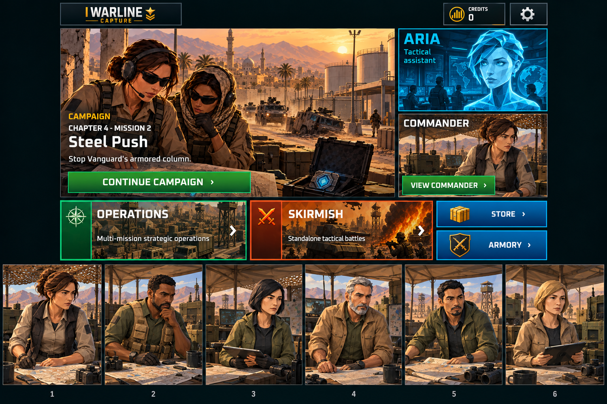

# Full-panel ARIA and commander scenes — v02 review

Date: 2026-09-29. Status: approved by the user on 2026-09-29: “looks good implement that”. Native integration and validation in progress.

## Requested correction

ARIA and Commander receive illustrated backgrounds covering each whole panel. Six commander scenes retain the six existing identities and use the established angular Campaign comic style. Native text, selected identity and navigation remain authoritative. Credits overlap and Store/Armory icon corrections are being validated separately.

**ARIA identity correction remains mandatory:** the generated likeness in this board is not accepted shipping art. Implementation will retain the exact original `Assets/Game/Art/UI/V3Shared/Portraits/ARIA_MainMenu_V3.png` over a separately generated command-room background with no replacement face. Preserve aspect ratio.

## References

- Current native home: `../After/before-panel-revision/home-en-1920.png`
- Original ARIA: `Assets/Game/Art/UI/V3Shared/Portraits/ARIA_MainMenu_V3.png`
- Six canonical commanders: `Assets/Game/Art/Narrative/FirstLaunch/Commander/commander_portrait_choices.png`
- Campaign comic style: `Assets/Game/Art/Narrative/FirstLaunch/Panels/16x9/FL-P15.png`

The exact generation prompt is preserved in [home-full-panels-v02.prompt.txt](home-full-panels-v02.prompt.txt). The board is a visual proposal, not native runtime or device evidence. Full-panel direction review is satisfied by the user’s implementation instruction. Original home approval remains valid.
