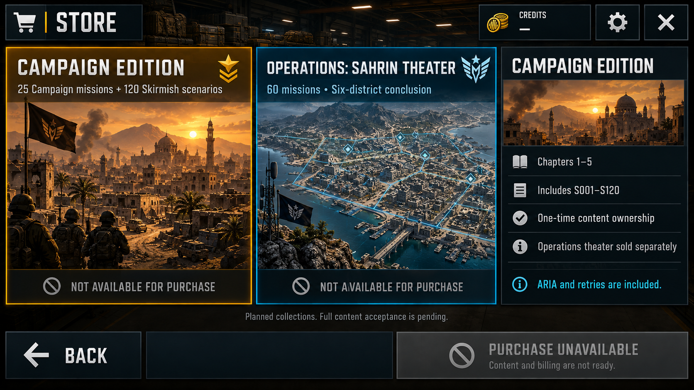

# Store content direction v01

2026-09-28. Status: visual review pending; implementation must wait for the user's decision.

Built-in ImageGen mockup using the existing Store final target and native Campaign selection capture as actual-game style references. The image is a composition reference only; implementation must reuse existing project art, render native labels and retain disabled commerce. The generated store scene is not a shipping art asset.

Two collections replace six consumables categories. Campaign Edition plans 25 Campaign missions and all S001–S120; Sahrin Theater plans O001–O060 and the six-district conclusion. Explicit unavailable state and planned membership copy do not certify or advertise finished content. No prices, scarcity, tactical power, fake cosmetics, purchase or nonfunctional Restore control.

References:
- Design/VisualLockLayered/SCN-14_StoreCommandExchange/reference/SCN-14_StoreV3_Final_Target.png
- Design/AgentReports/CH04M02SteelPush/VisualReview/en-return.png

Review request: approve the shown two-collection layout, or preserve current structure while correcting its content. No answer has been recorded yet. Home/header approval remains valid independently.
