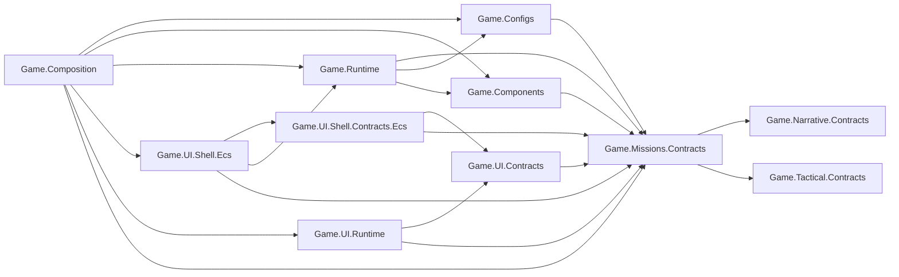
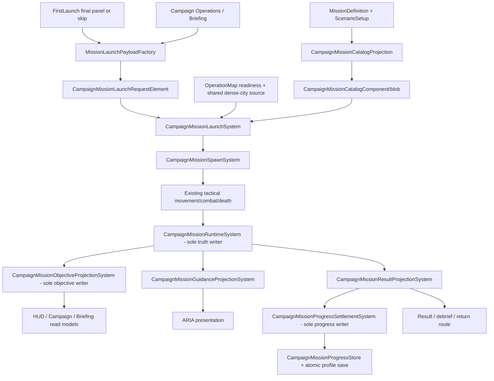

# M01 First Contact Dense-City Technical Architecture

Date: 2026-08-12
Status: Accepted for implementation with M01DC-001 on 2026-08-12
Scope owner: M01 contracts, runtime ownership, FirstLaunch/Campaign entry, UI projections, persistence, dense-city logical-view integration, first-gameplay QA, and performance
High-level design: `Design/M01_FirstContact_Dense_City_High_Level_Design.md`
Implementation tracker: `Design/Architecture/m01_first_contact_dense_city_implementation_tracker.md`

## 1. Purpose And Use

This is the stable implementation contract for `saga.ch01.m01.first_contact`. It exists separately from the high-level design and tracker so later implementation agents can load one concise technical authority instead of reconstructing architecture from many historical documents.

The three documents have distinct jobs:

| Document | Authority |
|---|---|
| High-level design | Player experience, narrative, rules, content, and product decisions. |
| This technical architecture | Exact type names, dependencies, state ownership, lifecycle, performance, QA, and anti-drift rules. |
| Implementation tracker | Dependency order, evidence, commit boundaries, and acceptance state. |

If they conflict, stop and reconcile them before implementation. Do not silently choose the easiest interpretation. M01DC-001 recorded project-owner acceptance on 2026-08-12; dependency-ready production edits are authorized only within this contract and the tracker.

## 2. Non-Negotiable Architecture Principles

1. There is one mission phase/outcome writer, one objective writer, and one Campaign-progress writer.
2. FirstLaunch and Campaign Operations create the same immutable launch contract through the same factory.
3. The accepted dense city is referenced as a physical source. M01 owns a logical mission view, never a copied city.
4. Authored configuration is immutable at runtime and projects once into ECS-owned data.
5. ECS owns live mission truth. UI, narrative, ARIA, audio, result, and persistence consume typed/versioned projections or requests.
6. Views display read models and publish intent. They do not own mission state, calculate rewards, spawn gameplay entities, or poll saves.
7. Every native allocation, blob, event subscription, pooled object, mission entity, and presentation entity has one named disposer and repeated lifecycle coverage.
8. Hot paths perform bounded work with steady-state `0 B/frame`. No per-frame hierarchy search, managed query construction, LINQ, Addressables load, or redundant structural churn is allowed.
9. Existing broad helpers are integration seams, not places to hide mission policy. In particular, do not grow `InitialUnitsSpawnSystem`, `UiActionRequestSystem`, `UIShellEcsPresentationSystem`, `OperationMapSceneLoadingSceneSystemHelper`, or `OperationMapRuntimeBootstrapSceneSystemHelper` into M01 owners.
10. Agent-operated first-play QA is a release gate. Codex/the implementing agent explicitly plays the novice QA role through real controls. Automated tests and performance captures do not substitute for that player-role review, and recorded actionable feedback must be implemented or explicitly deferred by the project owner.

## 3. Assembly And Dependency Contract

### 3.1 New Contract Assembly

Create one engine-independent assembly:

- path: `Assets/Game/Scripts/Missions/Contracts/Game.Missions.Contracts.asmdef`
- root namespace: `Game.Missions.Contracts`
- references: `Game.Narrative.Contracts` and `Game.Tactical.Contracts` only
- forbidden references: Configs, Components, Runtime, Composition, UI, UnityEngine, Unity.Entities, Addressables

The assembly owns immutable cross-layer mission vocabulary. It owns no ScriptableObjects, ECS components, services, views, file I/O, or mutable registry.

### 3.2 Allowed Dependency Direction

Rules:

- `Game.Missions.Contracts` never references a downstream assembly.
- `Game.Components` remains data-only; it may reference the mission contract but never Runtime, Configs, UI, or Composition.
- `Game.Configs` owns authored data and validation, not live state.
- `Game.Runtime` owns deterministic mission behavior and persistence settlement.
- `Game.Composition` performs projection and scene/startup binding only.
- UI assemblies consume mission contracts/read models and publish typed intent; no UI assembly writes mission truth.
- Add only the references actually needed by accepted slices. A prospective dependency is not permission to add it early.

## 4. Cross-Layer Mission Contracts

Create `MissionContracts.cs` in `Game.Missions.Contracts` with these exact public types:

| Type | Responsibility |
|---|---|
| `MissionLaunchOriginKind` | Distinguishes FirstLaunch and Campaign Operations origins. |
| `MissionRunKind` | Distinguishes first clear, retry, and replay without inferring from UI route. |
| `MissionPhaseKind` | Stable semantic phase vocabulary: Preparing through ReturnReplay. |
| `MissionOutcomeKind` | None, Victory, or Defeat; no UI-local outcome enum. |
| `MissionActionKind` | Typed Deploy, Retry, Continue, Exit, and replay-tutorial intent. |
| `MissionReturnDestinationKind` | CommandBase after first clear or CampaignOperations after replay. |
| `MissionObjectiveRuleKind` | Supported deterministic objective/failure rule vocabulary. |
| `MissionStarRuleKind` | Supported deterministic star-rule vocabulary. |
| `MissionRewardKind` | Supported reward vocabulary; M01 configuration contains no Intel reward. |
| `MissionLaunchPayload` | Immutable validated launch identity, guidance, run intent, correlation, and seed. |
| `MissionResultSummary` | Immutable result facts for presentation and settlement. |
| `MissionActionResult` | Typed accepted/rejected response with correlation and reason. |

Enums are append-only and use these frozen initial numeric values:

- `MissionLaunchOriginKind`: `None = 0`, `FirstLaunch = 1`, `CampaignOperations = 2`;
- `MissionRunKind`: `None = 0`, `FirstClear = 1`, `Retry = 2`, `Replay = 3`;
- `MissionPhaseKind`: `None = 0`, `Preparing = 1`, `InteractiveBrief = 2`, `FindSquad = 3`, `MoveToCover = 4`, `ConfirmThreat = 5`, `Engage = 6`, `SecureCorridor = 7`, `Result = 8`, `DebriefFirstClear = 9`, `ReturnReplay = 10`;
- `MissionOutcomeKind`: `None = 0`, `Victory = 1`, `Defeat = 2`;
- `MissionActionKind`: `None = 0`, `Deploy = 1`, `Retry = 2`, `Continue = 3`, `Exit = 4`, `SetReplayTutorial = 5`;
- `MissionReturnDestinationKind`: `None = 0`, `CommandBase = 1`, `CampaignOperations = 2`;
- `MissionObjectiveRuleKind`: `None = 0`, `DestroyMissionRole = 1`, `ProtectMissionRole = 2`;
- `MissionStarRuleKind`: `None = 0`, `CompleteMission = 1`, `NoSquadLoss = 2`, `CompleteUnderMilliseconds = 3`;
- `MissionRewardKind`: `None = 0`, `Credits = 1`, `Materials = 2`, `Fuel = 3`, `Intel = 4`.

`MissionLaunchPayload`, `MissionResultSummary`, and `MissionActionResult` are `readonly struct` values with validating constructors and value equality. Their managed-boundary IDs/tokens are non-null strings; ECS projection converts them once to bounded fixed strings/blob storage. No raw managed string is stored in a hot component. M01 validation rejects `MissionRewardKind.Intel`, although the generic contract retains it for later missions.

`MissionLaunchPayload` carries exactly:

- `SchemaVersion`
- `MissionId`
- `ScenarioId`
- `OperationMapId`
- `LaunchOrigin`
- `RunKind`
- `NarrativeGuidanceMode Guidance`
- `ReplayTutorialEnabled`
- `TransitionToken`
- `SessionToken`
- `AttemptOrdinal`
- `DeterministicSeed`

Use immutable constructors/equality. IDs and tokens use existing bounded value conventions suitable for both managed and ECS projection. A retry preserves mission/scenario/map IDs, session token, and deterministic seed, and increments only `AttemptOrdinal`. No route object, MonoBehaviour, ScriptableObject instance ID, current time, or random global state enters equality.

Create `MissionLaunchPayloadFactory` in `Game.Runtime`. It is a stateless pure factory used by both FirstLaunch and Campaign Operations. There must not be a FirstLaunch-only payload builder or a UI-owned payload variant.

## 5. Authored Configuration And Validation

### 5.1 Mission Definitions

Under `Game.Configs`, create:

| File/type | Responsibility |
|---|---|
| `MissionDefinitionConfig.cs` / `MissionDefinitionConfig` | ScriptableObject root for identity, display, sequences, objectives, stars, rewards, allowed commands, replay policy, and readiness. |
| same file / `MissionObjectiveDefinitionConfig` | Serializable immutable objective/failure rule data. |
| same file / `MissionStarDefinitionConfig` | Serializable rule and threshold data. |
| same file / `MissionRewardDefinitionConfig` | Serializable first-clear/replay reward data. |
| same file / `MissionCommandPolicyConfig` | Serializable allowed-command data using existing tactical command vocabulary. |
| `MissionDefinitionCatalogConfig.cs` / `MissionDefinitionCatalogConfig` | Catalog root. |
| same file / `MissionDefinitionCatalogEntryConfig` | Stable mission-ID-to-definition entry. |
| `MissionDefinitionContractValidation.cs` / `MissionDefinitionContractValidation` | Fail-closed IDs, duplicates, references, rules, rewards, readiness, and M01 invariants. |

Definitions are configuration, not runtime owners. No code mutates them after projection.

### 5.2 Scenario Setup

Extend the existing `ScenarioSetupConfig` additively with these serializable types:

- `ScenarioUnitGroupConfig`
- `ScenarioUnitEntryConfig`
- `ScenarioPatrolRouteConfig`
- `ScenarioRestrictionConfig`
- `ScenarioAmbientPresentationConfig`

Existing Skirmish data must retain identical serialization and behavior when all new fields are absent/default. Campaign fields validate before launch. Unit entries use the existing unit-config/catalog key plus an editor-validated expected asset identity; runtime does not perform per-frame asset lookup.

M01 canonical friendly group is the approved JRC first-contact rifle squad sourced from:

- `Prefab_UnitGrid_Chr_Soldier_Male_02_Alt_02_Config.asset`
- `Prefab_UnitGrid_Chr_Soldier_Male_02_Alt_04_Config.asset`
- `Prefab_UnitGrid_Chr_Soldier_Female_01_Alt_01_Config.asset`
- `Prefab_UnitGrid_Chr_Soldier_Female_02_Alt_01_Config.asset`

M01 hostile group is exactly:

- Courier: `Prefab_UnitGrid_Chr_Insurgent_Male_03_Config.asset`
- Warden: `Prefab_UnitGrid_Chr_Insurgent_Female_01_Config.asset`
- Broker: `Prefab_UnitGrid_Chr_Insurgent_Female_02_Config.asset`

`Chr_Insurgent_Male_05`/Nadir Qassem and the Male 02 heavy gunner are forbidden from the M01 scenario.

### 5.3 Logical Map Source Binding

Add `OperationMapSourceBindingConfig` to the operation-map config model with:

- `SourceOperationMapId`
- `SourceIdentityHash`
- `SourceContentHash`

Blank/default means self-owned and preserves every existing map. The M01 logical definition `opmap.ch01.district_edge_01` binds to the accepted physical source `opmap.skirmish.desert_base_01` and its exact accepted hashes. `OperationMapContractValidation` validates logical identity and physical source identity independently and fails closed on stale/mismatched hashes. Never clone, rename, or regenerate the accepted city merely to create an M01 identity.

## 6. ECS Data Contract

Create `CampaignMissionComponents.cs` under `Game.Components`. It contains data only:

| Component/buffer | Responsibility |
|---|---|
| `CampaignMissionRootComponent` | Stable mission-root tag. |
| `CampaignMissionCatalogComponent` | Versioned owned blob reference to projected mission/scenario data. |
| `CampaignMissionLaunchQueueComponent` | Queue identity/counters only; requests remain in buffers. |
| `CampaignMissionLaunchRequestElement` | Typed launch request. |
| `CampaignMissionLaunchResultElement` | Accepted/rejected result correlated to transition token. |
| `CampaignMissionRuntimeComponent` | Sole live phase/outcome identity, semantic version, attempt, and readiness. |
| `CampaignMissionAttemptFactsComponent` | Authoritative elapsed/loss/hostile/command-squad facts used by rules. |
| `CampaignMissionActionRequestElement` | Typed player/UI mission action intent. |
| `CampaignMissionActionResultElement` | Typed action result. |
| `CampaignMissionResultComponent` | Result projection from runtime facts, not settlement state. |
| `CampaignMissionSettlementRequestElement` | Exactly-once persistence request. |
| `CampaignMissionSettlementResultElement` | Correlated settlement result. |
| `CampaignMissionUnitRoleComponent` | Mission role and group identity for spawned units. |
| `CampaignMissionAmbientCivilianComponent` | Presentation-only civilian identity and route index. |

The same file may define the required blob structs with `CampaignMission...Blob` names. No managed string, Unity object reference, delegate, service, or mutable collection is stored in hot ECS data. `CampaignMissionRuntimeComponent.Version` increments only for a semantic change visible to a consumer.

The existing `MatchObjectiveRuntimeStateComponent` and `MatchObjectiveRuntimeElement` remain the objective read model. They are not a second mission state. Their missing authoritative writer is filled by the exact projection system named below.

## 7. Runtime Systems, Relations, And Ownership

### 7.1 Required Systems

| Exact type | Base | Sole responsibility | Must not do |
|---|---|---|---|
| `CampaignMissionLaunchSystem` | `ISystem` | Validate/consume launch requests, coordinate operation-map request/readiness, and create/reset the mission root. | Spawn forces, calculate objectives, write UI, settle saves. |
| `CampaignMissionSpawnSystem` | `ISystem` | One-time deterministic force spawn after map/catalog readiness; tag roles; own spawned-unit cleanup. | Modify `InitialUnitsSpawnSystem`, choose mission phase, poll assets. |
| `CampaignMissionPatrolOrderSystem` | `ISystem` | Issue existing typed move/hold/attack requests on semantic route events. | Reissue orders every frame or bypass tactical systems. |
| `CampaignMissionRuntimeSystem` | `ISystem` | Sole writer of `CampaignMissionRuntimeComponent`, outcome, and attempt facts. | Write objective buffers, UI, save files, or presentation. |
| `CampaignMissionObjectiveProjectionSystem` | `ISystem` | Sole writer of `MatchObjectiveRuntimeStateComponent` and `MatchObjectiveRuntimeElement` from mission truth. | Derive a competing mission phase or outcome. |
| `CampaignMissionGuidanceProjectionSystem` | `ISystem` | Emit typed ARIA guidance requests only when source version/phase changes. | Execute gameplay, mutate objectives, or allocate per frame. |
| `CampaignMissionResultProjectionSystem` | `ISystem` | Project immutable result/star facts from terminal mission state. | Grant rewards or navigate UI. |
| `CampaignMissionProgressSettlementSystem` | `SystemBase` | Consume settlement requests and call the injected progress store exactly once. | Poll files, calculate combat facts, or become a second result owner. |
| `CampaignMissionAmbientPresentationSystem` | `ISystem` | Create/update/clean bounded non-gameplay civilians and evacuation presentation. | Add health, targeting, selection, faction-combat, objective, reward, or star authority. |
| `CampaignMissionCatalogDisposalSystem` | `ISystem` | Dispose replaced/world-shutdown mission blobs exactly once. | Create policy or retain static ownership. |

Use `CampaignMissionCatalogProjection` as a stateless non-`SystemHelper` operation in `Game.Composition` to validate and project authored definitions into one persistent blob. Re-entry with the same source version is idempotent. Replacement transfers ownership explicitly, and the disposal system owns the old blob.

### 7.2 Ordering

1. `CampaignMissionLaunchSystem` consumes typed UI/narrative requests and waits for the existing operation-map readiness projection.
2. `CampaignMissionSpawnSystem` runs only after map/grid/prefab registry and mission catalog readiness.
3. `CampaignMissionPatrolOrderSystem` publishes semantic orders before existing order/movement consumers.
4. Existing movement, combat, and death systems produce gameplay facts.
5. `CampaignMissionRuntimeSystem` consumes those facts and is the only phase/outcome writer.
6. `CampaignMissionObjectiveProjectionSystem`, guidance, and result projection consume the new mission version.
7. Settlement consumes a terminal result request once.
8. UI/audio/narrative/presentation read projections; ambient presentation runs in the presentation group.

Use explicit Unity ordering attributes backed by architecture tests. If an exact existing system name differs from the design assumption, M01DC-002 records the actual type and M01DC-003 amends this ordering table before code is written.

### 7.3 State And Request Flow

## 8. FirstLaunch Direct Handoff

Create `FirstLaunchMissionHandoffOperation` as a stateless, non-`SystemHelper` operation. It combines the existing `NarrativeHandoffResult` with canonical mission configuration through `MissionLaunchPayloadFactory`.

Narrowly change the existing FirstLaunch composition seam:

- replace the untyped `MenuHandoffRequested` event with typed `MissionHandoffRequested` data;
- append `EnterMission = 3` to `UiShellStartupDisposition`; never reorder or renumber existing values;
- keep the final story/loading cover visible while the launch request is pending;
- mark FirstLaunch `Completed` only when a matching `CampaignMissionLaunchResultElement` is Accepted for the persisted transition token;
- keep `HandoffPending` and expose bounded retry on rejection/interruption;
- never fall through to Main Menu for a new-profile story completion/skip;
- leave returning-player/menu startup unchanged.

No static payload bridges scenes. The ECS request/root and persisted transition state carry correlation.

## 9. UI Read Models And Binding

Under `Game.UI.Contracts`, add immutable:

- `UiCampaignOperationsModel`
- `UiMissionBriefingModel`

Extend the existing `UiMissionResultPopupModel`; do not create a competing result popup model. Under `Game.UI.Shell.Contracts.Ecs`, add:

- `UiCampaignOperationsComponent`
- `UiMissionBriefingComponent`
- `UiCampaignMissionActionRequestElement`

Create `UiCampaignMissionProjectionSystem` in `Game.UI.Shell.Ecs`. It is the sole writer of Campaign/briefing mission read models and runs only when the mission catalog/progress source version changes.

Create `CampaignMissionScreenBinder` in `Game.UI.Runtime`. It binds serialized button events once when the route/view is installed, unbinds on destroy, calls `IUiShellRuntimeGateway`, and never has an `Update` loop. Extend `IUiShellRuntimeGateway` with mission read methods and one typed mission-action enqueue.

The existing `CampaignOperationsScreenView` and `MissionBriefingScreenView` remain dumb views. They may gain `Apply(...)` and serialized event/reference members only. They must not load configs, read JSON, construct launch payloads, calculate availability/rewards, or search the hierarchy. Do not add M01 policy to `UiActionRequestSystem` or `UIShellEcsPresentationSystem`.

## 10. Persistence And Exactly-Once Settlement

Add `CampaignMissionProgressSaveData[] campaignMissionProgress` to `PlayerProfileSaveData` with additive migration. Each entry contains:

- `missionId`
- `availability`
- `firstClearCompleted`
- `bestStars`
- `bestCompletionMilliseconds`
- `firstClearRewardSettled`
- `successfulReplayCount`
- `lastSettledToken`
- `pendingResume`
- `lastAttemptOrdinal`

Create sealed `CampaignMissionProgressStore` in `Game.Runtime`. It receives `SaveService`, owns normalize/read/settle mutations, sorts deterministically by mission ID, and is the only Campaign progress mutation path. UI never reads JSON directly.

Settlement token is the stable combination of `SessionToken` and `AttemptOrdinal`. Repeated settlement is ignored and returns the prior result. A first-clear reward and a replay reward are distinct configuration entries; M01 never grants Intel.

The current repository writes saves directly. M01DC-008 must add `JsonSaveRepository.SaveAtomic<T>` using same-directory temporary output, flush, and atomic replace/rename semantics appropriate to the platform. Existing `Save<T>` either delegates to this method or remains unchanged only with explicit regression evidence and Campaign profile writes using the atomic path. Test interruption, corrupt input, older profile migration, duplicate settlement, retry, restart, and unchanged settings/quick-game data.

## 11. Dense-City, Camera, And Presentation Boundaries

- Physical source: accepted `opmap.skirmish.desert_base_01` dense-city presentation and virtualized proxy database.
- Logical M01 view: `opmap.ch01.district_edge_01` with mission-specific bounds, cameras, minimap, surfaces, and typed anchors.
- M01 owns no copied scene, EntityScene, geometry, VRP database, Addressables identity, or permanent duplicate representation.
- `camera.ch01.m01.planning` matches FirstLaunch `FL-P18`; `camera.ch01.m01.battle_start` is the controlled gameplay blend.
- Non-playable city districts may remain visible but are not simulated or targetable by M01.
- Ambient civilians are presentation-only. Author eight initially, validate a hard maximum of twelve, and fall back to zero when presentation capacity is unavailable.
- The refinery/proxy-overlap artifact, hidden/brown city, invalid road-over-water crossing, minimap misalignment, and unrelated industrial/base framing are visual rejection conditions.

## 12. Narrative And Character Continuity

The live hostile patrol and FirstLaunch comic use the same three identities:

| Callsign | Character/config | M01 role |
|---|---|---|
| Courier | `Chr_Insurgent_Male_03` | Armed raider/courier. |
| Warden | `Chr_Insurgent_Female_01` | Rifle-cell commander. |
| Broker | `Chr_Insurgent_Female_02` | Sidearm/logistics operative. |

The callsigns are threat profiles, not principal-villain identities. M01 gives Qassem no portrait, voice, proxy, model, or clean reveal. The debrief may show coordination and a fragmentary obsolete/revoked-compatible ARIA credential trace. It must not confirm Qassem or reveal the complete Protocol Fragment; that confirmation remains reserved for M05.

The existing narrative sequence runtime owns brief/comms/debrief presentation. Mission config owns `seq.ch01.m01.brief`, `seq.ch01.m01.comms`, and `seq.ch01.m01.debrief`. Narrative publishes typed completion/action requests and never writes mission phase, result, rewards, or Campaign progress.

## 13. Agent-Operated First-Gameplay QA Contract

M01 is the first actual gameplay experience. It requires Codex/the implementing agent to role-play a novice player through real input on a fresh candidate package, observe audiovisual/gameplay output, score the experience, and file findings. This is explicitly agent-operated QA, not a human participant study. Scripted tests, telemetry routes, screenshots, and code inspection are supporting evidence only.

### 13.1 Required Sessions

Run and record at least these complete sessions:

1. **Cold novice / Full guidance:** new profile, read the story naturally, hesitate, make one wrong selection, tap empty terrain, issue one poor move, recover, finish, hear the debrief, and arrive at command base.
2. **Low-help / Contextual:** new profile or fully reset test profile, delay expected actions, ignore one hint, recover without hidden knowledge, and finish or retry once.
3. **Replay / Minimal:** launch from Campaign Operations, verify briefing and replay-tutorial default off, test touch targeting/camera/Stop/Hold, complete, and return to Campaign Operations.

All three sessions are required. At least one complete session must use real touch input on a supported Android device with device audio enabled. The report records `operatorKind=Agent`, agent/task identity, package, head, device, and input method. Project-owner feedback, when supplied, is recorded separately and is never fabricated. QA must use the same candidate package/head it names; a stale or rejected package cannot supply evidence.

### 13.2 Review Dimensions

Score each dimension from 1 (unacceptable) to 5 (excellent), attach timestamped evidence and prose, and record the first moment of confusion:

- story-to-gameplay continuity;
- objective and threat comprehension;
- select/move/attack/stop/hold discoverability;
- cognitive load and simplicity;
- camera framing, movement, zoom, and targetability;
- pacing, tension, satisfaction, and fun factor;
- input responsiveness and gameplay smoothness;
- unit/hostile/civilian readability;
- HUD, prompt, result, and reward comprehension;
- music, ambience, voice, dialogue, and action-SFX balance/clarity;
- guidance usefulness without annoyance;
- mistake recovery, retry, and route clarity;
- accessibility, text legibility, safe area, subtitles, and reduced motion;
- bugs, clipping, incorrect targets, stale UI, missing feedback, stalls, crashes, or ANRs.

Recommended acceptance: median at least 4 for comprehension, control discoverability, simplicity, smoothness, and audio intelligibility; no reviewed dimension below 3; no P0/P1/P2 finding open.

### 13.3 Finding And Response Rules

Every finding records: ID, session/package/head, guidance mode, reproduction steps, expected/actual, timestamp/capture, severity, affected contract, owner, proposed response, changed files/commit, validation, and disposition.

Severity:

- P0: data loss, crash/ANR, progression corruption, impossible completion, safety/security issue;
- P1: frequent blocker, broken first-play handoff, unusable core control, severe performance/audio/UI failure;
- P2: material confusion, pacing/fun problem, unreliable feedback, recoverable gameplay defect;
- P3: polish, preference, or low-frequency minor issue.

P0-P2 findings must be corrected and replayed before certification. P3 is fixed when bounded; otherwise it requires an explicit project-owner defer decision and target, not an agent assertion that it is harmless. If feedback requires a new product choice or scope beyond this design, stop for that decision. Code/content may act autonomously on findings already covered by the HLD, architecture, naming, accessibility, or performance contracts.

After any QA-driven code/content change, build a fresh package and rerun the affected automated, visual, lifecycle, performance, and agent-operated session. The final QA sign-off must name the exact final package/head used by Android certification.

## 14. Performance Contract

M01 inherits the accepted dense-city Android contract without weakening:

| Gate | Required |
|---|---|
| Average FPS | `>= 54` |
| 10th-percentile FPS | `>= 50` |
| Average frame time | `<= 18.6 ms` |
| p95 / p99 frame time | `<= 20 ms` / `< 25 ms` |
| CPU average / p95 | `<= 12 ms` / `<= 16 ms` |
| GPU average / p95 | `<= 16 ms` / `<= 18 ms` |
| Managed allocation | steady-state `0 B/frame` |
| Proxy overflow / deficit | zero |
| Correctness failures | zero |
| Representative diagnostics-disabled routes | 120 seconds each |
| Final cooled thermal route | exactly two minutes |

Canonical performance device is Samsung SM-S918B, serial `R5CTC1J02VB`. Redmi evidence is supplemental unless the project owner explicitly amends the canonical device. Agent-operated gameplay QA may use both, but supplemental results never replace the canonical performance run.

Bounded-work rules:

- systems short-circuit when no request/source-version change exists;
- no per-frame managed allocation or unbounded entity/hierarchy scan;
- no mission-driven increase to accepted proxy capacities or thresholds;
- civilians remain within the authored/hard cap;
- patrol orders publish only on semantic changes;
- read-model projections update only on version changes;
- no Addressables/file/config load during steady-state gameplay;
- repeated launch/retry/unload shows zero native, pool, event, blob, or entity growth.

## 15. Naming And Source-Growth Rules

Use these suffixes consistently:

| Suffix | Meaning |
|---|---|
| `Config` | Immutable authored data. |
| `Component` / `Element` | ECS data, no behavior. |
| `System` | ECS scheduler and one declared writer/responsibility. |
| `ProjectionSystem` | Reads authoritative state and writes one read model. |
| `Operation` / `Factory` / `Validation` | Stateless deterministic logic. |
| `View` | Serialized Unity references and display only. |
| `Binder` | One-time event binding/unbinding. |
| `Store` | Sole persistence-domain mutation owner. |

Generic Campaign runtime types start with `CampaignMission`. M01-specific code is limited to canonical assets, editor authoring/build validation, test fixtures, and captures. Do not create `M01MissionManager` or mission-specific runtime state machines when data can drive the generic Campaign mission pipeline.

Forbidden new names/patterns without a tracker amendment: `Manager`, `Controller`, `Coordinator`, `Facade`, `RuntimeSingleton`, service locator, mutable static registry, or a new `*SystemHelper`. The existing `SaveService` name is grandfathered; do not create a competing save service.

Production source files target at most 350 lines. Before reaching the target, split by cohesive responsibility into the approved stateless/system/data types; never add speculative source-growth headroom or an exception merely to pass. Existing exact source-growth ceilings remain immutable unless their owning architecture authority explicitly changes them.

## 16. Validation Entrypoints And Evidence

Use checked repository Unity wrappers and fail-closed markers only. Create these focused authorities:

| Entrypoint/type | Scope |
|---|---|
| `M01FirstContactContractValidation.RunFocusedValidation` | IDs, assets, definitions, character exclusions, logical/source map binding, rewards, and defaults. |
| `M01FirstContactArchitectureValidation.RunFocusedValidation` | Assembly graph, one-writer inventories, forbidden dependencies/names/patterns, lifecycle ownership, and source growth. |
| `M01FirstContactRuntimePlayModeTests` | Launch, phases, spawn, commands, objectives, victory/defeat, retry, settlement, guidance, routes, and cleanup. |
| `M01FirstContactVisualCapture` | FirstLaunch match, cameras, Old Market, HUD, patrol/civilians, result/debrief, aspects, and accessibility. |
| `M01FirstContactAndroidPackage` | Exact-head checked package, provenance, hash, install, launch, and device identity. |

Every wrapper invocation has an explicit log, timeout, exact expected test count, and marker in its tracker evidence. A timeout, project lock, nonzero exit, missing count, or missing marker is a failure. Expected counts are frozen when the implementation slice exists; do not invent counts in advance.

Consolidated acceptance also requires:

- compiler zero errors/warnings in the governed lane;
- full architecture and exact source-growth suites;
- deterministic two-pass generation hashes;
- protected-path and duplicate-content audits;
- FirstLaunch/Campaign equal-payload tests;
- Skirmish/default compatibility;
- writer, transition, lifecycle, native, pool, blob, event, allocation, and persistence tests;
- agent-operated first-gameplay QA findings and closed-loop replay evidence;
- fresh Android package, representative routes, and final cooled thermal evidence;
- clean main equal to origin/main at every accepted boundary.

## 17. Anti-Drift Review Checklist

Before each implementation commit, answer all of these from the diff:

- Does the change belong to the current M01DC item's exact allowlist?
- Is each new type named in this document or added by an accepted amendment first?
- Did a second mission, objective, result, reward, progress, or UI truth owner appear?
- Did UI/narrative/presentation begin constructing gameplay state directly?
- Did M01 policy leak into a protected broad helper or generic Skirmish pipeline?
- Did the physical dense-city source, VRP database, capacity, identity, or hash change?
- Did Qassem/heavy-gunner/full-credential confirmation leak into M01?
- Did any hot path gain managed allocation, polling, search, repeated orders, or structural churn?
- Does every new allocation/subscription/entity/blob/pool entry have exact cleanup and repeated-lifecycle evidence?
- Does a QA finding have a code/content response and replay, rather than only a note?
- Are wrappers, logs, markers, hashes, package/device identity, commit, push, and clean status truthful?

Any `yes` to a prohibited condition blocks acceptance. Correct the current slice or obtain a narrowly documented project-owner amendment; do not weaken a validator or silently defer the issue.

## 18. Acceptance

M01DC-001 accepted this document together with the implementation tracker on 2026-08-12. Acceptance freezes the names, responsibility boundaries, dependency direction, one-writer rules, first-play QA loop, and performance gates above. Later exact-head evidence may correct a mistaken current-type assumption through a tracker/document amendment before dependent code starts; it may not use that correction to broaden scope.

Final M01 acceptance requires M01DC-001 through M01DC-043, the exact final Android package and device evidence, closed QA findings, updated parent authorities, main equal to origin/main, and a clean repository.
