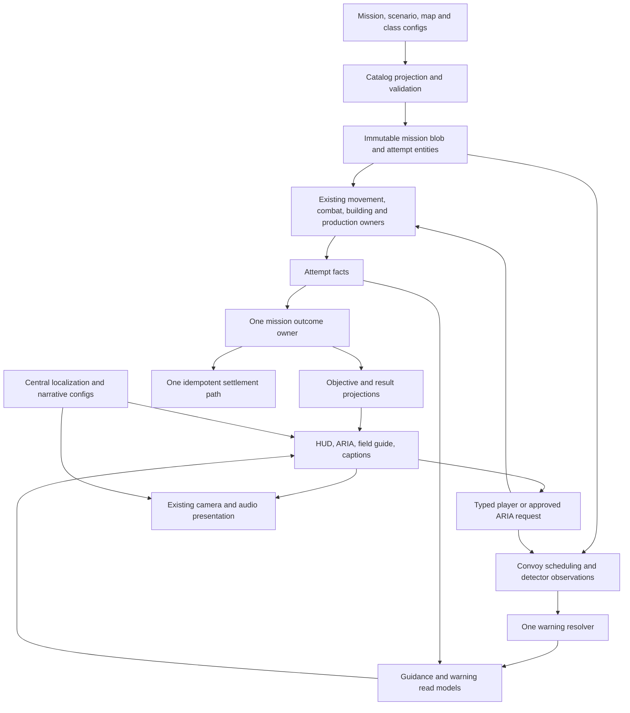

# M03 Radar Warning — Technical Architecture and Class Plan

Date: 2026-09-08

Status: Proposed; source inspected, no implementation or runtime validation performed

Product plan: [M03 Radar Warning](../M03_Radar_Warning_Production_Plan.md)

Execution: [M03 implementation tracker](m03_radar_warning_implementation_tracker.md)

## 1. Architectural decision

M03 extends the existing Campaign runtime. Authored mission/scenario/map/media data becomes immutable catalog projections and unmanaged attempt state. Simulation writes facts; objective/result/guidance/UI code projects them. Player and ARIA actions enter the same typed command boundaries. Narrative and camera completion affect presentation readiness only; they do not manufacture combat success.

The inspected project records Unity `6000.5.2f1`, Entities `6.5.0`, URP `17.5.0`, and Pipeline `0.6.0-exp.1`. This plan requires no package/version upgrade. Exact APIs must be checked against installed packages when implementation begins.



This is data flow, not an assembly dependency diagram. Existing bounded `.asmdef` edges remain authoritative: `Game.Missions.Contracts` and narrative/tactical contracts define portable values; `Game.Configs` owns authored schemas; `Game.Components` owns ECS data; `Game.Runtime` and its focused subassemblies own gameplay; UI contracts/shell/runtime/composition consume those boundaries. There is no inspected top-level `Game.Systems.asmdef` to invent. Core gameplay must not reference concrete UI, Editor, TMP, or narrative sprites/audio clips.

## 2. Verified gaps that must shape implementation

1. Mission phases still contain M01-specific names (`FindSquad`, `MoveToCover`, `ConfirmThreat`, `Engage`, `SecureCorridor`). M03 should use a small definition-driven defense stage, not duplicate the full mission lifecycle or pretend an enemy convoy is the M01 patrol.
2. Existing objective enums support Destroy/Protect role, Build, Produce, and Defend role. They do not yet express inner-core breach or the no-post-damage star. Add semantics explicitly and preserve serialized enum values.
3. Attempt facts already have post bound/damaged/destroyed and delayed-wave warning/activation flags. One pair of wave booleans cannot express two separately warned convoy elements.
4. The current delayed-wave config is singular. Generalize its projection to a bounded array of encounter elements while preserving the legacy authoring/default path. M02's current non-combat definition must continue to create zero hostile waves.
5. Both detector and delayed-wave systems call `ThreatWarningRuntimeState.RequestWarning`, which currently overwrites one pending record. The presentation path clears that pending record. Persistent actionable threat information requires separation of observations, canonical warning state, and presentation acknowledgement.
6. `ThreatDetectionWarningSystem` currently resets pending warning state when simulation is inactive. M03 pause must preserve and freeze a live warning, so distinguish pause from attempt teardown explicitly.
7. `ThreatAlertV3PopupView` toggles a route-preview visual. It does not, by itself, bind a route payload or move the gameplay camera. Its runtime hierarchy search is also a touched seam to replace with a serialized reference, without rebuilding unrelated prefab content.
8. The inspected `ThreatDetectionKind` enum is `None=0`, `Ground=1`, `Air=2`. The current satellite dish is **Air**, while `Prefab_UnitGrid_Veh_Radar_Tank.asset` is **Ground**, radius 240 cells, and cannot attack. Recommended resolution: loan one existing Radar Tank for M03; keep the dish's global behavior unchanged. Sensor detection remains subject to actual runtime/faction/coverage validation.
9. The inspected guidance projection has M01/M02 identity branches and inline fixed-string prose. Add bounded, key-based M03 guidance data and migrate only the necessary shared seam; do not grow another large mission-specific branch.
10. `CampaignMissionProgressSettlementSystem.ResolveNextMissionId` handles M01→M02 and M02→M03 only. It still needs M03→M04 and a readiness-safe campaign projection.

## 3. Ownership and class-by-class change map

Paths in the following tables are relative to `Assets/Game/Scripts/`. “Extend” is a planned change, not completed work. Existing type/file names retain their historical naming even where a new class with that name would not meet today's naming contract.

### 3.1 Authoring, loading, and persistence

| Existing class/type and source | Planned responsibility | Prohibited responsibility |
|---|---|---|
| `MissionDefinitionConfig`, `Configs/MissionDefinitionConfig.cs` | Add default-safe defense/rule/guide/next-mission metadata where appropriate; retain canonical sequence/reward identities. | Live health, active timers, camera transforms. |
| `MissionDefinitionContractValidation`, `Configs/MissionDefinitionContractValidation.cs` | Reject missing role bindings, unknown enum rules, incomplete rewards, and unsupported required capabilities. | Quietly fix invalid data or substitute M01. |
| `MissionDefinitionCatalogConfig`, `Configs/MissionDefinitionCatalogConfig.cs` | Resolve M01, M02, M03 by exact stable identity; duplicate identity fails closed. | Derive playability solely from progress availability. |
| `ScenarioSetupConfig`, `Configs/ScenarioSetupConfig.cs` | Keep scenario roster, faction, route, and map reference ownership. | Weapon tuning copied into narrative. |
| `ScenarioMissionRuntimeConfig`, `Configs/ScenarioMissionRuntimeConfig.cs` | Mission resources, loaned access, base role, bounded encounter data, and build policy. | New economy or production implementation. |
| `ScenarioDelayedWaveConfig`, same file | Backward-compatible legacy input projected as zero/one encounter element. | Two parallel live schedules for the same convoy. |
| `ScenarioMissionRuntimeContractValidation`, `Configs/ScenarioMissionRuntimeContractValidation.cs` | Validate resource order quantity/cost, group counts, activation/contact chronology, and paths. | Accept a building/ability merely because a catalog row exists. |
| `CampaignMissionCatalogProjection`, `Composition/CampaignMissionCatalogProjection*.cs` | Bake immutable, validated defense/convoy/support/guide keys once, with source version. | Managed config reads every simulation frame. |
| `CampaignMissionOperationMapLaunchResolver`, `Composition/CampaignMissionOperationMapLaunchResolver.cs` | Exact logical-to-physical map identity and readiness. | Change accepted dense-city source or substitute a visually similar map. |
| `CampaignMissionOperationMapReuseUtility`, `Composition/CampaignMissionOperationMapReuseUtility.cs` | Preserve accepted reuse/hash validation. | In-place runtime city generation. |
| `CampaignMissionMenuBootstrapRuntime`, `Composition/CampaignMissionMenuBootstrapRuntime.cs` | Compose the established launch path with new catalog entries. | M03-specific encounter, camera, or economy policy. |
| `CampaignMissionProgressStore`, `Runtime/Campaign/CampaignMissionProgressStore.cs` | Idempotent first-clear/replay persistence and best-star merging. | Persist failed match spending or tutorial-specific resource grants. |

### 3.2 Mission and gameplay owners

| Existing class/type and source | Planned change/reuse |
|---|---|
| `CampaignMissionLaunchSystem`, `Runtime/Missions/CampaignMissionLaunchSystem.cs` | Validate M03 readiness, profile availability, attempt identity and seed; reject repeat/stale deployment. |
| `CampaignMissionSpawnSystem`, `Runtime/Missions/CampaignMissionSpawnSystem*.cs` | Instantiate exact role/group members and scenario-loaned sensor; bind real post; suppress staged enemies consistently. |
| `CampaignMissionAttemptResourceInitializationSystem`, `Runtime/Missions/CampaignMissionAttemptResourceInitializationSystem.cs` | Initialize the reviewed attempt economy once; distinguish first clear/retry/replay without double crediting. |
| `CampaignMissionDelayedWaveSystem`, `Runtime/Missions/CampaignMissionDelayedWaveSystem.cs` | Become the sole convoy-element schedule owner via bounded config; publish warning observations and one-shot activation. |
| `CampaignMissionDelayedWaveUtility`, `Runtime/Missions/CampaignMissionDelayedWaveUtility.cs` | Pure timing/definition validation for old one-wave and new bounded-element inputs. |
| `CampaignMissionPatrolOrderSystem`, `Runtime/Missions/CampaignMissionPatrolOrderSystem*.cs` | Reuse authored initial order dispatch where compatible; support convoy role/route data through narrow helpers, with no second recurring convoy steering loop. |
| `CampaignMissionOpeningPresentationComponent`, `Components/CampaignMissionComponents.cs` | Reuse the existing attempt-scoped opening state and request handshake; add bounded shot/snapshot data only at the existing owner. |
| `CampaignMissionSpawnSystem.OpeningPresentation.cs`, `Runtime/Missions/` | Existing opening anchor resolution: M1 establishes player/hostile areas; M2 resolves camera-start/post/build-lot anchors. Add explicit M03 RTS start, post/clinic and approach anchors. |
| `CampaignMissionPatrolOrderSystem.EstablishBaseOpening.cs`, `Runtime/Missions/` | Reference M2's smooth focus/hold/return timing and reuse the same ownership; do not modify accepted M2 timing to accommodate M3. |
| `BaseBreachOrderSystem`, `Systems/BaseBreachOrderSystem.cs` | Keep canonical breach/target movement behavior. Its attack-breach order is not automatically the mission's inner-boundary truth. |
| `CampaignMissionAttemptFactProjectionSystem`, `Runtime/Missions/CampaignMissionAttemptFactProjectionSystem*.cs` | Sample actual post health, civilian deaths, surviving convoy membership, and living boundary crossings. It owns these fields; UI/guidance cannot write them. |
| `CampaignMissionRuntimeSystem`, `Runtime/Missions/CampaignMissionRuntimeSystem.cs` | Sole semantic lifecycle/outcome writer; evaluate defense rules and simultaneous-event priority. |
| `CampaignMissionObjectiveProjectionSystem`, `Runtime/Missions/CampaignMissionObjectiveProjectionSystem.cs` | Project three objectives and their real progress/state. Never complete a defense because the UI timer expired. |
| `CampaignMissionResultProjectionSystem`, `Runtime/Missions/CampaignMissionResultProjectionSystem.cs` | Project frozen outcome, independent stars, exact losses/damage and settlement status. |
| `CampaignMissionProgressSettlementSystem`, `Runtime/Missions/CampaignMissionProgressSettlementSystem.cs` | One first-clear/replay commit; extend configured successor/rewards to M04 without inventing playable M04 content. |
| `CampaignMissionCatalogDisposalSystem`, `Runtime/Missions/CampaignMissionCatalogDisposalSystem.cs` | Dispose owned catalog blobs/buffers at correct lifetime; repeated routes preserve no stale pointer. |
| `CampaignMissionTutorialProtectionSystem`, `Runtime/Missions/CampaignMissionTutorialProtectionSystem.cs` | Audit and prevent inheritance of M01 tutorial invulnerability or combat suppression after M03 handoff. |
| `BuildingPlacementConstructionTransaction`, `Systems/BuildingPlacementConstructionTransaction.cs` | Existing affordability, footprint, acceptance and construction request. |
| `BuildingConstructionResourceTransactionSystemHelper`, `Systems/BuildingConstructionResourceTransactionSystemHelper.cs` | Existing atomic Credit/Material spend and rejection; retain source-growth ceiling. |
| `BuildingProductionCampRequestTransaction`, `Systems/BuildingProductionCampRequestTransaction.cs` | Existing production transaction including real four-member quantity and resource cost. |
| `CampaignMissionBuildingPlacementPolicy`, `Systems/CampaignMissionBuildingPlacementPolicy.cs` | Apply temporary M03 catalog and authored build zones without relaxing other modes. |
| `SelectedMoveOrderCommandSystem`, `Systems/SelectedMoveOrderCommandSystem*.cs` | One normal movement request for manual or approved assistant action. |
| `AttackOrderCommandSystem`, `Systems/AttackOrderCommandSystem.cs` | Existing confirmed hostile target validation. |
| `RtsSelectionImmediateSelectedUnitCommandSystem`, `Systems/RtsSelectionImmediateSelectedUnitCommandSystem.cs` | Existing immediate Hold/Stop command semantics; prove behavior across eligible selected classes. |

### 3.3 Threat, ARIA, UI, localization, and cinematic owners

| Existing class/type and source | Planned change/reuse |
|---|---|
| `ThreatDetectionWarningSystem`, `Systems/ThreatDetectionWarningSystem.cs` | Reuse detector jobs; emit bounded source-tagged observations; separate pause from teardown; filter suppressed members from unauthorized disclosure. |
| `ThreatWarningRuntimeState`, `Systems/ThreatWarningRuntimeState.cs` | Preserve legacy API compatibility as a request adapter; canonical record writes move to one resolver. No direct overwrite/clear by new callers. |
| `ThreatWarningPresentationState`, `Systems/ThreatWarningPresentationState.cs` | Consume record/version, acknowledge presentation separately, use centralized localized keys. |
| `ThreatWarningAudioEventUtility`, `Systems/ThreatWarningAudioEventUtility.cs` | Reuse audio event routing with one warning identity; prevent duplicate detector/script speech. |
| `ThreatAlertV3PopupView`, `UI/Screens/ThreatAlertV3PopupView.cs` | Bind source, severity, confidence, ETA, route, disabled reason, and real Jump request through the shell. Serialized references only. |
| `AssistantThreatReadModelSystem`, `UI/Shell/Ecs/AssistantThreatReadModelSystem.cs` | Read the same canonical warning ledger used by popup/HUD; stable priority and identity. |
| `CampaignMissionGuidanceProjectionSystem`, `Runtime/Missions/CampaignMissionGuidanceProjectionSystem.cs` | Sole M03 tutorial projection/step progression owner; key-based data, authoritative completion predicates, optional-step skipping. |
| `AssistantCommandIntentSystem`, `UI/Shell/Ecs/AssistantCommandIntentSystem*.cs` | Validate current intent, target, command availability, player request, and attempt; route to existing command boundaries. |
| `AssistantControlOwnerSystem`, `UI/Shell/Ecs/AssistantControlOwnerSystem.cs` | Cancel previews/bounded actions on player override, stale state, pause, result, and route exit. |
| `AssistantMessagePrioritySystem`, `UI/Shell/Ecs/AssistantMessagePrioritySystem.cs` | Critical alert arbitration, cooldown, de-duplication and resumable interrupted information. |
| `AssistantNarrationRequestSystem`, `UI/Shell/Ecs/AssistantNarrationRequestSystem.cs` | Settings-aware speech queue; never speak a stale exact ETA. |
| `AssistantNarrationAudioRequestSystem`, `UI/Shell/Ecs/AssistantNarrationAudioRequestSystem.cs` | Existing audio request lifecycle; paired locale clips and cancellation. |
| `AssistantNarrationPresentationSystemHelper`, `UI/Screens/AssistantNarrationPresentationSystemHelper.cs` | Present approved line/caption; no ability execution. |
| `AssistantHighlightPresentationSystemHelper`, `UI/Screens/AssistantHighlightPresentationSystemHelper*.cs` | Existing UI/world hint presentation; valid targets and serialized references; no per-frame scene lookup. |
| `MatchHudAssistantUiSystemHelper`, `UI/Screens/MatchHudAssistantUiSystemHelper*.cs` | Present one typed step and controls without duplicated gameplay policy. |
| `CampaignMissionHudResultBinder`, `UI/Screens/CampaignMissionHudResultBinder.cs` | Real stars, damage/loss reasons, debrief entry and replay navigation. |
| `CampaignMissionScreenBinder`, `UI/Screens/CampaignMissionScreenBinder.cs` | Campaign/briefing shows M03 and reward/readiness truth. |
| `RtsCameraRequestSystem` / `RtsCameraSystem`, `Systems/RtsCamera*.cs` | Sole camera request/arbitration and actual camera behavior. M03 supplies validated poses and priority only. |
| `RuntimeCameraFocusRequestUtility`, `Systems/RuntimeCameraFocusRequestUtility.cs` | Existing bounded focus request; exact route anchor and return/cancel state. |
| `CampaignMissionFinaleCameraUtility`, `Runtime/Missions/CampaignMissionFinaleCameraUtility.cs` | Reuse outcome-compatible post framing, separate from victory determination. |
| `RuntimeGameplayStateSystem`, `Systems/RuntimeGameplayStateSystem.cs` | Existing simulation-active/pause ownership; guide/cinematic request pauses through the established route. |
| `NarrativeSequenceConfig`, `Configs/Narrative/NarrativeSequenceConfig.cs` | Canonical three M03 sequences, seven panels, line IDs, per-aspect references and motion/audio cues. |
| `NarrativeSpeakerCatalog` / `NarrativeLocaleConfig`, `Configs/Narrative/` | Reuse identities/voices and locale media; no separate M03 speaker universe. |
| `CampaignMissionDebriefCompositionSystemHelper`, `Composition/Narrative/CampaignMissionDebriefCompositionSystemHelper.cs` | Route settled victory to truthful localized debrief variants; replay/story view cannot regrant rewards. |
| `NarrativePanelAssetResidencyPresentationSystemHelper`, `UI/Narrative/NarrativePanelAssetResidencyPresentationSystemHelper.cs` | Bound panel residency/preload and dispose handles on all exits. |
| `NarrativeVoicePlaybackPresentationSystemHelper`, `UI/Narrative/NarrativeVoicePlaybackPresentationSystemHelper.cs` | Voice cancellation/replay/locale changes with captions and speaker identity. |
| `NarrativePanelMotionPresentationSystemHelper`, `UI/Narrative/NarrativePanelMotionPresentationSystemHelper.cs` | Reduced-motion and aspect-safe motion of shared comic art. |
| `GameLocalizationCatalog` / `GameLocalization`, `Configs/Localization/` | Existing `en` and `fa-IR` tables, locale event and formatting. |
| `GameText`, `Configs/GameText.cs` | One key resolution path for authored and dynamic M03 UI. |
| `V3UiLocalizationCatalogBuilder`, `Editor/V3UiLocalizationCatalogBuilder.cs` | Import new key source, preserve reviewed locale tables, emit honest missing-Farsi report. |

This table covers classes directly responsible for M03 behavior, not every low-level engine class in the repository. Existing combat, grid, render, audio, shell, and save dependencies remain delegated to their current owners.

### 3.4 Proposed additions — create only the bounded missing seams

| Proposed type/file | Kind / location | Why needed and single ownership |
|---|---|---|
| `MissionDefenseDefinitionConfig` | Serializable data, `Configs/MissionDefenseDefinitionConfig.cs` | Convoy/contact/breach/support/guidance references without expanding an already-large general config file. |
| `MissionDefenseContracts` | Enums/immutable values, `Missions/Contracts/MissionDefenseContracts.cs` | Source/confidence/defense-stage/reason types shared without UI dependencies. Existing serialized enums get additive explicit values only. |
| `CampaignMissionDefenseComponents` | Structs/buffer elements, `Components/CampaignMissionDefenseComponents.cs` | Attempt-scoped convoy membership, element state, defense facts and support access; no new gameplay owner by itself. |
| `ThreatWarningComponents` | Structs/buffers, `Components/ThreatWarningComponents.cs` | Separate observation requests, canonical records and presentation acknowledgements. Legacy component migration must avoid dependency cycles. |
| `ThreatWarningResolveSystem` | `ISystem`, `Systems/ThreatWarningResolveSystem.cs` | Sole arbiter/canonical writer for scripted and sensor observations. A justified shared seam replacing competing writes. |
| `RadarPingRequestSystem` | `ISystem`, `Systems/RadarPingRequestSystem.cs` | Sole validator/consumer of Ping charges/cooldown and producer of scan requests/results. Reuses detection; owns no second visibility model. |
| `CampaignMissionDefenseRuleUtility` | Pure utility, `Runtime/Missions/CampaignMissionDefenseRuleUtility.cs` | Small reusable defense-rule evaluation consumed by the existing mission owner; no independent lifecycle. |
| `MissionGuidanceStepConfig` | Serializable records, `Configs/MissionGuidanceStepConfig.cs` | Stable keys, typed targets, conditions, optionality and priorities. Existing guidance system remains the consumer. |
| `MissionOpeningShotConfig` | Serializable records, `Configs/MissionOpeningShotConfig.cs` | Bounded authored key-area focus/hold/return data for the existing Campaign opening owner; not a new camera controller. |
| `MissionFieldGuideConfig` | ScriptableObject/records, `Configs/MissionFieldGuideConfig.cs` | Topic/class references and localization keys, with bounded offline content. |
| `MissionFieldGuideProjectionSystem` | UI projection, `UI/Shell/Ecs/MissionFieldGuideProjectionSystem.cs` | Read-only guide availability/current-context model and typed navigation requests. |
| `MissionFieldGuideView` | Passive view, `UI/Screens/MissionFieldGuideView.cs` | Serialized topic/card/control references and events; no `Update` gameplay loop or pause mutation. |
| `M03RadarWarningConfigBuilder` | Editor-only, `Editor/M03RadarWarningConfigBuilder.cs` | Deterministic mission/scenario/logical-map/catalog construction through Unity asset APIs. Split by responsibility before source becomes broad. |
| `M03RadarWarningNarrativeConfigBuilder` | Editor-only, `Editor/M03RadarWarningNarrativeConfigBuilder.cs` | Three narrative sequences, stable subassets, bindings, and localized line imports. |
| M03 focused test fixtures / consolidated runner | `Assets/Tests/Editor/` and appropriate PlayMode assembly | Exact names/markers are created by tracker items and inventoried before use. Do not list a planned test as existing. |

This is a proposed inventory, not a file-creation quota. Reuse an already-suitable owner discovered at implementation time instead of duplicating it. Prefer small responsibility extraction over growing frozen helpers. Do not split arbitrary line blocks simply to bypass source-growth ratchets. No new Manager, Controller, Service, Provider, broad runtime shell, updating gameplay MonoBehaviour, or catch-all assembly.

## 4. Data contracts and invariants

### 4.1 Immutable authoring projection

The M03 defense definition needs:

- Exact mission/scenario/logical-map identity and schema/source version.
- Finite ordered encounter elements: element/group/route IDs, expected member identities/count, warning time, activation time, predicted contact boundary/time, route seed variant, target mission role, and permitted faction.
- Distinct outer contact line and inner-core geometry, plus actual post-health role.
- Loaned catalog access for Tower, Barrier and Radar Ping; ground Radar Tank sensor start; production availability; initial resources; no hidden cost path.
- Ping limit/cooldown, source capability and coverage rules; authored scout warning baseline independent of sensor survival.
- Stable guidance step and field-guide references; canonical result/star/reward keys; next mission ID and separate deploy-readiness requirement.

Validation rejects duplicate/missing role or group IDs, ambiguous post bindings, zero expected hostile count, impossible contact times, off-map/out-of-surface spawns, no route for actual vehicle footprint, or unaffordable promised strategies. World/grid units must be explicit: cells for detector radius, meters/world units for weapon ranges and camera geometry, simulation milliseconds for scheduling. Validate the transform rather than assuming one cell equals one meter.

Legacy assets with no defense definition retain current behavior. If legacy singular-wave data and the new definition are both populated inconsistently, fail validation instead of choosing one silently. The catalog projection produces one runtime representation and owns its disposal.

### 4.2 Mutable attempt state

Use `(SessionToken, AttemptOrdinal, CatalogSourceVersion)` on asynchronous requests/results and role memberships. Entity references must also pass World and liveness checks. A new attempt invalidates old requests even when Unity reuses an entity index.

| State | Writer | Essential fields/invariant |
|---|---|---|
| Lifecycle/outcome | Existing mission runtime | Phase, outcome, result identity; terminal outcome freezes once. |
| Active elapsed time | Existing mission fact-clock owner | Starts at control handoff, pauses with simulation, never depends on narration duration. |
| Convoy element schedule | Existing delayed-wave system | WarningIssued, Activated, source epoch and planned/contact times per element; monotonically one-shot. |
| Convoy membership | Spawn owner at initialization; death truth from combat | Stable member/group IDs and entity handles; remaining count includes inactive required members. |
| Post/civilian/breach facts | Existing fact projection | Initial/live post health, ever-damaged, destroyed, civilian losses, living breach event and offending role. |
| Warning ledger | New warning resolver | Bounded canonical records, version, source/confidence, ETA basis, known count, route/focus, stale/resolved state. |
| Ping attempt state | New Ping request system | Charges, next-ready simulation time, current accepted request ID/result; no UI writer. |
| Guidance | Existing guidance projection | Step identity, acknowledged explanations, action completion references, hint strength and version. |
| Persistent progress/rewards | Existing store/settlement | One transaction per result identity; idempotent first clear and replay handling. |

A shared aggregate facts component currently has several field-level contributors. Make those fields and system ordering explicit; avoid read-modify-write clobbering of another system's fields. Prefer dedicated new component/buffer ownership for the new defense data over further broad shared writes.

### 4.3 Warning observation → record → presentation

Proposed observation payload: attempt identity, observation ID, convoy element/group ID when known, source kind (`ScoutReport`, `GroundSensor`, `VisualContact`), sensor entity or authored source ID, observed simulation time, confidence, known threat count or unknown sentinel, route ID, focus anchor/observed position, ETA lower/upper estimate or predicted-contact time, severity, expiration and resolved reason.

1. Scripted reports reveal an authored approach corridor and estimate, not hidden precise enemy transforms. Their force size can be “composition unconfirmed.”
2. Real detector observations use actual live compatible sensors and detectable enemies. Sensor and script events for the same element merge rather than duplicate alert/audio.
3. Resolve priority deterministically: terminal resolution/removal, critical breach/imminent danger, fresh confirmed contact, fresh sensor information, then scout estimate. Within an equal tier use observation time and stable ID tie-breaks.
4. Keep at most a small configured number of active mission warnings (proposed four, enough for two convoy elements and degraded/critical state). Eviction cannot drop an unresolved critical record; stale optional records are the first candidates. Count/cap overflow is a validation diagnostic, not silent infinite growth.
5. UI acknowledgement hides a popup; it never deletes the source record or completes a mission objective. HUD, minimap, ARIA and guide see the same version.
6. Countdown display updates only on changed displayed second/state. Expiry labels uncertainty; it does not spawn enemies or infer victory. Result teardown closes the ledger once.
7. During pause preserve records and freeze simulation-relative ETA. At actual World/attempt teardown clear and release them. A language change rebuilds only text presentation.

Suppression must be consistent across combat, movement, detection, minimap, selection, and narrative focus. The current design's legacy “all enemies on minimap” exposure cannot leak suppressed convoy membership into M03 certainty. Implement an M03 information filter through the existing projection seam and retain other-mode defaults until their broader intel redesign is in scope.

### 4.4 Radar Ping transaction

Ping is a finite, offline, player-triggered refresh of a compatible active detector. It cannot reveal the entire map, change combat, or guarantee new enemies. The proposed M03 loan gives two charges and a 60-second simulation cooldown; permanent ownership is settled only on first clear.

Request includes attempt, request ID, explicit sensor/focus source, expected support version and player/assistant origin. Validate active mission, permitted/owned-or-loaned ability, correct faction, sensor alive, Ground capability, coverage, available charge and cooldown. Validate against current state immediately before committing, not only when enabling the button.

Reuse the detector scan result pipeline. Commit one valid scan and its charge/cooldown transition at a defined system boundary; return Accepted/Rejected plus stable reason and record version. A valid scan with no new contacts consumes one charge and says no new contact was confirmed. An invalid/no-sensor/stale/duplicate/cooldown request consumes nothing. A canceled preview never creates a scan request. Sensor death before commit rejects; a committed scan is not retroactively refunded because a later event destroys the sensor. Resolve async results only in their originating attempt.

The starting Radar Tank is a scenario loan with its actual Ground detector; moving it is optional, and no production/permanent vehicle unlock is implied. Loss of the sensor disables Ping but does not erase previously known information, disable critical scout warnings, or make victory impossible. Dish support remains Air unless a separately scoped design change is accepted.

## 5. Runtime ordering, camera, tutorial, and persistence

### 5.1 Proposed system order

1. Established world/mission readiness and pause/input-state projection.
2. Attempt setup and existing command acceptance (including bounded Ping validation).
3. One-shot convoy activation through the existing ECB/owner boundary before relevant movement/engagement jobs.
4. Existing movement, pathfinding, building/production, combat and death systems.
5. Fact sampling, actual living breach detection, compatible detector observations.
6. Warning arbitration and support result publication.
7. Mission rule evaluation and terminal outcome freeze.
8. Objective/result/guidance/assistant/UI projections from the same completed facts.
9. Managed camera/audio/Canvas updates; settlement at the established persistence boundary.

The final update attributes and dependencies must be proven against the existing groups, including damage/death ordering. Do not sprinkle `CompleteDependency()` calls to make an apparent order work. Use ECBs for structural transitions and dispose containers/handles at documented ownership boundaries. Unity's ECB model supports deferred structural changes and requires correct job/dependency and temporary-entity handling; the cited older public documentation is conceptual support, not proof of API compatibility with this checkout's Entities 6.5 package. [Unity ECB overview](https://docs.unity3d.com/Packages/com.unity.entities@1.4/manual/systems-entity-command-buffers.html).

### 5.2 Guidance and guide contracts

Guidance data contains step key, title/body/voice keys, trigger predicate, completion predicate, optional/critical flags, valid assistance modes, typed target, allowed action, cooldown and escalation. Implement a bounded predicate set for real facts/accepted commands, not a general scripting language. Candidate selection prioritizes current danger and skips fulfilled/outdated steps. It must accept a valid alternative defensive location.

Explanation acknowledgements are separate from build completion, movement arrival, Hold/Stop acceptance, production acceptance/completion and Ping acceptance. `CanExecute` depends on current target/faction/capability/version. Actual accepted command results advance applicable teaching; UI simulation of button highlights is not evidence of a gameplay transaction. Prefer the existing typed gateway, and isolate any legacy UI-button adapter without introducing new direct assistant-to-HUD gameplay coupling.

The guide is a read-only topic/class catalog with a shell-owned pause/navigation request. It owns no separate progress model beyond stable seen-topic IDs if already supported by the profile. “Show this control” requests a preview after the appropriate return to HUD; it cannot execute the underlying action. Guide filtering responds to mission availability and current class capabilities, and text comes from the central localization catalog.

### 5.3 Camera and audio arbitration

Only the established camera system mutates the actual camera. Use explicit owner/request tokens and priority: active result/route teardown or player override cancels M03 preview; intro owns its bounded pre-control phase; optional in-combat focus yields to direct input. Cache a return pose/selection context only for the same valid attempt. Missing/destroyed targets use a tested authored fallback pose, never `(0,0,0)` or a stale transform.

The user's required opening is the existing M1/M2 grammar: visible RTS start → smooth simultaneous pan/zoom into important areas → smooth return to RTS. The inspected M1 state thresholds end at 15 seconds; M2's specialized thresholds end at 6.75 seconds, with 2.25-second focus/return requests. These are code thresholds, not wall-clock profiling evidence. M3 proposes a 10.5-second two-area tour: 0.75-second RTS hold; 2.25-second move to post/clinic/sensor; 1-second hold; 2.25-second move to approach/fork; 1.5-second hold; 2.25-second return; 0.5-second settle.

Implement this as bounded shot data consumed by the existing opening owner. The camera owner snapshots the valid starting ground focus, zoom/perspective and orientation after map/intro-shell readiness, then restores them at handoff. Use `RuntimeCameraFocusRequestComponent` and the existing `RtsSelectionRuntimeCameraSystemHelper.SmoothFocus.cs` path, which updates smooth focus and smooth perspective together. The historical `UseTacticalRevealZoom` codes already distinguish detail and RTS restoration; adapt through a typed boundary if needed rather than scatter new magic values or directly set a Camera transform.

Opening presentation time and active mission time are distinct. The tour can advance while the active encounter clock is still zero; a user Pause freezes the appropriate existing presentation route as well. Do not gate camera progression on a combat-active flag that can only become true after the camera finishes. Final handoff requires completion/settling acknowledgement, not only an elapsed timeout. A bounded presentation timeout must safely restore RTS/input and report the media failure without activating combat twice.

Intro skip, normal completion and interrupted load must reach one final handoff. Finale presentation does not delay authoritative outcome freezing, reward commit or recovery from media failure. No active-combat camera scene forces time scaling. Guide and pause share `RuntimeGameplayStateSystem` rather than each writing time scale.

Voice queues carry line ID, locale/version, priority, attempt and request ID. On language change or route exit cancel stale pending/current requests, leave semantic guidance state intact, and permit explicit replay. Critical informational captions remain available even if spoken narration or optional comic subtitles are off. Final clips are loaded through the established audio/residency pipeline rather than embedded in ECS facts.

### 5.4 Result and progression atomicity

Freeze a result payload with mission/attempt/result identity, outcome, elapsed active time, convoy resolution, civilian losses, post-damage fact, breached role when applicable, independent star mask, and projected reward set. Store settlement exactly once through existing owners; persistence success/failure must be reflected by result navigation rather than silently showing an uncommitted reward as owned.

Preserve the latest M02 first-clear presentation order: internal `Result` snapshot/settlement → `DebriefFirstClear` comic while Victory is hidden → `ResultAfterDebrief` Victory popup → existing menu return. The comic never recomputes the outcome, and the popup never triggers a second reward. Defeat and ordinary replay keep their appropriate existing direct-result branches. This supersedes older design prose that loosely says “result then debrief.”

Default-safe successor data should replace the small hardcoded successor switch if that extension is needed for M03. Validate no self-cycle or missing successor identity; M04 can be available in progress while its deploy button is disabled with a localized content-readiness explanation. This plan does not implement M04.

Retry resets all attempt data while retaining profile settings and previously committed progress. Replay uses the correct reduced grant, best-star update and independently replayable story. Quitting after combat outcome but before debrief completion must not lose or duplicate a committed first-clear reward. Double-clicking Continue, replaying archive content, and reopening result must be harmless.

## 6. Content assets and build workflow

Proposed asset destinations, matching current families:

- `Assets/Game/Configs/Missions/Chapter01/M03_RadarWarning_Mission.asset`.
- `Assets/Game/Configs/Scenarios/Chapter01/M03_RadarWarning_Scenario.asset`.
- `Assets/Game/Configs/OperationMaps/Chapter01/M03_ConvoyApproach_OperationMap.asset`.
- `Assets/Game/Configs/Narrative/Chapter01/M03_RadarWarning_Narrative.asset` with three canonical sequence subassets.
- `Assets/Game/Configs/Missions/Chapter01/M03_RadarWarning_Guidance.asset` and `M03_RadarWarning_FieldGuide.asset` if separate assets make existing config ownership clearer.
- Exact M03 comic/audio directories and manifests resolved beside existing Chapter 1 media conventions during the inventory task; no guessed production asset references in builders.
- New M03 localization keys registered with the existing localization builder; no duplicate locale source.
- Evidence under `Design/AgentReports/M03RadarWarning/<task-id>/` once implementation begins.

Create/modify Unity scenes, prefabs, and ScriptableObjects via connected Editor authoring/builders, not hand-edited serialized YAML. Preserve stable GUID/subasset identity and `.meta` files. Two deterministic builder passes should produce the same semantic assets and stable bytes where existing serialization supports it. Register exact allowed paths before generation so broad builders cannot rewrite accepted fonts, unrelated narratives, menu prefabs or city content unexpectedly.

Author text/storyboards and provisional assets early; freeze final media only after G3's playable timing. Font/atlas/audio/art import budgets and runtime panel residency must be measured. Do not preload every future class portrait and all seven panels into the mission simply because the guide can reference them.

Rollback is a bounded M03 rollout reversal: disable M03 deploy readiness, restore only the recorded M03 registration/data/source change set, and retain the prior accepted M01/M02 entry points. Preserve existing profile progress, including already-awarded availability/ownership, and use backward-compatible optional save fields rather than deleting user data. Do not remove shared localization keys/media still referenced by another accepted version. Physical city/Addressables rollback packages, packages, CI settings, font work and unrelated dirty files remain untouched. If a shared warning-contract change is rolled back, restore its producers, resolver/adapters and consumers as one coherent version; never mix new requests with an old consumer. Test M01/M02 launch and a profile containing M03 availability after the rollback.

## 7. Performance and source-growth constraints

The existing [performance contract](performance_regression_contract.md) and its accepted baseline JSON own numeric release thresholds. The inspected document records the ratcheted Editor Match p95 limit of 20 ms; device budgets remain separate. Re-read the tracked baseline at execution so this plan cannot accidentally freeze an obsolete threshold. M03 does not raise budgets to make a pass.

Changed steady-state simulation paths target 0 B/frame managed allocation after warmup. Use cached world-scoped queries, bounded unmanaged buffers, dirty/version UI projection, and integer/display-second ETA updates. The existing detector uses jobs and temporary native containers; audit its measured scan cost when adding source/route output, but do not turn M03 into an unrelated detector optimization project. No LINQ, formatting, closures, logging, or repeated entity-array snapshots in added hot loops.

Capture p95/p99/max, recurring GC, detector/warning/rule costs, path requests and retries, entity/projectile/marker counts, panel/audio residency and teardown handles. Record representative segments: ready idle; warning; multiple selection and orders; tower/barrier build; production; each convoy contact; guide open/locale switch; result/return; repeated attempts. Screenshot/video-capture overhead is reported separately from normal frame metrics.

Respect `production_source_growth_baseline.md`: existing helper and large production files have ratcheted line and byte ceilings, including files that have since shrunk. Default is no growth beyond those ceilings and no unreviewed new helper. Bounded extraction must have a real responsibility and pass architecture checks. Planning grants no source-growth exceptions and does not edit baseline limits.

## 8. Validation matrix

Every row is planned acceptance. A source read or a prefab existence test is not a runtime pass.

| Area | Essential cases |
|---|---|
| Data/compatibility | Exact identities; missing/duplicate roles; wrong faction/sensor kind; unreachable vehicle footprint; invalid temporal ordering; inconsistent old/new wave data; affordability and quantity; M01 unchanged and M02 no combat. |
| Launch/readiness | Fresh M02-cleared profile; direct M03 launch; retry/replay; locked profile; missing map/asset; rapid duplicate deploy; stale source version; M04 unavailable content. |
| Warning | Script then sensor merge; sensor then script; two elements; severity ordering; unknown count; ETA update/expiry; target destroyed; warning dismiss; popup closed; no sensor; all guidance modes; no hidden minimap positions. |
| Clock | Normal RTS camera tour versus skip; no camera/mission-clock readiness deadlock; Full tutorial pause; long guide pause; pause at warning/contact boundary; locale change; focus cancel; background/suspend according to existing lifecycle; elapsed and ETA remain consistent. |
| Convoy | Pre-activation suppression across all projections; one-shot activation; exact manifest counts; no early victory after vanguard; barrier obstruction/reroute or attack; stuck route diagnostic; escort separated; no phantom kills. |
| Rules | Post damaged but victory; core breach; dead vehicle on boundary; last hostile/post death same tick; zero civilians versus one loss; tower damaged with clean post; independent stars; remaining inactive members. |
| Commands | Move/Hold/Stop for rifle and loaned sensor; noncombatant rejection; manual and ARIA parity; invalid footprint; resource rejection; production double-submit; player override. |
| Ping | Loaned versus owned; unauthorized; Ground versus Air sensor; out of coverage; charges/cooldown; duplicate; empty scan; sensor death before/after commit; paused request; retry reset; old-attempt result. |
| Guidance/guide | Early valid alternate actions; skip optional build/Ping; no affordable production; contact preempts tutorial; no repeat nagging; invalid preview target; long guide pause and exact return context; later classes unavailable. |
| Narrative/media | Three correct sequences; all skip/continue paths; clean/damaged/loss branches; no M01/M02 voice substitution; missing optional media recovery; no result grant from archive; per-aspect safe framing. |
| Opening camera | First visible RTS frame; progressive first-frame pan/zoom; post/clinic and approach holds; original focus/zoom/orientation restored; no command or encounter clock before handoff; actual motion samples at both aspects; M1/M2 opening regressions preserved. |
| Localization | `en`/`fa-IR` complete keys and matching placeholders; Persian shaping and mixed direction; live switching at warning/build/result; longest copy/large text; no release fallback hiding missing strings. |
| Settlement | First win, retry-to-first-win, replay, preowned reward conversion, improved stars, double result/Continue, quit before/after save, return after debrief, no failed-attempt spend persistence. |
| Lifecycle/perf | At least 10 repeated menu→M03→retry/result→menu cycles as an initial leak probe; M01→M02→M03→Skirmish isolation; World disposal; stable handles/query lifetime; current performance/architecture gates. |

Existing suites available for selective regression include `M02EstablishBaseContractValidation`, `M02EstablishBaseGuidanceTests`, `M02EstablishBaseLifecycleTests`, `ThreatWarningValidationTests`, `ThreatAlertV3PrefabTests`, `GameLocalizationCatalogTests`, `ProductionSourceGrowthArchitectureTests`, `ScriptArchitectureAlignmentContractTests`, and `EcsBurstHotPathArchitectureTests`. Their actual entry points/pass markers must be read immediately before invocation. Locate the current M01 consolidated runner by symbol rather than assuming its filename.

Proposed new runner: `Game.Tests.Editor.M03RadarWarningValidation.RunFocusedValidation`, with required marker `[M03RadarWarningValidation] result=Passed`. **This method/marker does not exist yet.** Build and register the real tests before using this example:

```bash
Tools/CI/invoke_unity_macos.sh --timeout 600 --log /private/tmp/warline-m03-focused.log -- \
  -quit -executeMethod Game.Tests.Editor.M03RadarWarningValidation.RunFocusedValidation
```

Follow repository `AGENTS.md`: keep Hub open/signed in; use the wrapper for Unity validation/capture; no macOS batchmode, direct Editor executable, IPC reset, or process termination. A running Editor owning the same project may require an existing supported validation context or safe isolated checkout; do not close it to make a lane. A timeout, missing marker, nonzero exit, project lock or compilation error is a failed validation, not evidence of a licensing blocker. Do not try an alternate invocation to bypass the wrapper contract.

No Unity command was run to produce this plan. Proposed class names, assets, timings and tests remain unimplemented until the tracker records actual evidence.
