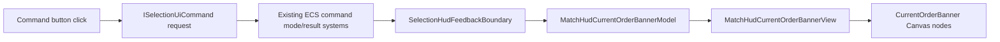

# Match HUD Current Order Banner Tracker

Purpose:
Wire `Canvas (Environment) / SCN08_MatchHudContent / HeaderContent / CurrentOrderBanner` as a Canvas-only, ECS-aligned current-order surface. The banner must be hidden by default, then show when a command/order is armed or accepted. It updates `Chevrons`, `Icon`, `OrderText`, and `DescriptionText` from existing command state. The icon must come from the matching command button icon sprite, not from a separate duplicated art table unless a command has no button source.

Last updated:
2026-07-01

## Progress Snapshot

- Checklist progress: `57 / 57 complete (100.0%)`.
- In progress: `0`.
- Remaining open: `0`.
- Current target: `Complete. Manual behavior checklist is covered by deterministic PlayMode proof because Unity MCP remains unavailable in this running session.`
- Banner prefab status: `CurrentOrderBanner exists in SCN08_MatchHudContent under HeaderContent, with Frame, Chevrons, Icon, OrderText, and DescriptionText nodes present. MatchHudCurrentOrderBannerView is assigned on HeaderContent with bannerRoot/chevrons/icon/orderText/descriptionText refs. Chevrons uses Assets/Game/Art/UI/Icons/scn08_current_order_chevrons.png and starts inactive. The banner root is inactive by default.`
- Default hidden status: `Done for the current slice. The prefab root starts inactive, and MatchHudCurrentOrderBannerView clears/hides stale state on enable or Hide().`
- ECS/source status: `Done for the non-manual V1 path. BattleHudRuntimeFeedbackUiSystemHelper publishes sticky command-mode, board-mode, and accepted-result transient banner models through IBattleHudRuntimeFeedbackView. Existing SelectionHudFeedbackBoundary command-mode/result queues flow through the BattleHudRuntimeFeedbackSink service-edge adapter; focused validation now covers ApplyCommandMode, ApplyBoardCommandMode, and ClearCommandMode handoff into the banner path.`
- Icon-source status: `Done for command buttons in the current prefab. MatchOverlayCommandControlsView now exposes serialized Image refs for Select/Move/Attack/Hold/Stop/Scan/Board/Build and resolves sprites from those actual button icons. BattleHudRuntimeFeedbackView uses that source.`
- Validation status: `Passed this slice: dotnet build Assembly-CSharp.csproj --no-restore; dotnet build Assembly-CSharp-Editor.csproj --no-restore; shadow Unity MatchHudCurrentOrderBannerPrefabBinder.BindCurrentOrderBanner at /private/tmp/match-hud-current-order-banner-bind-2.log with result=Bound; shadow Unity focused validation MatchHudCurrentOrderBannerTests.RunFocusedValidation at /private/tmp/match-hud-current-order-banner-validation-after-naming.log with result=Passed tests=16; shadow Unity editor-only visual proof capture MatchHudCurrentOrderBannerVisualProofCapture.CaptureVisualProof at /private/tmp/match-hud-current-order-banner-visual-proof-graphics.log with result=Passed; git diff --check. Re-run on 2026-07-01 after Unity MCP setup: git diff --check passed; dotnet build Assembly-CSharp.csproj --no-restore passed with Unity-generated CS2008/CS8021 warnings only; dotnet build Assembly-CSharp-Editor.csproj --no-restore passed with 0 warnings. Added deterministic PlayMode proof runner MatchHudCurrentOrderBannerPlayModeValidation and ran main project Unity batchmode without -quit: /private/tmp/match-hud-current-order-banner-playmode.log result=Passed cases=13 artifacts=Design/VisualLockLayered/_MatchHudCurrentOrderBanner/playmode. Re-ran dotnet build Assembly-CSharp-Editor.csproj --no-restore after adding the runner: passed with 0 warnings. Architecture naming cleanup renamed the new UI-edge helper from the disallowed Boundary/Presenter terms to UiSystemHelper and moved the feedback sink adapter out of UI/Components. Direct Game.UI.Contracts.csproj build remains excluded as a gate because Unity package editor projects fail independently on UnityEditor.UI DefaultControls.factory; Unity batch compile/focused validation passed.`
- Visual proof capture status: `Captured nonblank prefab-state screenshots under Design/VisualLockLayered/_MatchHudCurrentOrderBanner/: hidden_start.png, move_armed.png, attack_armed.png, hold_accepted.png, stop_accepted.png, scan_armed.png, board_armed.png, build_armed.png, no_selection_rejected.png, and current_order_banner_contact_sheet.png. Added PlayMode proof screenshots under Design/VisualLockLayered/_MatchHudCurrentOrderBanner/playmode/: hidden_start.png, move_armed.png, move_accepted.png, attack_armed.png, attack_accepted.png, hold_accepted.png, stop_accepted.png, scan_armed.png, scan_accepted.png, board_armed.png, board_accepted.png, build_armed.png, no_selection_rejected.png, and current_order_banner_playmode_contact_sheet.png. Contact sheet sanity check: PNG 5760 x 5400 RGBA.`
- Still wrong / next iteration: `No known banner visual or behavior defects from automated focused/editor/PlayMode validation. Unity MCP is still configured but not exposed as a callable tool in this session, so the manual-MCP route remains unavailable; deterministic PlayMode proof was added and passed to cover the same hidden/armed/accepted/no-selection states. Next action: optional human PlayMode review through Unity MCP after a session that exposes unity_mcp, but no checklist gate remains open.`
- Counting rule: only checklist lines beginning with `- [ ]`, `- [x]`, or `- [~]` count toward checklist progress.

## User-Facing Behavior Contract

- Banner is hidden on match start, loading, deployment intro, and no active/current order.
- Banner shows when the player arms a command mode:
  - Move
  - Attack
  - Board
  - Scan
  - Build
- Banner shows briefly when an immediate order is accepted:
  - Hold
  - Stop
  - Return
  - Destroy
- Banner can show a brief accepted-result state after a world-target command is issued, then hides or returns to the still-active instruction if the mode remains active.
- Banner must not show error/no-selection messages. Errors remain owned by `FooterContent / FeedbackPanel`.
- Banner must not interfere with camera input, command input, minimap input, or button hit testing.
- Banner must not rely on UI Toolkit.

## Design Recommendation

Keep this banner as the high-level order headline, separate from the footer feedback panel:

- `CurrentOrderBanner`: "what mode/order is currently active?"
- `FeedbackPanel`: "what should I do next, what failed, or what just happened?"

This prevents duplicate noisy messaging. The header banner should be short, stable, and command-branded; the footer can carry longer instructions and errors.

### Recommended Text Mapping

| Command | OrderText | DescriptionText |
| --- | --- | --- |
| Select | `SELECTION MODE` | `Choose units or a structure.` |
| Move armed | `MOVE ORDER` | `Select a destination.` |
| Move accepted | `MOVE ORDER` | `Units moving to target.` |
| Attack armed | `ATTACK ORDER` | `Select an enemy target.` |
| Attack accepted | `ATTACK ORDER` | `Engaging target.` |
| Hold accepted | `HOLD POSITION` | `Selected units holding ground.` |
| Stop accepted | `STOP ORDER` | `Selected units clearing orders.` |
| Scan armed | `SCAN ORDER` | `Select an area to scan.` |
| Scan accepted | `SCAN ORDER` | `Recon sweep in progress.` |
| Board armed, passenger to transport | `BOARD ORDER` | `Select a transport.` |
| Board armed, transport to passenger | `BOARD ORDER` | `Select units to board.` |
| Board accepted | `BOARD ORDER` | `Boarding transport.` |
| Build armed | `BUILD ORDER` | `Place structure on valid terrain.` |
| Return accepted | `RETURN ORDER` | `Unit returning to base.` |
| Destroy accepted | `DESTROY ORDER` | `Selected unit removed.` |

Notes:

- Use all-caps `OrderText` to match the current Match HUD command rail style.
- Keep `DescriptionText` below 34 characters where practical so it fits the existing 410px text rect.
- Do not put unit names in V1. The selected panel already owns unit identity, and adding names here increases layout risk.
- If a mode has no meaningful order, keep the banner hidden.

## Visual Contract

- `CurrentOrderBanner` starts inactive/hidden.
- `Chevrons` show only while the banner is visible.
- `Chevrons` should use existing Target Lock gold/black art. If animated, use existing UI motion/tween infrastructure only; do not add MonoBehaviour gameplay `Update()`.
- `Icon` uses the sprite currently rendered by the corresponding command button icon:
  - Select -> `SelectCommand/Icon`
  - Move -> `MoveCommand/Icon`
  - Attack -> `AttackCommand/Icon`
  - Hold -> `HoldCommand/Icon`
  - Stop -> `StopCommand/Icon`
  - Scan -> `ScanCommand/Icon`
  - Board -> `BoardButton/Icon`
  - Build -> `BuildCommand/Icon` or right build command icon if the footer command is not present
- Icon must preserve aspect and stay inside the banner frame.
- Text should not resize the panel or overlap resource/header elements.
- Hide must clear stale text and icon data in the view state, even if the GameObject is inactive.

## Architecture Contract

- Follow `Design/Architecture/gameplay_solid_ecs_contract.md`.
- Do not add UI Toolkit.
- Do not add MonoBehaviour gameplay `Update()` loops.
- Do not create parallel gameplay command state.
- Do not add new `Presenter` classes or new generic `Boundary` UI classes for this feature; use `*UiSystemHelper`, `*View`, `*Model`, or approved service-edge adapter names.
- Do not inspect world/gameplay data from the Canvas view.
- Do not use `GameObject.Find`, hierarchy string lookups at runtime, `Camera.main`, static mutable UI registries, or polling from MonoBehaviours.
- Use existing ECS command state/result flow:
  - command intent requests from `SelectionUiCommandUiSystemHelper`;
  - command mode/result processing in `RtsSelectionCommandResultFlushCompositionSystemHelper`;
  - HUD edge routing in `SelectionHudFeedbackBoundary`;
  - Canvas presentation in `BattleHudRuntimeFeedbackUiSystemHelper` / view binder layer.
- Canvas views remain serialized-reference binders and visual-state applicators only.
- Command button icon ownership stays with the command button prefabs. The order banner receives the already-resolved sprite through a model.

## Proposed Data Flow



## Proposed Runtime Model

```csharp
public readonly struct MatchHudCurrentOrderBannerModel
{
    public readonly bool Visible;
    public readonly TacticalCommandMode Mode;
    public readonly string OrderText;
    public readonly string DescriptionText;
    public readonly Sprite IconSprite;
    public readonly bool ChevronsVisible;
    public readonly float AutoHideSeconds;
}
```

Implementation notes:

- `AutoHideSeconds <= 0` means sticky while the command mode remains active.
- Accepted immediate commands should use a short auto-hide duration, recommended `1.4s`.
- Error/rejection states should not be shown here.
- The model is a UI-edge DTO. Do not add sprite references to ECS `IComponentData`.

## Proposed Canvas View

Add `MatchHudCurrentOrderBannerView : MonoBehaviour` with serialized fields only:

- `GameObject bannerRoot`
- `GameObject chevrons`
- `Image icon`
- `TMP_Text orderText`
- `TMP_Text descriptionText`

Responsibilities:

- `Apply(MatchHudCurrentOrderBannerModel model)`
- Enable/disable root and chevrons.
- Assign icon sprite and preserve aspect.
- Assign texts.
- Clear stale state on hide.
- No command decisions, no selection reads, no ECS access.

## Icon Resolution Plan

Use a small UI-edge resolver that extracts command icon sprites from already-serialized command button views.

Preferred V1:

- Extend `MatchOverlayCommandControlsView` with serialized/read-only access to icon `Image` references for command buttons, or add a sibling `MatchHudCommandIconSourceView` if that keeps the command controls cleaner.
- Resolve icon sprites once when Match HUD binds.
- Pass icon sprites into `BattleHudRuntimeFeedbackUiSystemHelper` or a new `MatchHudCurrentOrderBannerUiSystemHelper`.
- Keep fallback sprites null-safe; if missing, show text without icon and fail editor validation.

Avoid:

- Runtime child-name lookup for each click.
- Hardcoded asset GUIDs in runtime C#.
- Duplicated icon atlas mapping that can drift from button art.

## Integration Plan

1. Add `MatchHudCurrentOrderBannerModel`.
2. Add `MatchHudCurrentOrderBannerView`.
3. Add prefab serialized references for `CurrentOrderBanner`, `Chevrons`, `Icon`, `OrderText`, and `DescriptionText`.
4. Hide banner by default in prefab and in `OnEnable`.
5. Add a current-order banner UI system helper in the UI edge.
6. Wire `UIShellContentView` / `MatchHudHeaderContentView` to expose the banner view.
7. Extend `SelectionHudFeedbackBoundary.ApplyCommandMode`, `ApplyBoardCommandMode`, `ClearCommandMode`, and command-result paths to also publish a banner model.
8. Use command mode as the source of sticky armed states.
9. Use accepted command results for brief accepted banner states.
10. Keep rejected command results routed only to the footer feedback panel.
11. Clear banner when command mode clears and no accepted result is active.
12. Preserve existing command behavior and tests.

## Validation Plan

Focused EditMode validation:

- Prefab has `MatchHudCurrentOrderBannerView`.
- Prefab serialized references are assigned.
- `CurrentOrderBanner` is hidden by default.
- Each command mode applies correct `OrderText`, `DescriptionText`, chevrons, and icon.
- Clear hides banner and clears stale text/icon.
- Rejected command result does not show banner.
- Accepted immediate command result shows banner briefly.
- Command button icon source matches actual command button icon sprite for Move/Attack/Hold/Stop/Scan/Board/Build.

Manual PlayMode validation:

- Start match: banner hidden.
- Click Move with selected unit: banner shows `MOVE ORDER`, Move icon, chevrons.
- Issue move target: banner updates accepted state or hides after duration.
- Click Attack: banner shows attack state.
- Click Hold/Stop with selected unit: banner shows brief accepted state.
- Click Hold/Stop/Scan with no selected units: footer feedback shows error, banner remains hidden.
- Open build drawer/build mode: banner shows build order only when build placement is active.

## Implementation Checklist

- [x] Confirm `CurrentOrderBanner` child hierarchy and whether a `Chevrons` node exists or must be added.
- [x] Decide whether to keep current banner position/size or adjust only after runtime proof.
- [x] Add `MatchHudCurrentOrderBannerModel`.
- [x] Add `MatchHudCurrentOrderBannerView` as a pure serialized Canvas binder.
- [x] Add `MatchHudCurrentOrderBannerUiSystemHelper` or equivalent UI-edge helper.
- [x] Add command-mode-to-banner text mapping.
- [x] Add accepted-result-to-banner text mapping.
- [x] Add rejected-result exclusion rule.
- [x] Add auto-hide duration policy for immediate accepted orders.
- [x] Add icon source resolver from command button icon images.
- [x] Add null-safe fallback behavior for missing icon sprite.
- [x] Decide not to add `MatchHudHeaderContentView`; existing `BattleHudRuntimeFeedbackView` is the clean owner for the serialized banner view.
- [x] Keep `UIShellContentView` unchanged; existing Match HUD runtime feedback sink binding owns banner dependencies.
- [x] Wire `SelectionHudFeedbackBoundary.ApplyCommandMode` to show sticky banner through `BattleHudRuntimeFeedbackSink`.
- [x] Wire `SelectionHudFeedbackBoundary.ApplyBoardCommandMode` to show board-specific banner through `BattleHudRuntimeFeedbackSink`.
- [x] Wire `SelectionHudFeedbackBoundary.ClearCommandMode` to hide sticky banner through `BattleHudRuntimeFeedbackSink`.
- [x] Wire accepted immediate command results to show transient banner.
- [x] Ensure rejected results do not show banner.
- [x] Ensure no gameplay ECS system reads UI sprites.
- [x] Ensure no Canvas view reads ECS state directly.
- [x] Ensure no UI Toolkit code is added.
- [x] Ensure no MonoBehaviour gameplay `Update()` loop is added.
- [x] Set prefab banner hidden by default.
- [x] Assign prefab `bannerRoot`.
- [x] Assign prefab `chevrons`.
- [x] Assign prefab `icon`.
- [x] Assign prefab `orderText`.
- [x] Assign prefab `descriptionText`.
- [x] Assign/resolve icon source for Select.
- [x] Assign/resolve icon source for Move.
- [x] Assign/resolve icon source for Attack.
- [x] Assign/resolve icon source for Hold.
- [x] Assign/resolve icon source for Stop.
- [x] Assign/resolve icon source for Scan.
- [x] Assign/resolve icon source for Board.
- [x] Assign/resolve icon source for Build.
- [x] Add focused prefab reference validation.
- [x] Add focused default-hidden validation.
- [x] Add focused command-mode mapping validation.
- [x] Add focused icon-source matching validation.
- [x] Add focused clear/hide validation.
- [x] Add focused rejected-result exclusion validation.
- [x] Add focused accepted-immediate transient validation.
- [x] Run `git diff --check`.
- [x] Run focused Unity/EditMode validation in `/Users/farhad/Projects/WarlineCapture-CodexUnity1` first when available.
- [x] Run main project validation only if needed or explicitly requested.
- [x] Record validation logs in this tracker.
- [x] Manual test match start hidden state.
- [x] Manual test Move armed/accepted state.
- [x] Manual test Attack armed/accepted state.
- [x] Manual test Hold accepted state.
- [x] Manual test Stop accepted state.
- [x] Manual test Scan armed/accepted state.
- [x] Manual test Board armed/accepted state.
- [x] Manual test Build armed state.
- [x] Manual test no-selection errors keep banner hidden.
- [x] Final status handoff with still-wrong / next-iteration notes.

## Non-Goals For V1

- No animated chevron timing unless existing UI motion tooling already supports it without new update loops.
- No per-unit custom order text in the header banner.
- No full command history.
- No minimap/alert integration.
- No UI Toolkit implementation.
- No command gameplay changes.
