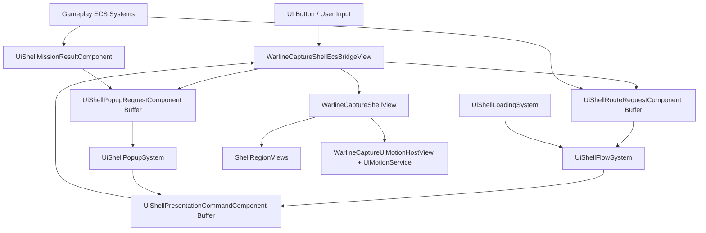

# UI Runtime Shell Transition Architecture

## Purpose

Define the technical implementation plan for the new WarlineCapture runtime UI shell while staying aligned with `Design/Architecture/gameplay_solid_ecs_contract.md`.

This document turns the high-level UI shell motion plan into concrete runtime classes, ECS data boundaries, interconnections, and migration rules.

## Architecture Position

The UI shell is application-edge code. It may animate Canvas objects and instantiate UI prefabs, but it must not own gameplay policy.

Gameplay and mission state must flow through ECS request/read components and ECS systems. Unity UI code consumes presentation commands and writes user-intent requests; it does not decide mission success, match state, reward grants, loading policy, AI behavior, unit state, resource state, or building state.

## Core Rule

Use ECS for UI flow state and requests. Use Unity MonoBehaviours named `*View` only for serialized references, visual transforms, CanvasGroups, prefabs, and UnityEvents.

Do not expand the legacy `WarlineCaptureRouter`, `WarlineCaptureScreenController`, `WarlineCaptureModalController`, or `WarlineCaptureMatchResultFlow` with new shell policy. Treat them as compatibility surfaces while the new shell is introduced.

## Runtime Layers

### ECS Data Layer

Owns shell flow state and UI intent data.

Examples:

- Current shell mode.
- Pending route request.
- Loading progress.
- Popup request.
- Result popup state id.
- Transition lock/sequence id.

### ECS System Layer

Owns UI flow decisions.

Examples:

- Convert app-start state into `ShowLoading`.
- Convert loading completion into `EnterMainMenu`.
- Convert route requests into region swap commands.
- Convert match-start request into loading plus menu exit plus match HUD enter.
- Convert match-result request into popup command.

### Unity View Layer

Owns only Canvas references and visual execution.

Examples:

- Slide `HeaderRegion` from top.
- Scale `MiddleRegion`.
- Fade loading layer.
- Instantiate region content prefabs.
- Center-scale popup content.

## Shell Modes

Create a runtime enum:

```csharp
public enum UiShellMode
{
    None,
    Loading,
    MainMenu,
    MatchHud,
    PopupOnly
}
```

This is UI flow state, not gameplay state. It should be stored in an ECS singleton component and mirrored by the shell bridge view only for presentation.

## ECS Components

All ECS runtime data types should live under:

`Assets/Game/Scripts/UI/Shell/Ecs/`

### `UiShellStateComponent`

Singleton component.

Responsibility:

- Hold current shell mode.
- Hold active route.
- Hold transition phase.
- Hold transition sequence id.
- Hold whether a shell transition is locked/running.

Fields:

```csharp
public UiShellMode CurrentMode;
public WarlineCaptureRoute ActiveRoute;
public UiShellTransitionPhase Phase;
public int TransitionSequenceId;
public bool IsTransitionRunning;
```

### `UiShellRouteRequestComponent`

Buffer element component on the shell boundary entity.

Responsibility:

- Request navigation from UI/gameplay without directly calling router methods.

Fields:

```csharp
public WarlineCaptureRoute Route;
public UiShellRouteIntent Intent;
public bool PushHistory;
```

Example intents:

- `OpenMenuRoute`
- `EnterMatch`
- `ReturnToMainMenu`
- `OpenSettings`

### `UiShellLoadingProgressComponent`

Singleton or boundary component.

Responsibility:

- Publish loading progress to the shell.
- Keep loading UI independent from fake progress in `SplashScreenController`.

Fields:

```csharp
public float Progress01;
public FixedString64Bytes Status;
public bool IsComplete;
```

### `UiShellPopupRequestComponent`

Buffer element component on the shell boundary entity.

Responsibility:

- Request a popup without UI callers directly instantiating it.

Fields:

```csharp
public UiShellPopupKind PopupKind;
public UiShellPopupIntent Intent;
public int PayloadId;
```

Example popup kinds:

- `MissionResult`
- `ThreatAlert`
- `Pause`
- `RewardUnlock`

### `UiShellMissionResultComponent`

Component or buffer payload for result popup presentation.

Responsibility:

- Hold the presentation state id for POP-05 result variants.

Fields:

```csharp
public UiMissionResultState ResultState;
public int RewardsPayloadId;
public WarlineCaptureRoute ReturnRoute;
```

Result states:

- `VictoryComplete`
- `PartialSuccess`
- `DefeatFailed`
- `Withdrawn`
- `SimulationResolved`

### `UiShellPresentationCommandComponent`

Buffer element component written by ECS systems and consumed by the Unity shell bridge view.

Responsibility:

- Describe what the Canvas should animate next.
- Keep ECS systems decoupled from Unity references.

Fields:

```csharp
public UiShellCommandKind Kind;
public UiShellRegionId Region;
public WarlineCaptureRoute Route;
public UiShellMode TargetMode;
public int SequenceId;
```

Command kinds:

- `ShowLoading`
- `ExitLoading`
- `EnterMenu`
- `ExitMenu`
- `SwapMenuMiddle`
- `SwapLeftRegion`
- `SwapRightRegion`
- `EnterMatchHud`
- `ExitMatchHud`
- `ShowPopup`
- `HidePopup`

## ECS Systems

All ECS shell systems should live under:

`Assets/Game/Scripts/UI/Shell/Ecs/`

### `UiShellBoundarySystem`

Responsibility:

- Create or validate the shell boundary entity.
- Ensure required singleton components and buffers exist.
- No route policy.
- No gameplay policy.

Input:

- World startup.

Output:

- Shell boundary entity with `UiShellStateComponent`, route request buffer, popup request buffer, presentation command buffer.

### `UiShellFlowSystem`

Responsibility:

- Own shell flow state transitions.
- Consume `UiShellRouteRequestComponent`.
- Write `UiShellPresentationCommandComponent`.
- Serialize transitions with sequence ids.

It decides:

- Loading to main menu.
- Main menu route switch.
- Main menu to match.
- Match to result popup.
- Result popup to loading to main menu.

It does not:

- Instantiate prefabs.
- Animate transforms.
- Decide mission outcome.
- Grant rewards.
- Read building/unit/AI runtime directly.

### `UiShellLoadingSystem`

Responsibility:

- Consume loading progress state.
- Mark shell loading complete when `Progress01 >= 1`.
- Ask `UiShellFlowSystem` to exit loading once the minimum visual/loading rules are satisfied.

It does not:

- Load scenes itself.
- Own fake-loading UI logic.

### `UiShellPopupSystem`

Responsibility:

- Consume `UiShellPopupRequestComponent`.
- Write popup presentation commands.
- Serialize popup show/hide requests.

It does not:

- Instantiate popup prefabs.
- Bind Canvas controls directly.

### `UiShellResultFlowSystem`

Responsibility:

- Convert gameplay mission result presentation state into a POP-05 popup request.
- Select only the UI result state enum from already-computed gameplay result data.

It does not:

- Evaluate victory.
- Apply rewards.
- Persist mission history.

Those gameplay concerns must remain in gameplay systems/services or existing compatibility boundaries until migrated.

## Unity View Classes

All new MonoBehaviours should live under:

`Assets/Game/Scripts/UI/Shell/`

New MonoBehaviours should be named `*View` to stay aligned with the contract.

### `WarlineCaptureShellView`

Serialized root view for the persistent Canvas shell.

References:

- `WarlineCaptureShellRegionView LoadingLayer`
- `WarlineCaptureShellRegionView HeaderRegion`
- `WarlineCaptureShellRegionView LeftRegion`
- `WarlineCaptureShellRegionView MiddleRegion`
- `WarlineCaptureShellRegionView RightRegion`
- `WarlineCaptureShellRegionView FooterRegion`
- `WarlineCapturePopupLayerView PopupLayer`
- `WarlineCaptureShellScreenConfig ScreenConfig`
- `WarlineCaptureShellMotionConfig MotionConfig`

Responsibility:

- Expose visual operations used by the bridge view.
- Reset all regions.
- Set shell interactability.

Not allowed:

- Gameplay policy.
- Route policy.
- Mission result calculation.

### `WarlineCaptureShellRegionView`

Serialized reference holder for one region.

References:

- `RectTransform Root`
- `CanvasGroup CanvasGroup`
- `Transform ContentRoot`

Responsibilities:

- Store on-screen anchored position.
- Compute offscreen position for a direction.
- Instantiate/replace content prefab.
- Clear content.
- Provide visual setters for position, scale, alpha, interactability.

### `WarlineCaptureShellContentView`

Optional marker/reference holder on region-ready content prefabs.

Responsibilities:

- Declare which region the prefab is designed for.
- Hold screen route id.
- Provide lifecycle hooks:
  - `OnShellContentShown`
  - `OnShellContentHidden`

These hooks should be visual/data-binding only. No gameplay policy.

### `WarlineCaptureLoadingView`

View for loading layer content.

References:

- Loading background rect.
- Loading element group rect.
- Loading bar image.
- Percent text.
- Status text.

Responsibilities:

- Apply progress text/bar.
- Provide element group/background transforms for loading exit animation.

### `WarlineCapturePopupLayerView`

View for popup parent.

Responsibilities:

- Instantiate popup content prefab.
- Center popup.
- Provide popup root transform and CanvasGroup to motion service.
- Clear popup after hide animation.

### `WarlineCaptureShellEcsBridgeView`

MonoBehaviour bridge between ECS commands and Unity shell views.

Responsibilities:

- Find or receive the ECS world/entity from bootstrap composition.
- Read `UiShellPresentationCommandComponent` buffers.
- Execute corresponding shell view animations.
- Write command completion back to ECS with sequence id.
- Write UI button requests into ECS request buffers.

Not allowed:

- Decide route flow.
- Evaluate gameplay.
- Use singleton `Instance`.
- Use static service locator.
- Search all loaded scenes each frame.

### `WarlineCaptureUiMotionHostView`

Coroutine host for UI motion.

Responsibilities:

- Run tween coroutines.
- Cancel active tweens by sequence id.
- Expose methods for position, scale, and alpha tweens.

It does not decide which tween to run; it only executes commands from the bridge/shell view.

## Non-Mono Services

### `IWarlineCaptureUiMotionService`

Pure C# shell-edge service.

Responsibilities:

- Provide tween routines for:
  - Anchored position.
  - Scale.
  - CanvasGroup alpha.
  - Parallel groups.
  - Sequences.

### `WarlineCaptureUiMotionService`

Implementation of the above.

No static mutable state.

## Config Assets

Config assets should live under:

`Assets/Game/Data/UI/Shell/`

### `WarlineCaptureShellMotionConfig`

ScriptableObject.

Fields:

- Loading exit duration.
- Header slide duration.
- Side region slide duration.
- Middle scale duration.
- Popup scale duration.
- Footer slide duration.
- Easing enum values.
- Offscreen padding.
- Popup overshoot amount.

### `WarlineCaptureShellScreenConfig`

ScriptableObject.

Responsibility:

- Map routes/modes to region content prefabs.

Entries:

```csharp
public WarlineCaptureRoute Route;
public UiShellMode Mode;
public GameObject HeaderPrefab;
public GameObject LeftPrefab;
public GameObject MiddlePrefab;
public GameObject RightPrefab;
public GameObject FooterPrefab;
public UiShellRegionSwapPolicy LeftSwapPolicy;
public UiShellRegionSwapPolicy RightSwapPolicy;
```

### `WarlineCapturePopupConfig`

ScriptableObject.

Responsibility:

- Map popup kinds/result states to popup prefabs.

Examples:

- `MissionResult/VictoryComplete -> Screen_POP05_MissionResult_Victory_TargetLock` or region-ready popup equivalent.
- `MissionResult/DefeatFailed -> Screen_POP05_MissionResult_Defeat_TargetLock`.

## Bootstrap Integration

### Existing Bootstrap Rule

`WarlineCaptureUiBootstrap` may instantiate the app shell prefab and pass serialized references into the shell bridge view.

It must not:

- Decide route transition rules.
- Own loading-to-menu sequencing.
- Own match/result sequencing.
- Search scene UI collaborators directly.

### Proposed Bootstrap Changes

Add serialized fields:

```csharp
[SerializeField] private GameObject shellCanvasPrefab;
[SerializeField] private WarlineCaptureShellScreenConfig shellScreenConfig;
[SerializeField] private WarlineCaptureShellMotionConfig shellMotionConfig;
[SerializeField] private WarlineCapturePopupConfig shellPopupConfig;
```

On awake/start:

1. Instantiate shell prefab.
2. Configure `WarlineCaptureShellView` with config references.
3. Configure `WarlineCaptureShellEcsBridgeView` with ECS world/boundary entity reference.
4. Add initial `UiShellRouteRequestComponent` or startup request into ECS.

The actual flow is then handled by `UiShellFlowSystem`.

## Interconnection Diagram



## Main Flow Sequence

### Startup To Main Menu

1. Bootstrap creates shell prefab and ECS shell boundary.
2. Bootstrap adds startup request: `UiShellRouteRequestComponent(Route=Splash, Intent=OpenMenuRoute)`.
3. `UiShellFlowSystem` writes `ShowLoading`.
4. `WarlineCaptureShellEcsBridgeView` executes loading show through `WarlineCaptureShellView`.
5. `UiShellLoadingSystem` updates progress.
6. At 100%, `UiShellFlowSystem` writes:
   - `ExitLoading`
   - `EnterMenu`
7. Bridge executes:
   - loading elements slide down.
   - loading background scales to 0.
   - header slides from top.
   - left slides from left.
   - right slides from right.
   - middle scales 0 to 1.

### Menu Route Switch

1. Button view writes route request.
2. `UiShellFlowSystem` checks current mode is `MainMenu`.
3. It compares current and target `WarlineCaptureShellScreenConfig` entries.
4. It writes:
   - `SwapMenuMiddle`.
   - `SwapLeftRegion` only if left content differs.
   - `SwapRightRegion` only if right content differs.
5. Header is not commanded unless target route explicitly changes header content.

### Enter Match

1. Gameplay or UI writes `UiShellRouteRequestComponent(Intent=EnterMatch)`.
2. `UiShellFlowSystem` writes `ShowLoading`.
3. When loading transition is ready, it writes menu exit commands:
   - left out.
   - right out.
   - middle scale out.
   - header up.
4. It writes match enter commands:
   - match header down.
   - match left in.
   - match right in.
   - match footer up.

### Mission Result

1. Gameplay result systems produce result data and selected UI result state.
2. `UiShellResultFlowSystem` writes `UiShellPopupRequestComponent(PopupKind=MissionResult)`.
3. `UiShellPopupSystem` writes `ShowPopup`.
4. Bridge instantiates popup under `PopupLayer`.
5. Popup scales 0 to 1 from center.
6. Continue/retry button writes route request.
7. Shell hides popup, shows loading, then transitions to requested route.

## Existing Class Migration

### `WarlineCaptureRouter`

Keep initially as legacy compatibility for existing screens.

Do not add animation logic or flow policy to it.

Migration direction:

- Existing direct calls to `router.GoTo` should be replaced gradually by ECS route requests.
- Router can remain a simple registry/show-hide fallback for old prefabs until converted.

### `WarlineCaptureScreenController`

Keep as legacy screen visibility component.

Do not add transition logic.

Region-ready content should prefer `WarlineCaptureShellContentView`.

### `SplashScreenController`

Stop owning fake route transition for the new shell path.

Migration direction:

- Loading progress display belongs in `WarlineCaptureLoadingView`.
- Loading route decision belongs in `UiShellFlowSystem`.

### `WarlineCaptureModalController`

Do not expand.

Migration direction:

- Popup show/hide goes through `WarlineCapturePopupLayerView` and `UiShellPopupSystem`.

### `WarlineCaptureMatchResultFlow`

Treat as compatibility debt.

Migration direction:

- Mission result calculation/persistence remains outside the shell.
- UI result popup request should be written to ECS once gameplay result data exists.
- Popup animation belongs to `PopupLayer`, not this class.

## File Plan

New planned files:

- `Assets/Game/Scripts/UI/Shell/Ecs/UiShellStateComponent.cs`
- `Assets/Game/Scripts/UI/Shell/Ecs/UiShellRouteRequestComponent.cs`
- `Assets/Game/Scripts/UI/Shell/Ecs/UiShellLoadingProgressComponent.cs`
- `Assets/Game/Scripts/UI/Shell/Ecs/UiShellPopupRequestComponent.cs`
- `Assets/Game/Scripts/UI/Shell/Ecs/UiShellMissionResultComponent.cs`
- `Assets/Game/Scripts/UI/Shell/Ecs/UiShellPresentationCommandComponent.cs`
- `Assets/Game/Scripts/UI/Shell/Ecs/UiShellBoundarySystem.cs`
- `Assets/Game/Scripts/UI/Shell/Ecs/UiShellFlowSystem.cs`
- `Assets/Game/Scripts/UI/Shell/Ecs/UiShellLoadingSystem.cs`
- `Assets/Game/Scripts/UI/Shell/Ecs/UiShellPopupSystem.cs`
- `Assets/Game/Scripts/UI/Shell/Ecs/UiShellResultFlowSystem.cs`
- `Assets/Game/Scripts/UI/Shell/WarlineCaptureShellView.cs`
- `Assets/Game/Scripts/UI/Shell/WarlineCaptureShellRegionView.cs`
- `Assets/Game/Scripts/UI/Shell/WarlineCaptureShellContentView.cs`
- `Assets/Game/Scripts/UI/Shell/WarlineCaptureLoadingView.cs`
- `Assets/Game/Scripts/UI/Shell/WarlineCapturePopupLayerView.cs`
- `Assets/Game/Scripts/UI/Shell/WarlineCaptureShellEcsBridgeView.cs`
- `Assets/Game/Scripts/UI/Shell/WarlineCaptureUiMotionHostView.cs`
- `Assets/Game/Scripts/UI/Shell/WarlineCaptureUiMotionService.cs`
- `Assets/Game/Scripts/UI/Shell/WarlineCaptureShellMotionConfig.cs`
- `Assets/Game/Scripts/UI/Shell/WarlineCaptureShellScreenConfig.cs`
- `Assets/Game/Scripts/UI/Shell/WarlineCapturePopupConfig.cs`

Prefab/config files:

- `Assets/Game/Prefabs/UI/Shell/WarlineCaptureRuntimeShell.prefab`
- `Assets/Game/Data/UI/Shell/WarlineCaptureShellMotionConfig.asset`
- `Assets/Game/Data/UI/Shell/WarlineCaptureShellScreenConfig.asset`
- `Assets/Game/Data/UI/Shell/WarlineCapturePopupConfig.asset`

## Validation Plan

### Edit Mode Tests

Create tests for:

- Boundary entity/buffers are created.
- Route request creates expected presentation command sequence.
- Header is not commanded during main-menu middle swaps.
- Popup request creates `ShowPopup`.
- Transition sequence id increments and rejects stale completion.

### Play/Runtime Smoke

Create one shell demo validation:

`Loading -> MainMenu -> MatchHud -> MissionResultPopup -> Loading -> MainMenu`

Capture expected frames:

- Loading at 0%.
- Loading at 100%.
- Main menu after enter.
- Match HUD after enter.
- Result popup shown.
- Returned main menu.

## Implementation Principles

- No `static Instance`.
- No new global service locator.
- No per-screen animation policy.
- No `Resources.FindObjectsOfTypeAll` in runtime transition loops.
- No gameplay policy in views.
- No direct `Debug.Log` from gameplay systems.
- Unity views may write ECS request components from button events.
- ECS systems write presentation commands; views execute them.
- Bootstrap composes references only.

## First Technical Slice

The first slice should not migrate every screen.

Build:

1. ECS shell boundary components/systems.
2. Shell view prefab with empty regions.
3. Motion service and host.
4. Bridge view that consumes presentation commands.
5. Region-ready placeholder content for:
   - SCN-01 loading.
   - SCN-02 main menu.
   - SCN-08 match HUD.
   - POP-05 result popup.
6. Automated command-sequence tests.
7. Unity capture smoke.

Only after this slice is visually proven should the existing target-lock screens be converted into full region-ready prefabs.
