# WarlineCapture UI/UX Screen & Popup Implementation Spec

Version A visual mockups + Version B Codex/Unity Canvas reading guide. This Markdown version is designed for Codex ingestion and uses relative image paths.

## Global UI implementation rules
- **Active visual direction:** WarlineCapture gameplay/key art now uses the premium 2D isometric mobile RTS direction in `Design/2D_Isometric_Production_Direction.md` and `Design/2D_Isometric_Art_Bible.md`. Older current-asset references in this spec are historical source references only. UI chrome should use the accepted WarlineCapture HUD style from visual-lock targets: dark graphite panels, cyan edge highlights, orange/gold accents, clean sliced frames, Oxanium typography, and separated reusable Canvas layers.
- **Resolution:** The boards are landscape 3840x2160 presentation references. In Unity, use Canvas Scaler = Scale With Screen Size, reference resolution 1920x1080 or 3840x2160 depending on project convention; keep safe-area padding for mobile devices.
- **Routing:** All mode screens share one app shell: SafeAreaRoot > HeaderBar > ContentRoot > FooterBar > ModalOverlay > TooltipLayer. Tactical MatchScene has a persistent HUD plus overlay canvases for drawers, wheels, and modals.
- **Game design relationship:** Saga screens implement the level-based map and star progression; Operation screens implement the multi-week city security campaign; Quick Custom setup implements replayable skirmishes and AI tuning.
- **Base shell hierarchy:** CanvasRoot / SafeAreaRoot / HeaderBar / ContentRoot / FooterBar / ModalOverlay / TooltipLayer
- **Tactical HUD hierarchy:** MatchHUDCanvas / TopHUD(ObjectivePanel, ThreatFeedPanel, ResourceBar) / BottomHUD(SquadTray, CommandBar, MiniMapPanel, BuildToggle) / ContextOverlay(CommandWheelCanvas) / ModalOverlay
- **Prefab naming:** Use PascalCase prefab names: ModeCardView, StatTileView, UnitCardView, ObjectiveRowView, RewardItemView, ActionButtonView, PopupFrameView.
- **Model binding:** Each screen should have a ViewModel or controller object. Do not hard-code mockup text into the prefab except for editor preview values.
- **Gameplay element contract:** Every visible UI element, including labels, images, icons, cards, rows, maps, meters, badges, tabs, button groups, buttons, dropdowns, toggles, sliders, and clickable items, must have a gameplay purpose, data binding, state rule, and feedback/decorative role in `Design/UIUX_Gameplay_Element_Alignment.md` before implementation. Elements without a live runtime system must be explicitly `Locked`, `DesignedUnavailable`, `DevOnly`, or `ReadOnly`; do not ship silent inert UI.
- **Localization:** All player-facing text should use string keys. Keep mockup labels as English source values only.
- **Accessibility:** Respect Large Text, High Contrast UI, and colorblind settings. Icons must remain distinguishable without color alone.
- **Modal behavior:** Blocking popups use ModalOverlay with dark scrim. Non-blocking alerts use ToastOverlay/ThreatFeedPanel and should not pause simulation unless marked critical.
- **Canonical visual-lock targets:** The high-quality generated target PNG paths for all `SCN-*`, `POP-*`, and `PREFAB-*` surfaces are listed in `Design/UIUX_Mockup_To_Canvas_Conversion_Plan.md` under `Canonical Visual-Lock Target Inventory`. Use those `Design/VisualLock/...` files for production Canvas matching; the JPGs embedded below remain source/content references.

## Screens and Popups

### SCN-01 - Splash / Loading
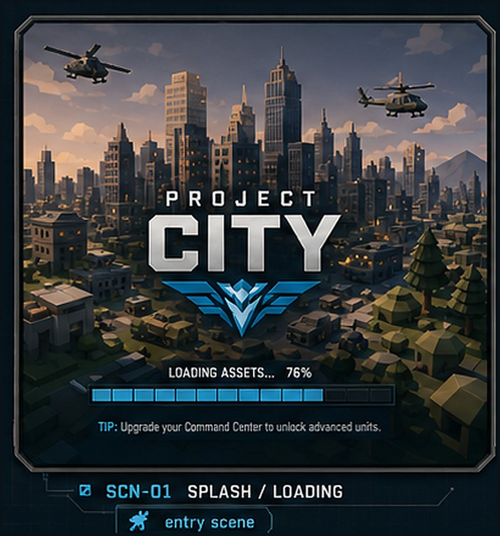

**Where shown:** Shown immediately on app launch, during cold start, and when returning from a deep mode load that needs asynchronous asset preparation.

**Game design link:** Supports the AAA polish target in GDD sections 3.3 and 11.4. It is the first player-facing proof that the game is a polished mobile RTS, and it hides mode/map loading before Main Menu.

**Player/UX purpose:** Set tone, communicate the brand, and give loading feedback without exposing technical loading noise.

**Text labels and meaning:**
- PROJECT CITY logo and emblem: brand identity.
- LOADING ASSETS... 76%: async load progress.
- Tip line: teaches upgrades and command-center progression while the player waits.

**Images/icons and meaning:**
- Premium 2D isometric city skyline, helicopters, and military base scenery: establishes the active urban military RTS setting.
- Dark beveled frame and cyan progress bar: matches Military Combat HUD UI kit direction.

**Buttons and controls:**
- No player button by default. Optional Skip/Continue may appear only after minimum load time when the next scene is ready.

**Unity/Codex implementation:** Scene SplashScene. Canvas SplashCanvas. Root panels: SafeAreaRoot, LogoRoot, LoadingBar, StatusText, TipText. Bind LoadingBar.value to AsyncOperation.progress; randomize TipText from loading tips table.

**Runtime data bindings:**
- Loading progress
- Localized loading tips
- Next route: MainMenuScene

**Navigation / trigger:** Auto-routes to SCN-02 Main Menu / Mode Select when all required assets are ready.

### SCN-02 - Main Menu / Mode Select
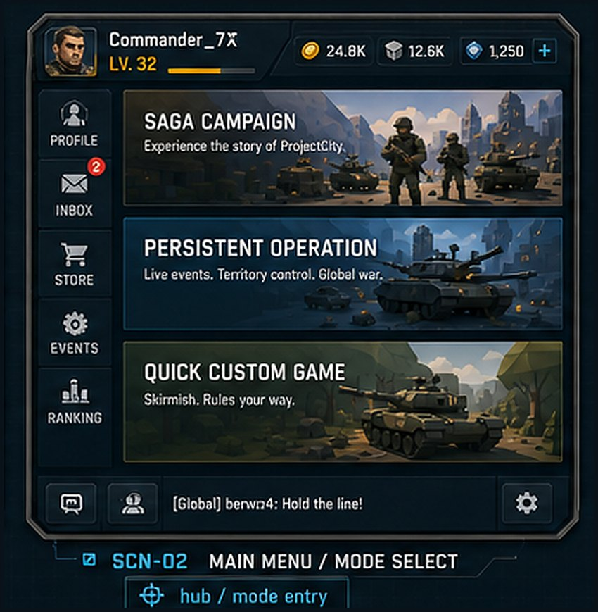

**Where shown:** Shown after Splash, after mission results, and whenever the player exits back to the hub.

**Game design link:** Directly implements the three-mode product structure from GDD sections 1, 7, 8, and 9: Saga Campaign, Persistent Operation, and Quick Custom Game.

**Player/UX purpose:** Let the player choose the game mode quickly while seeing account progression, resources, and secondary navigation.

**Text labels and meaning:**
- Commander_7X, LV. 32: current player identity and progression.
- Resource counters 24.8K, 12.6K, 1,250: Credits, Materials, and Command Authority.
- SAGA CAMPAIGN: story and level progression entry.
- PERSISTENT OPERATION: long saved operation mode entry.
- QUICK CUSTOM GAME: sandbox/skirmish entry.
- Global chat/status strip: local Command Feed showing system notices, completed rewards, Operation reports, and platform social messages through the same feed integration state.

**Images/icons and meaning:**
- Premium 2D isometric mode-card art: soldiers and armor for Saga, district command/logistics for Persistent Operation, tactical map/armor for Quick Custom.
- Commander avatar and left navigation icons: profile/store/events/ranking access.

**Buttons and controls:**
- Mode cards are primary buttons.
- Profile, Inbox, Store, Events, Ranking are side-navigation buttons.
- Plus button beside resources opens resource detail and Command Exchange or details.
- Gear button opens Settings.
- Bottom icons open chat/social/commander shortcuts.

**Unity/Codex implementation:** Scene MainMenuScene. Canvas MainMenuCanvas. Panels: TopProfileBar, ModeCardList, LeftNav, BottomUtilityBar. Each mode card is a prefab using ModeCardView with title, subtitle, image, progress state, and OnClick route.

**Runtime data bindings:**
- PlayerProfile
- ResourceWallet, canonical resources
- ModeUnlockState
- UnreadInboxCount
- LiveEventState

**Navigation / trigger:** Saga card -> SCN-05. Persistent Operation card -> SCN-11. Quick Custom Game card -> SCN-13. Profile icon -> SCN-03. Gear -> SCN-04.

### SCN-03 - Commander Profile
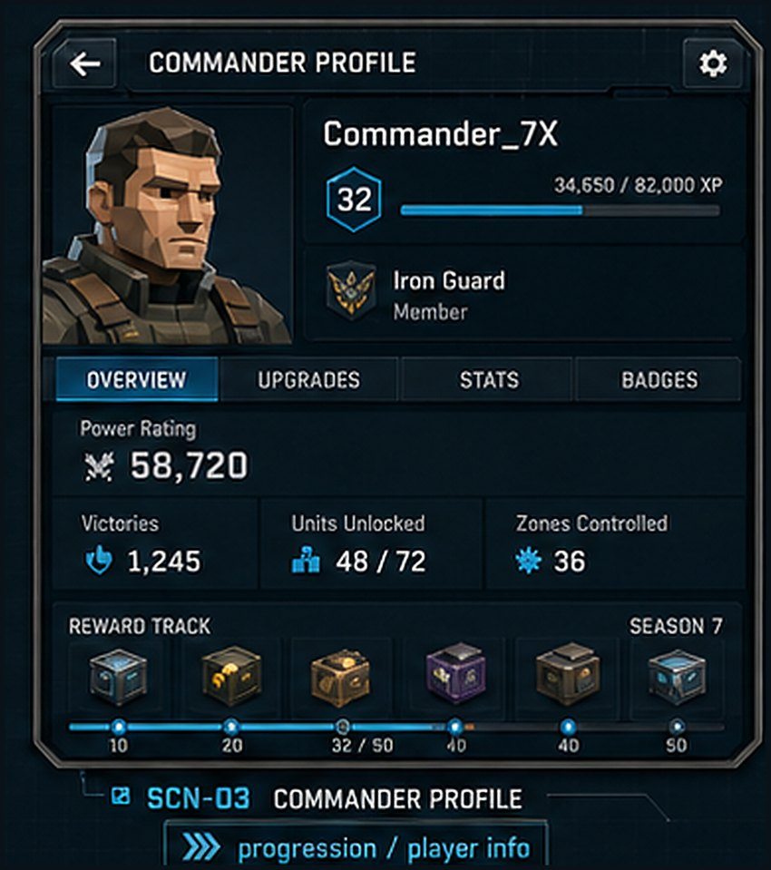

**Where shown:** Shown from the Main Menu side navigation, after ranking/reward interactions, and from any screen that allows player-profile inspection.

**Game design link:** Implements GDD section 13 Player Progression and section 13.2 Upgrade Categories. It also supports long-term rewards across all three modes.

**Player/UX purpose:** Show player identity, XP, power rating, unit unlock progress, controlled zones, and seasonal reward track.

**Text labels and meaning:**
- COMMANDER PROFILE: screen title.
- Commander_7X and level badge 32: account identity and current level.
- XP bar and numeric XP: progression to next level.
- Iron Guard / Member: player alliance or squad affiliation value from PlayerProfileState.
- Power Rating 58,720: aggregate account strength.
- Victories, Units Unlocked, Zones Controlled: cross-mode summary stats.
- Reward Track / Season 7: seasonal or campaign reward progression.

**Images/icons and meaning:**
- Premium 2D isometric commander portrait or stylized profile art: player persona.
- Reward tiles and badges: deterministic rewards, cosmetics, and canonical resources.
- Shield/insignia icons: faction/alliance identity.

**Buttons and controls:**
- Back arrow returns to previous screen.
- Gear opens profile settings or account options.
- Overview, Upgrades, Stats, Badges tabs switch content panels.
- Reward track nodes open deterministic reward details and claim earned nodes.

**Unity/Codex implementation:** Scene ProfileScene. Canvas ProfileCanvas. Panels: HeaderBar, PortraitPanel, TabBar, StatsPanel, RewardTrackPanel. Use a TabController and reusable StatTile prefab.

**Runtime data bindings:**
- PlayerProfile
- CommanderXP
- AccountStats
- UnitUnlockCollection
- RewardTrackProgress

**Navigation / trigger:** Back -> Main Menu or calling screen. Tabs stay within ProfileScene.

### SCN-04 - Settings & Accessibility
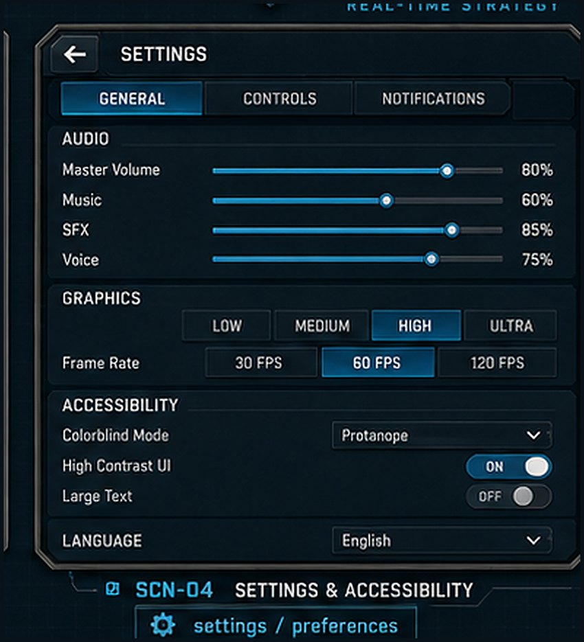

**Where shown:** Shown from Main Menu, Pause menu, and optionally from first-run onboarding.

**Game design link:** Supports GDD section 11.4 Accessibility and Readability, and the AAA mobile quality bar in section 3.3.

**Player/UX purpose:** Give players control over audio, graphics, controls, notifications, accessibility, and language.

**Text labels and meaning:**
- SETTINGS: screen title.
- General, Controls, Notifications tabs: settings categories.
- Audio labels and percentages: volume controls.
- Graphics quality and frame rate labels: performance tuning.
- Colorblind Mode, High Contrast UI, Large Text: accessibility features.
- Language: localization entry.

**Images/icons and meaning:**
- Sliders, toggle switches, segmented buttons, dropdowns: WarlineCapture HUD-style settings controls.

**Buttons and controls:**
- Back arrow returns to previous screen.
- Tab buttons swap settings category.
- Quality and frame-rate segmented buttons choose discrete settings.
- Toggles switch accessibility options.
- Dropdowns choose colorblind mode or language.

**Unity/Codex implementation:** Scene SettingsScene or modal overlay. Canvas SettingsCanvas. Panels: HeaderBar, TabStrip, SettingsScrollView, FooterButtons. Persist values through SettingsService and PlayerPrefs/cloud settings.

**Runtime data bindings:**
- AudioSettingsModel
- GraphicsSettingsModel
- AccessibilitySettingsModel
- LocalizationSettings

**Navigation / trigger:** Back -> calling screen. Settings can be opened from SCN-02 and POP-07.

### SCN-05 - Saga Map
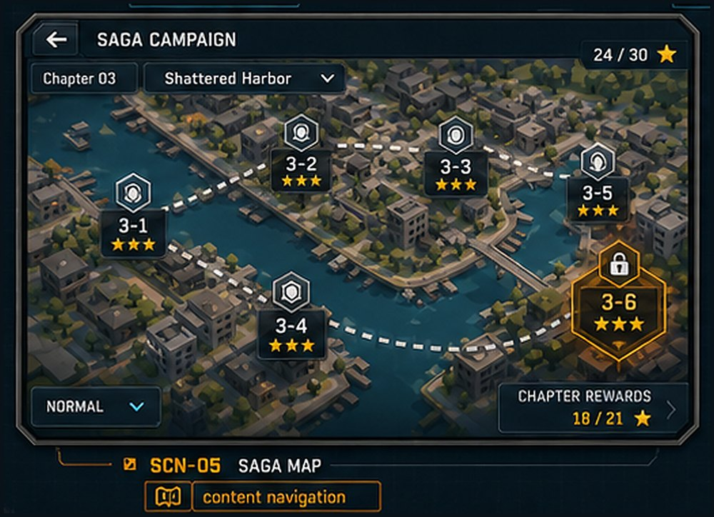

**Where shown:** Shown when the player enters Saga Campaign from the Main Menu.

**Game design link:** Implements GDD section 7 Saga Campaign: curated mission nodes, chapter unlocks, stars, and rewards. Chapter 1 node data comes from `SagaChapters/Saga_Chapter01_First_Response.md`; player-facing Chapter 1 title is `First Response`.

**Player/UX purpose:** Let the player browse chapter nodes, see completion stars, select missions, and collect chapter rewards.

**Text labels and meaning:**
- SAGA CAMPAIGN: mode title.
- Chapter selector label: bound to `ChapterConfig.PlayerFacingTitle` such as `First Response`.
- Star count: bound to completed star progress for the selected chapter.
- Node labels: bound to `SagaMissionNodeConfig` and mission display name, not baked mockup text.
- NORMAL: difficulty selector.
- CHAPTER REWARDS: reward progress for chapter stars.

**Images/icons and meaning:**
- Premium 2D isometric city/island map with waterways, bridges, and district blocks: saga path visualization.
- Node icons and dotted route: progression path.
- Gold highlighted node: currently selected or next playable mission.

**Buttons and controls:**
- Back arrow returns to Main Menu.
- Chapter dropdown changes chapter.
- Mission nodes select MissionConfig.
- Difficulty dropdown changes mission difficulty if unlocked.
- Chapter Rewards opens reward detail panel.

**Unity/Codex implementation:** Scene SagaMapScene. Canvas SagaMapCanvas. Panels: HeaderBar, ChapterSelector, MapViewport, NodeInfoPanel, FooterBar. Use SagaMapController to populate node prefabs from MissionConfig list.

**Runtime data bindings:**
- SagaProgress
- ChapterConfig
- MissionConfig
- ScenarioSetup
- LevelId / IsoMapId
- MapPreviewArtId
- StarProgress
- UnlockState

**Navigation / trigger:** Select playable node -> SCN-06 Mission Briefing. Back -> SCN-02.

### SCN-06 - Mission Briefing
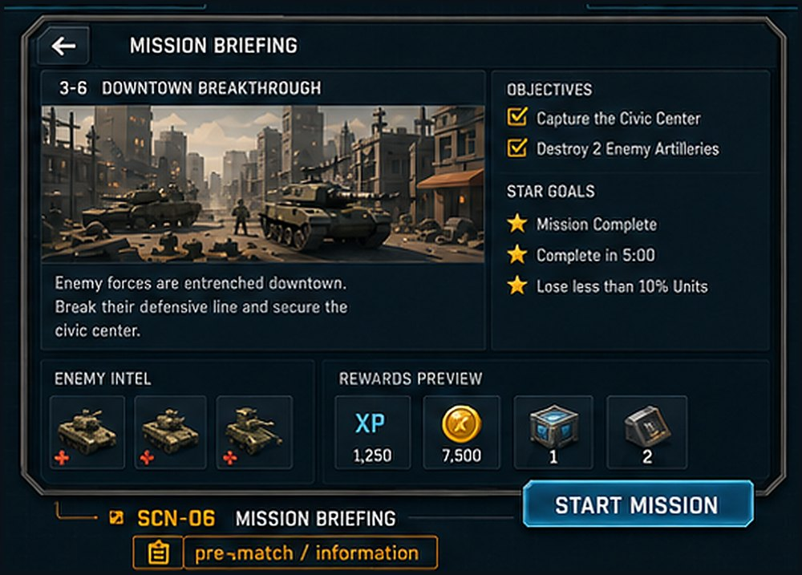

**Where shown:** Shown after selecting a Saga node, a generated operation mission, or a curated quick preset that needs preview information.

**Game design link:** Supports GDD sections 7.3, 7.5, and 10.2: MissionConfig, ScenarioSetup, Level/Map preview, objectives, enemy intel, and rewards.

**Player/UX purpose:** Explain the mission before deployment: objective, threat, star goals, expected enemy, and reward preview.

**Text labels and meaning:**
- MISSION BRIEFING and mission title: mission identity.
- Briefing paragraph: narrative and tactical context.
- Level / Map line: battlefield identity and map preview reference for the selected ScenarioSetup.
- OBJECTIVES: required win conditions.
- STAR GOALS: visible bonus scoring goals.
- ENEMY INTEL: preview of expected unit families.
- REWARDS PREVIEW: Commander XP, Credits, Materials, Fuel, Intel, Rush Tickets, Gear Modules, or explicit unlock items.

**Images/icons and meaning:**
- Premium 2D isometric mission key art: city street combat with armor, bound to `MapPreviewArtId` when a mission-specific preview exists.
- Enemy intel thumbnails: expected threats.
- Reward icons: deterministic grants from `Economy_Reward_Design.md`.

**Buttons and controls:**
- Back arrow returns to Saga Map or source screen.
- START MISSION proceeds to Loadout or directly to match depending on mode rules.
- Enemy intel tiles and reward tiles open deterministic detail tooltips with threat strength, reward type, amount, source, and grant rule.

**Unity/Codex implementation:** Scene MissionBriefingScene. Canvas BriefingCanvas. Panels: HeaderBar, MissionImagePanel, ObjectivePanel, IntelPanel, RewardPanel, PrimaryCTA. Populate from MissionConfig and RewardConfig.

**Runtime data bindings:**
- MissionConfig
- ScenarioSetup
- LevelId / IsoMapId
- MapPreviewArtId
- ObjectiveConfig
- AIProfileConfig
- RewardConfig
- PlayerUnlockState

**Navigation / trigger:** Start Mission -> SCN-07 Loadout / Squad Prep. Back -> SCN-05 or calling operation/custom setup.

### SCN-07 - Loadout / Squad Prep
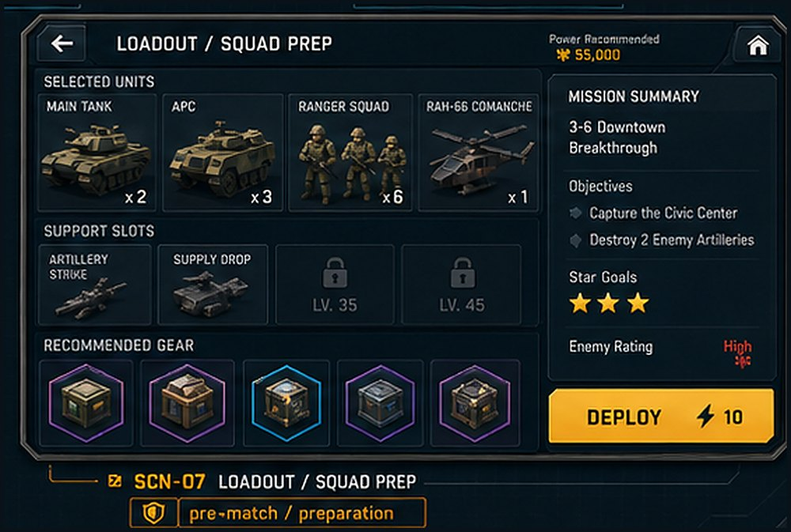

**Where shown:** Shown before launching a mission that allows player loadout choice.

**Game design link:** Supports GDD sections 7.7 rewards/unlocks, 11.1 mobile-first controls, and 13.2 upgrade categories.

**Player/UX purpose:** Let the player choose units, support abilities, and gear while checking mission power requirements and objectives.

**Text labels and meaning:**
- LOADOUT / SQUAD PREP: screen title.
- Power Recommended 55,000: difficulty/power target.
- Selected Units: chosen squads/vehicles/aircraft and counts.
- Support Slots: tactical support abilities and locked slots.
- Recommended Gear: upgrade/boost item suggestions.
- Mission Summary: objectives, star goals, enemy rating.
- DEPLOY 10: launch button and energy/fuel cost.

**Images/icons and meaning:**
- Premium 2D isometric tank, APC, infantry, and aircraft cards.
- Crate/module gear icons with rarity-colored borders.
- Lock icons for slots gated by level.

**Buttons and controls:**
- Back returns to briefing.
- Home returns to main hub after confirmation.
- Unit cards open roster selector.
- Support slot cards open support selector.
- Gear cards open equipment selector.
- Deploy launches MatchScene.

**Unity/Codex implementation:** Scene LoadoutScene. Canvas LoadoutCanvas. Panels: HeaderBar, UnitRosterGrid, SupportSlotsPanel, GearPanel, MissionSummaryPanel, DeployButton. Validate loadout against mission rules before enabling Deploy.

**Runtime data bindings:**
- PlayerUnitRoster
- SelectedLoadout
- SupportAbilityInventory
- GearInventory
- MissionConfig
- ScenarioSetup
- MissionRestrictions
- DeployCost

**Navigation / trigger:** Deploy -> MatchScene with GameModeConfig and loadout payload.

### SCN-08 - RTS Battle HUD
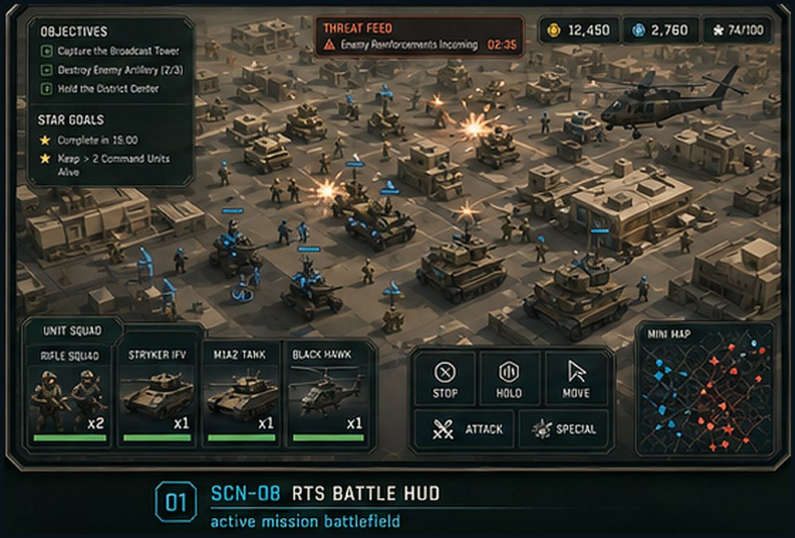

**Where shown:** Shown during active tactical missions in Saga, Persistent Operation, and Quick Custom Game.

**Game design link:** Implements GDD sections 5.1 Match-Level Loop, 5.2 Combat Micro Loop, and 11.2 HUD Layout.

**Player/UX purpose:** Keep real-time battlefield information readable on mobile: objectives, threats, resources, squad cards, commands, and minimap.

**Text labels and meaning:**
- OBJECTIVES: current required mission tasks.
- STAR GOALS: visible bonus scoring conditions.
- THREAT FEED: current warning or timed event.
- Resource counters: Credits, Materials, Fuel, Build Capacity, or mission-specific supply labels from the canonical economy/resource config.
- Unit Squad: selected squads and health/status.
- Mini Map: tactical overview.

**Images/icons and meaning:**
- Premium 2D isometric battlefield with friendly units, enemy units, effects, aircraft, vehicles, and city/base structures.
- Unit cards and command buttons: player control surfaces.

**Buttons and controls:**
- Squad cards select/focus squads.
- STOP, HOLD, MOVE, ATTACK, SPECIAL issue commands.
- Build button opens SCN-09 Build Drawer.
- Minimap can jump camera or expand.
- Pause button opens POP-07 Pause / Options.

**Unity/Codex implementation:** Scene MatchScene. Canvas MatchHUDCanvas. Panels: ObjectivePanel, ThreatFeedPanel, ResourceBar, SquadTray, CommandBar, MiniMapPanel, BuildToggle. Use anchors: objective top-left, resources top-right, squad tray bottom-left, commands bottom-center/right.

**Runtime data bindings:**
- ObjectiveRuntimeState
- ThreatFeedState
- FactionResourceState
- SelectedUnitGroup
- MiniMapState

**Navigation / trigger:** Battle HUD remains active until win/loss -> POP-05, pause -> POP-07, build -> SCN-09 overlay.

### SCN-09 - Build Drawer / Production
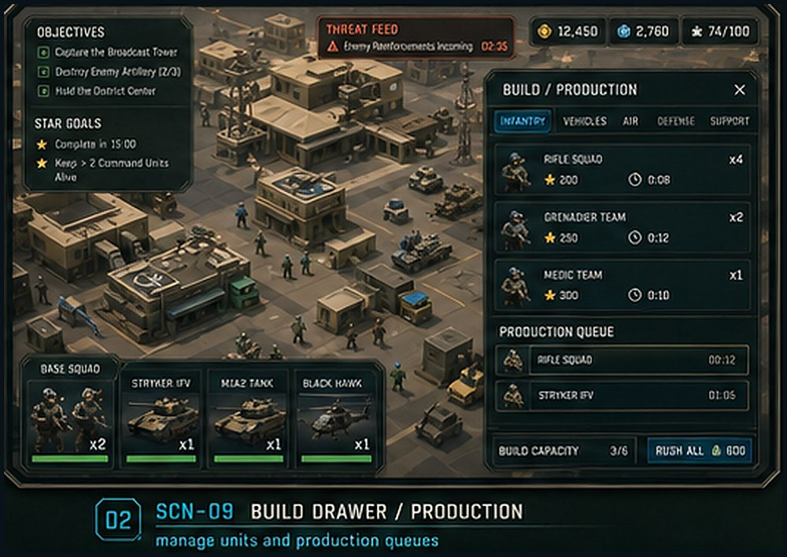

**Where shown:** Shown as an overlay/drawer during MatchScene when the player taps Build or a production facility.

**Game design link:** Uses existing base-building, production, and economy systems described in GDD section 2, plus mobile drawer guidance in section 11.1.

**Player/UX purpose:** Let the player build structures and queue units without leaving the battlefield.

**Text labels and meaning:**
- BUILD / PRODUCTION: drawer title.
- Tabs: Infantry, Vehicles, Air, Defense, Support/Economy/Civilian depending on mission rules.
- Item names: Rifle Squad, Grenadier Team, Medic Team, or structures.
- Costs and timers: resource and production-time feedback.
- Production Queue: currently queued items and remaining time.
- Build Capacity: supply/population cap.
- Rush All: Rush Ticket queue-acceleration action for missions that allow production acceleration.

**Images/icons and meaning:**
- Premium 2D isometric item thumbnails for units/buildings.
- Queue rows and tabs styled with accepted WarlineCapture HUD panels.

**Buttons and controls:**
- Category tabs filter build list.
- Build item rows create placement mode or queue production.
- Queue X cancels item.
- Rush All accelerates queued production if enabled.
- Close X hides drawer.

**Unity/Codex implementation:** Overlay in MatchScene. Canvas BuildDrawerCanvas or child of MatchHUDCanvas. Panels: CategoryTabs, BuildListScroll, ProductionQueuePanel, CapacityBar, RushButton. Use ScrollRect + object pooling for list items.

**Runtime data bindings:**
- AllowedBuildCatalog
- FactionResources
- ProductionQueue
- BuildCapacity
- TechUnlockState

**Navigation / trigger:** Select structure -> POP-03 Build Placement. Select unit -> queue production. Close -> SCN-08 Battle HUD.

### SCN-10 - Unit Command / Command Wheel
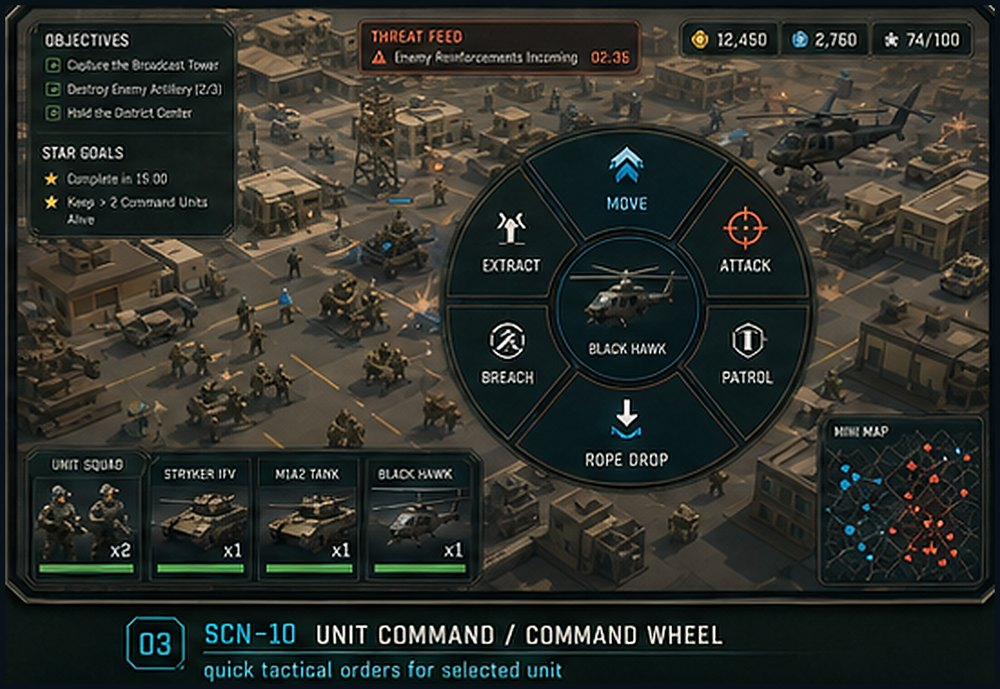

**Where shown:** Shown during MatchScene when the player long-presses or taps command mode for a selected squad, vehicle, or aircraft.

**Game design link:** Direct implementation of GDD section 11.3 Command Wheel and mobile-first RTS control philosophy.

**Player/UX purpose:** Expose fast contextual orders without requiring PC-style hotkeys.

**Text labels and meaning:**
- Selected unit label such as BLACK HAWK or Ranger Squad.
- Radial commands: Move, Attack, Patrol, Breach, Extract, Rope Drop, Stop/Hold depending on unit type.
- Mini Map and squad cards remain visible for context.

**Images/icons and meaning:**
- Large radial wheel over premium 2D isometric combat scene.
- Unit icon in wheel center clarifies command target.

**Buttons and controls:**
- Wheel segments issue commands.
- Move/Attack require target selection after command tap.
- Rope Drop / Extract only enabled for transport aircraft or eligible units.
- Breach only enabled near gates/walls/compounds.

**Unity/Codex implementation:** Overlay in MatchScene. Canvas CommandWheelCanvas. Panels: SelectedEntityCard, RadialCommandRoot, CommandButtons, ContextInfo. Generate wheel segments from selected unit command capability list.

**Runtime data bindings:**
- SelectedEntity
- CommandCapabilitySet
- ContextTarget
- UnitTransportState
- PathingState

**Navigation / trigger:** Command executes then overlay closes or remains pinned depending on control setting.

### SCN-11 - Persistent Operation Dashboard
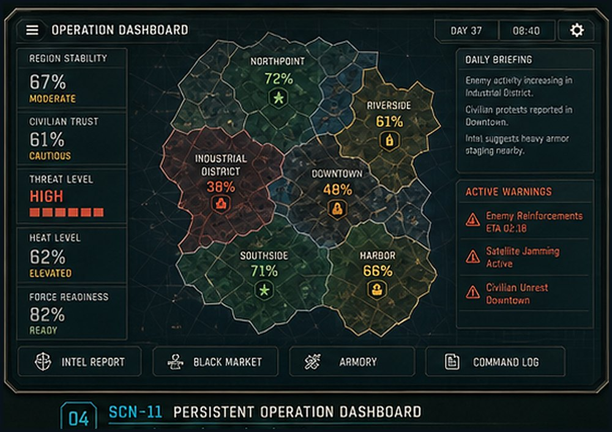

**Where shown:** Shown when entering Persistent Operation and between tactical missions/days.

**Game design link:** Implements GDD section 8 Persistent City Operation: district state, trust, stability, threat, heat, and day flow.

**Player/UX purpose:** Let the player manage a long saved city operation at the strategic layer.

**Text labels and meaning:**
- OPERATION DASHBOARD: mode title.
- Region Stability, Civilian Trust, Threat Level, Heat Level, Force Readiness: core operation meters.
- District labels and percentages: per-district status.
- Daily Briefing: narrative/system summary for current day.
- Active Warnings: urgent threats that may launch tactical missions.

**Images/icons and meaning:**
- District map with colored regions and status icons.
- Warning icons and premium 2D isometric tactical styling.

**Buttons and controls:**
- Back arrow returns to Main Menu after any required save check.
- Intel Report opens intel summary.
- Black Market opens the Operation category of Command Exchange with deterministic supply offers.
- Armory opens upgrades/loadouts.
- Command Log opens history.
- District regions open SCN-12 District Detail.
- Active Warning rows open warning/event detail or route to generated mission briefing.
- End Day resolves the Operation simulation, saves state, and opens POP-06 End of Day Report.

**Unity/Codex implementation:** Scene OperationDashboardScene. Canvas OperationDashboardCanvas. Panels: RegionMapViewport, MetricSidebar, DailyBriefingPanel, WarningList, BottomActionBar. Bind map regions to DistrictState objects.

**Runtime data bindings:**
- OperationSaveState
- DistrictState[]
- OperationDay
- ActiveEventList
- PlayerReadiness

**Navigation / trigger:** Select district -> SCN-12. Start event mission -> SCN-06 or SCN-07 depending on mission setup. End day -> POP-06.

### SCN-12 - District Detail / Actions
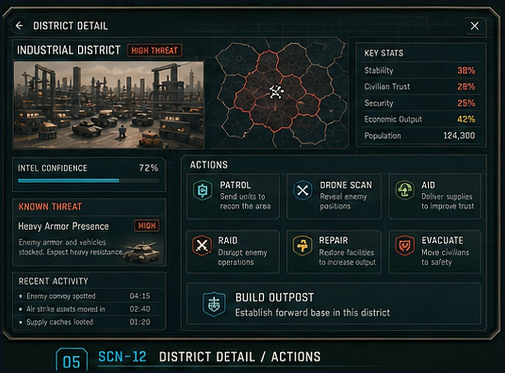

**Where shown:** Shown after selecting a district from Persistent Operation Dashboard.

**Game design link:** Supports GDD sections 8.5 District Model, 8.6 Hidden Cell Model, and 8.7 Player Actions.

**Player/UX purpose:** Let the player inspect a district, understand its risk, and choose strategic actions.

**Text labels and meaning:**
- District title and High Threat tag: identity and alert level.
- Key Stats: stability, civilian trust, security, economic output, population.
- Intel Confidence: how reliable the current information is.
- Known Threat: current visible threat estimate.
- Recent Activity: last system events.
- Actions: Patrol, Drone Scan, Aid, Raid, Repair, Evacuate, Build Outpost.

**Images/icons and meaning:**
- District key art and small map inset.
- Action icons: shield, drone, aid, raid, repair, evacuation, outpost.

**Buttons and controls:**
- Back arrow returns to Operation Dashboard.
- Patrol reduces local threat and may reveal clues.
- Drone Scan increases intel confidence.
- Aid raises trust/stability.
- Raid launches or generates tactical mission, often gated by confidence.
- Repair restores infrastructure.
- Evacuate starts civilian safety flow.
- Build Outpost creates forward base.

**Unity/Codex implementation:** Scene DistrictDetailScene or overlay. Canvas DistrictCanvas. Panels: HeaderBar, DistrictImagePanel, StatListPanel, IntelPanel, ActionGrid, RecentActivityPanel. Buttons dispatch OperationActionRequest.

**Runtime data bindings:**
- DistrictState
- KnownThreatEstimate
- IntelConfidence
- AvailableDistrictActions
- RecentActivityLog

**Navigation / trigger:** Action may resolve instantly, open POP-02 Confirm Raid, open SCN-06 briefing, or update OperationSaveState.

### SCN-13 - Quick Custom Game Setup
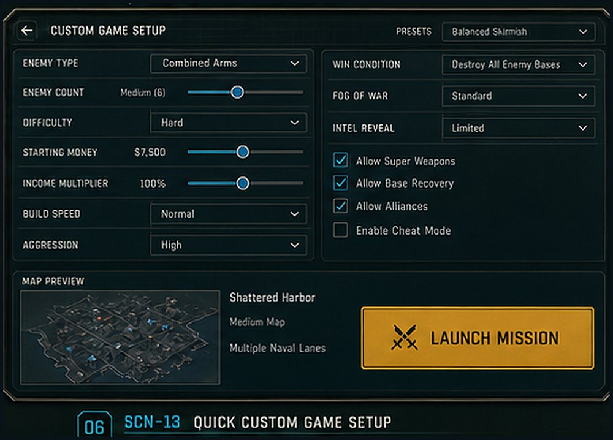

**Where shown:** Shown when selecting Quick Custom Game from Main Menu.

**Game design link:** Implements GDD section 9 Quick Custom Game and exposes existing AI tuning knobs as a player-facing setup screen.

**Player/UX purpose:** Let players create fast skirmishes against hidden-cell, military, defensive, air, swarm, or random AI profiles.

**Text labels and meaning:**
- CUSTOM GAME SETUP: screen title.
- Enemy Type, Enemy Count, Difficulty: opponent configuration.
- Starting Credits (tactical Money), Income Multiplier, Build Speed, Aggression: economy and pacing.
- Win Condition, Fog of War, Intel Reveal: match rules.
- Advanced rule controls cover Base Recovery and Alliances. Player builds show locked rules with exact unlock requirements; debug/cheat controls are DevOnly and hidden in release builds.
- Map Preview: selected map and size.
- Launch Mission: start button.

**Images/icons and meaning:**
- Premium 2D isometric map preview and accepted WarlineCapture setup controls.
- Sliders, dropdowns, checkboxes, and orange CTA.

**Buttons and controls:**
- Back arrow returns to Main Menu and saves the latest valid setup.
- Preset dropdown loads recommended configurations.
- Sliders adjust numeric values.
- Dropdowns choose modes/rules.
- Checkboxes toggle explicit match rules with locked, selected, and disabled states.
- Launch Mission creates QuickGameConfig and starts MatchScene.

**Unity/Codex implementation:** Scene CustomGameScene. Canvas QuickGameCanvas. Panels: PresetDropdown, ConfigFormLeft, ConfigFormRight, MapPreviewPanel, LaunchButton. Validate config before launch.

**Runtime data bindings:**
- QuickGameConfig
- AIProfileConfig[]
- MapDefinition
- WinConditionConfig
- PlayerDebugPermissions

**Navigation / trigger:** Launch Mission -> MatchScene. Back -> Main Menu.

### SCN-14 - Store / Command Exchange

**Where shown:** Shown from Main Menu Store, Operation Dashboard Black Market, resource plus buttons, and monetization entry points.

**Game design link:** Implements the monetization strategy and canonical economy/reward rules. Product content comes from `Monetization/Monetization_Store_Catalog.md`; resources and reward types come from `Economy_Reward_Design.md`.

**Player/UX purpose:** Let the player inspect starter packs, resources, Armory items, cosmetics, and Operation supplies with deterministic contents and clear disabled purchase reasons.

**Text labels and meaning:**
- COMMAND EXCHANGE: screen title.
- Featured / Starter Packs / Resources / Armory / Cosmetics / Operation: category filters.
- Product card title, contents, price, and disabled reason: catalog-driven purchase information.
- Target id/detail line: exact unit, building, ability, upgrade track, cosmetic, or OperationSupply target.

**Images/icons and meaning:**
- Store product art is content art, separated from product-card frames.
- Resource icons use Credits, Materials, Fuel, Intel, Command Authority, Rush Tickets, BlueprintParts, GearModule, Cosmetic, UnitUnlock, BuildingUnlock, SupportAbilityUnlock, and OperationSupply.
- No Tokens, gems, Intel Keys, SagaStars, or direct Operation metric-grant icons.

**Buttons and controls:**
- Category tabs filter catalog sections.
- Product card opens `POP-09 Ability / Upgrade Detail` when it targets an ability or upgrade track; other products open reward detail with deterministic grant rules.
- Purchase buttons are disabled until wallet, catalog, receipt, profile persistence, and reward grant services are implemented.
- Restore purchase appears only when platform receipt support exists.

**Unity/Codex implementation:** Scene or route `CommandExchangeScene`. Canvas CommandExchangeCanvas. Panels: HeaderBar, CategoryRail, FeaturedPanel, ProductGrid, ProductDetailDrawer, DisabledPurchaseReason. Use a real catalog view model; do not bake product text or prices into sprites.

**Runtime data bindings:**
- StoreCatalog
- ProductId
- RewardItemConfig[]
- WalletState
- PurchaseAvailabilityState
- ReceiptServiceState
- RewardService

**Navigation / trigger:** Back -> caller route. Product ability/upgrade detail -> POP-09. Reward detail -> reward tooltip/popup. Purchase -> receipt flow only after purchase services exist.

### SCN-19 - Armory

**Where shown:** Shown from Persistent Operation Dashboard Armory, Commander Profile Upgrades tab, Store Armory product links, Loadout detail links, and reward unlock follow-through.

**Game design link:** Implements the combat catalog and upgrade-track specs in `Combat_Catalog_And_Upgrade_Design.md`. Availability, unlock moments, resolved item ids, and implementation owners come from `BalanceConfigs/Combat_Balance_Config_v0_1.json`; art comes from `VisualConfigs/Combat_Visual_Config_v0_1.json`.

**Player/UX purpose:** Give the player one clear place to inspect owned units, buildings, support abilities, parts, Gear Modules, and upgrade tracks without changing active combat state.

**Text labels and meaning:**
- ARMORY: screen title.
- Units / Vehicles / Air / Sea / Buildings / Support: roster and upgrade categories.
- Owned / Upgrade Tracks / Parts / Gear Modules: bottom content tabs.
- Selected item title, tier, BlueprintParts progress, stat preview, unlock source, and disabled reason: config-driven selected item detail.

**Images/icons and meaning:**
- Item card content art uses visual catalog ids and remains separate from card frames.
- Tier pips show current/locked tiers.
- Parts, GearModule, lock, stat, and canonical resource icons are standalone sprites.

**Buttons and controls:**
- Back returns to the caller.
- Category rail filters roster/upgrade track type.
- Bottom tabs switch between owned roster, upgrade tracks, parts inventory, and Gear Modules.
- Item cards select the item and update the inspection panel.
- Item card detail/long-press opens `POP-09 Ability / Upgrade Detail`.
- Upgrade CTA is disabled until the selected upgrade can be applied outside active combat with payable BlueprintParts/GearModule costs.

**Unity/Codex implementation:** Scene `ArmoryScene`. Canvas ArmoryCanvas. Panels: HeaderBar, ResourceCounterList, CategoryRail, RosterUpgradeGrid, InspectionPanel, BottomTabBar, DisabledReasonPanel. Generate cards from resolved combat catalog ids and inventory state.

**Runtime data bindings:**
- PlayerInventory
- UnlockState
- AbilityConfig[]
- UpgradeTrackConfig[]
- ResolvedItemIds
- GearModuleInventory
- BlueprintPartsInventory
- VisualCatalog
- UpgradeAvailabilityState

**Navigation / trigger:** Back -> caller route. Item detail -> POP-09. Upgrade CTA -> UpgradeService only after inventory, validation, and persistence are implemented; active combat mutation remains blocked.

### POP-01 - Threat Alert
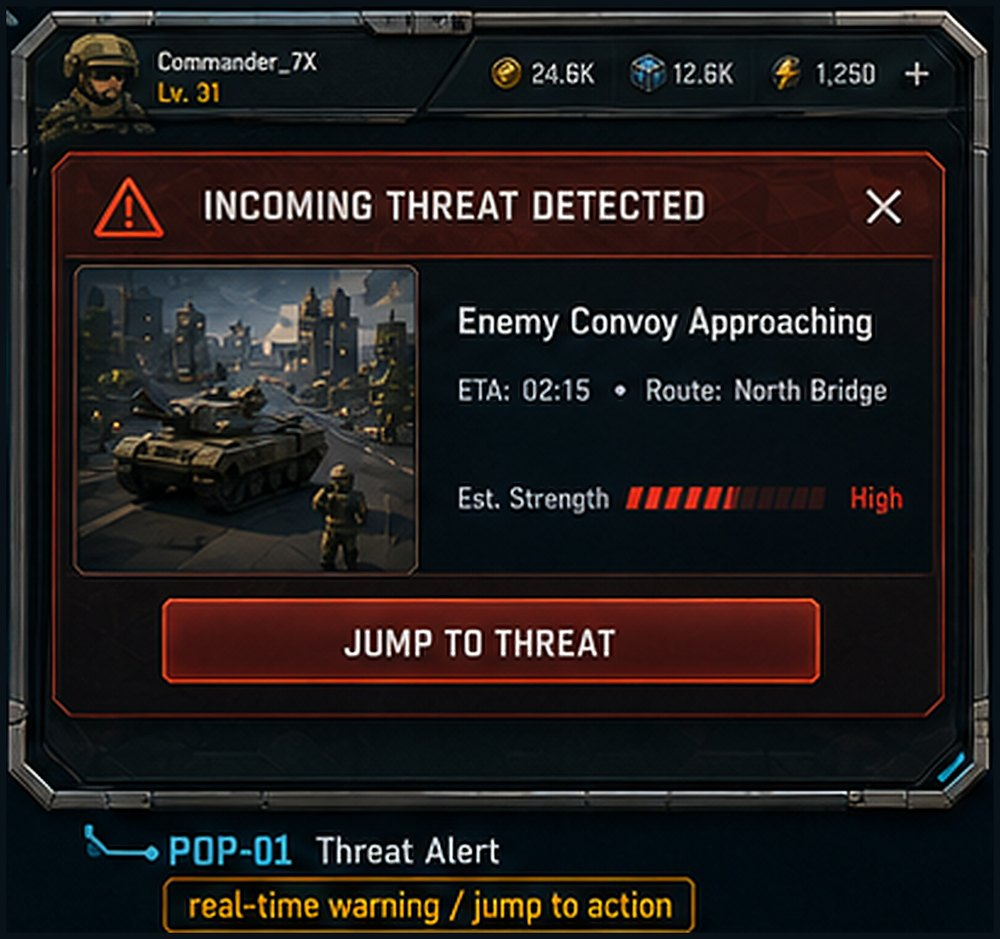

**Where shown:** Overlay during MatchScene and Persistent Operation Dashboard when a detected threat needs immediate player attention.

**Game design link:** Builds on existing radar/satellite warning systems in GDD section 2 and threat/intel loops in sections 5 and 8.

**Player/UX purpose:** Warn the player and provide a one-tap jump to the threat location.

**Text labels and meaning:**
- INCOMING THREAT DETECTED: urgency header.
- Enemy Convoy Approaching: threat type.
- ETA 02:15 / Route: North Bridge: timing and route.
- Est. Strength High: risk level.

**Images/icons and meaning:**
- Warning triangle icon, red panel styling, vehicle thumbnail.
- Dimmed tactical background behind modal.

**Buttons and controls:**
- Jump to Threat focuses camera/map on the threat and closes the popup while preserving the threat feed row.
- Close X dismisses but leaves warning in threat feed.

**Unity/Codex implementation:** Prefab ThreatAlertPopup. Root parts: Icon, TitleText, BodyText, ETA/Route row, StrengthMeter, CTAButton, CloseButton. Use ModalOverlay or non-blocking ToastOverlay depending severity.

**Runtime data bindings:**
- ThreatEventId
- ThreatType
- ETA
- RouteName
- EstimatedStrength
- WorldPosition

**Navigation / trigger:** Triggered by ThreatFeedSystem, radar/satellite detection, AI attack director, or operation event tick.

### POP-02 - Confirm Raid
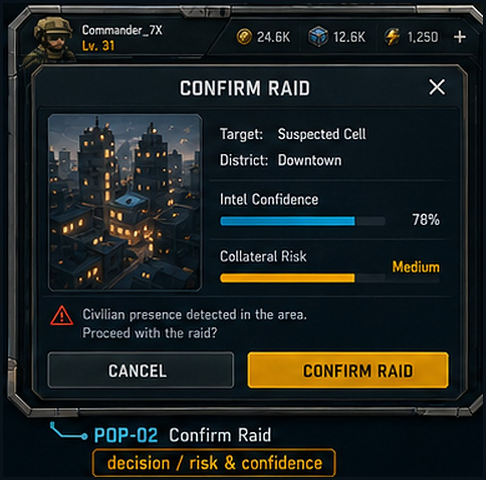

**Where shown:** Shown when the player chooses Raid from District Detail or a suspected target before enough intel is guaranteed.

**Game design link:** Implements the Intelligence Before Force design pillar and persistent mode hidden-cell model in GDD sections 4.3, 8.6, and 8.7.

**Player/UX purpose:** Force a deliberate decision when an action has confidence and collateral-risk consequences.

**Text labels and meaning:**
- CONFIRM RAID: modal title.
- Target / District: suspected cell and location.
- Intel Confidence 78%: probability quality, not certainty.
- Collateral Risk Medium: civilian/infrastructure risk estimate.
- Civilian presence warning: ethical and gameplay consequence reminder.

**Images/icons and meaning:**
- City/district thumbnail and red warning icon.
- Blue confidence bar and amber risk bar.

**Buttons and controls:**
- Cancel returns to District Detail.
- Confirm Raid creates/loads a tactical mission or resolves an operation action if abstracted.
- Close X acts like Cancel.

**Unity/Codex implementation:** Prefab ConfirmRaidPopup. Root parts: Header, TargetInfo, DistrictThumbnail, IntelConfidenceBar, RiskMeter, WarningText, ButtonRow. Use CanvasGroup fade + scale animation.

**Runtime data bindings:**
- DistrictId
- SuspectedCellId
- IntelConfidence
- CollateralRisk
- CivilianDensity
- RaidCost

**Navigation / trigger:** Confirm -> SCN-06/SCN-07/MatchScene or operation simulation result. Cancel -> SCN-12.

### POP-03 - Build Placement
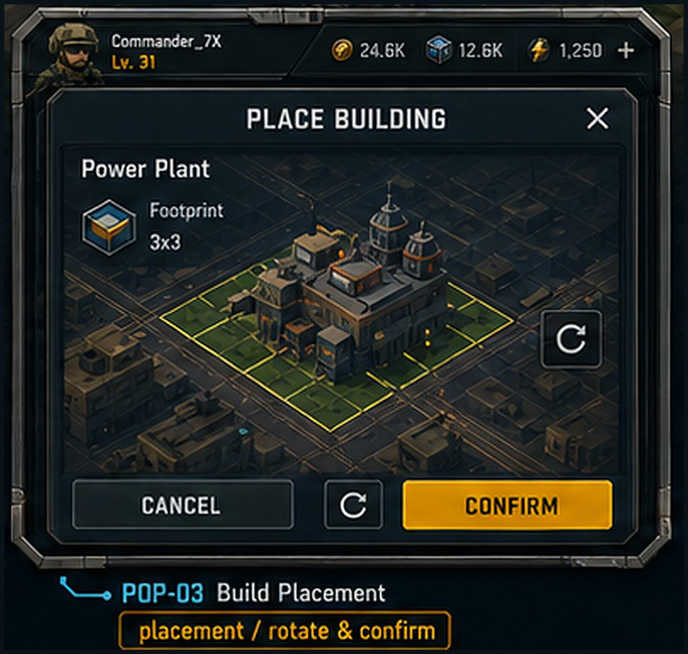

**Where shown:** Shown after choosing a building from Build Drawer during tactical missions or outpost setup.

**Game design link:** Uses the existing base-building and grid placement systems described in GDD section 2.

**Player/UX purpose:** Confirm building footprint, orientation, and placement validity before spending resources.

**Text labels and meaning:**
- PLACE BUILDING: modal/drawer title.
- Power Plant: selected building name.
- Footprint 3x3: grid footprint size.
- Cancel / Confirm labels: placement decision.

**Images/icons and meaning:**
- Premium 2D isometric building preview on green valid tiles.
- Placement grid, footprint outline, rotate icon.

**Buttons and controls:**
- Rotate changes orientation.
- Confirm spends resources and places ghost/real building.
- Cancel exits placement mode and returns to build drawer.

**Unity/Codex implementation:** Prefab BuildPlacementPanel plus world-space ghost object. Root parts: PlacementPreview, RotateButton, ConfirmButton, CancelButton, CostRow, FootprintLabel. Confirm enabled only when BuildGridValidator is valid.

**Runtime data bindings:**
- BuildingDefinition
- FootprintSize
- PlacementCell
- Rotation
- FactionResources
- BuildValidityReason

**Navigation / trigger:** Triggered from SCN-09. Confirm -> building construction. Cancel -> SCN-09/SCN-08.

### POP-04 - Reward / Unlock
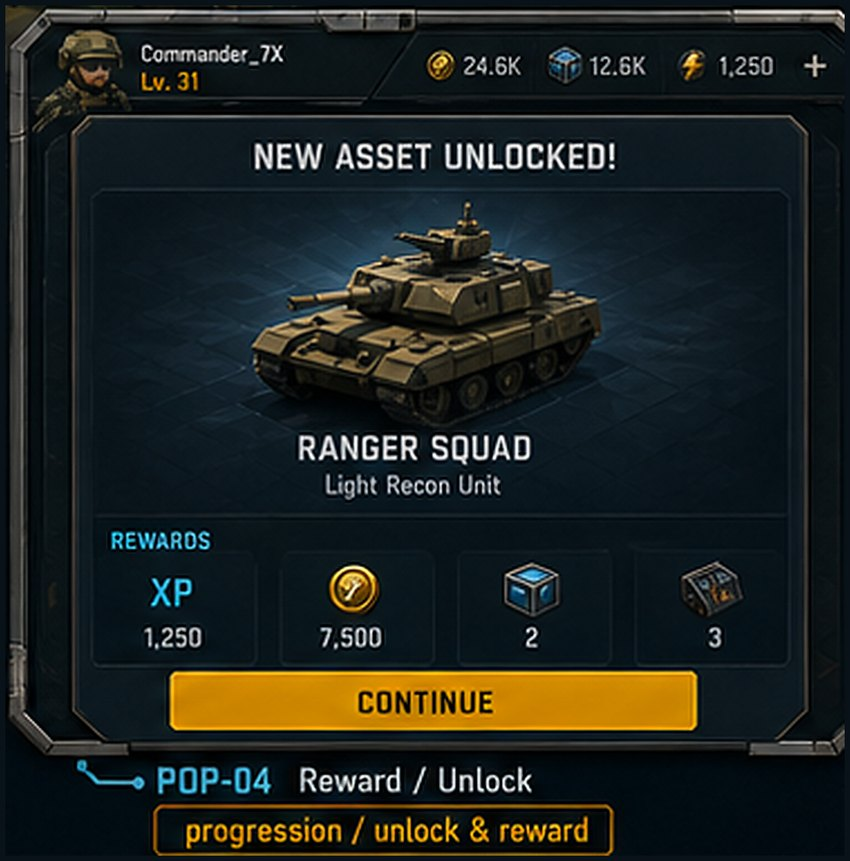

**Where shown:** Shown after mission completion, chapter reward claim, commander level-up, or unlock milestone.

**Game design link:** Supports GDD sections 7.7 Saga Rewards and 13 Progression and Meta Systems.

**Player/UX purpose:** Make new units, buildings, support abilities, or resources feel clear and rewarding.

**Text labels and meaning:**
- NEW ASSET UNLOCKED: reward header.
- RANGER SQUAD / Light Recon Unit: unlock identity and role.
- Rewards row: Commander XP, Credits, Materials, Fuel, Intel, Command Authority, Rush Tickets, and concrete unlock counts.
- Continue: acknowledgement.

**Images/icons and meaning:**
- Premium 2D isometric unlocked unit image on display pedestal.
- Reward icons: Commander XP, Credits, Materials, Fuel, Intel, Rush Tickets, and parts.

**Buttons and controls:**
- Continue closes popup and returns to result, map, or menu.
- Reward icons open tooltips showing canonical reward type, amount, source, and duplicate-conversion rule.

**Unity/Codex implementation:** Prefab RewardUnlockPopup. Root parts: Header, UnlockImage, UnlockTitle, UnlockSubtitle, RewardIconGrid, ContinueButton. Use RewardPresentationData created by RewardSystem.

**Runtime data bindings:**
- RewardConfig
- UnlockId
- RewardItems[]
- CommanderXPDelta
- ResourceDelta

**Navigation / trigger:** Appears after POP-05 for major mission grants, after SCN-05 chapter reward claims, and after commander level-up milestones.

### POP-05 - Mission Result
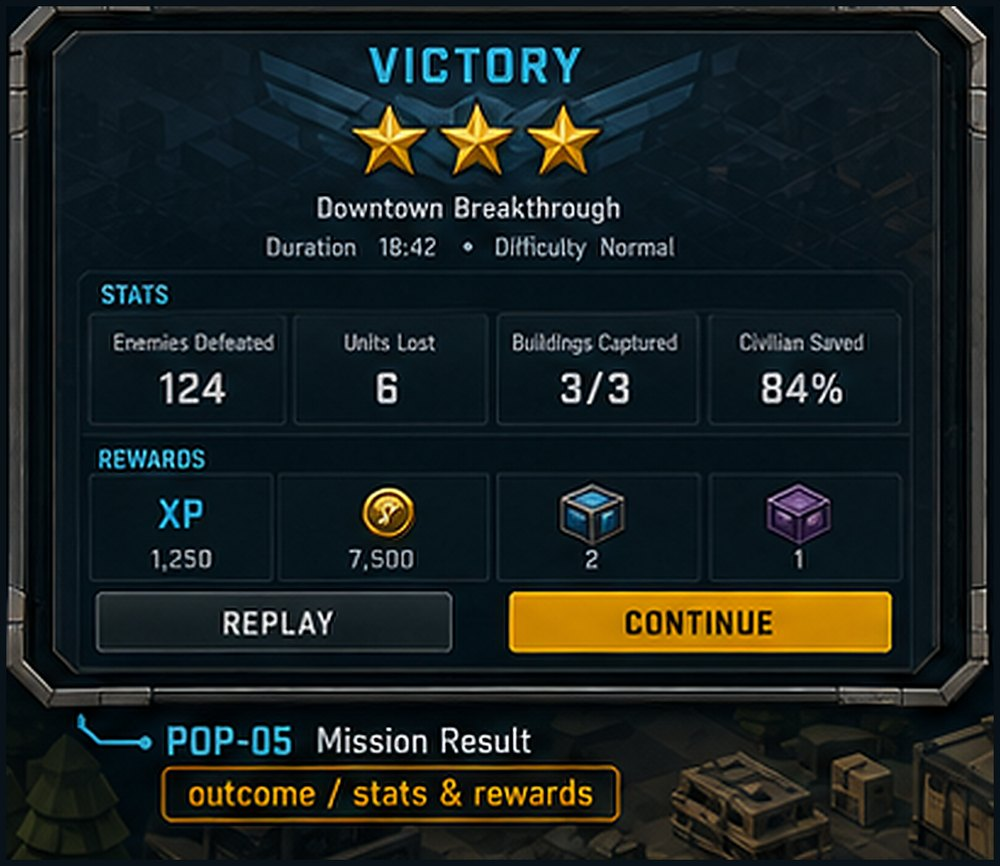

**Where shown:** Shown at the end of Saga missions, generated operation tactical missions, and Quick Custom Game matches.

**Game design link:** Implements GDD sections 7.6 Star Scoring, 7.7 Rewards, and 10.3 Objective Types.

**Player/UX purpose:** Summarize outcome, score, performance stats, stars, and rewards, then route the player forward.

**Text labels and meaning:**
- VICTORY or Defeat: result state.
- Mission name and duration/difficulty: match metadata.
- Stats: enemies defeated, units lost, buildings captured, civilian saved.
- Consequences: civilian safety and district delta for Saga/Operation missions.
- Rewards: Commander XP, Credits, Materials, Fuel, Intel, Rush Tickets, Gear Modules, and explicit unlock items.
- Replay / Continue: next action.

**Images/icons and meaning:**
- Victory emblem and star row.
- Reward grid and stat tiles.

**Buttons and controls:**
- Replay restarts the mission with same config.
- Continue applies rewards and routes to Saga Map, Operation Dashboard, or Main Menu.
- Defeat variant may show Retry instead of Continue emphasis.

**Unity/Codex implementation:** Prefab MissionResultPopup or scene ResultScene. Root parts: ResultHeader, StarRow, StatsGrid, ConsequenceRow, RewardGrid, ActionButtons. ObjectiveSystem feeds MissionResultData.

**Runtime data bindings:**
- MissionResultData
- ObjectiveCompletion
- StarResult[]
- CombatStats
- RewardGrantResult
- DistrictConsequenceDelta
- CivilianOutcomeDelta

**Navigation / trigger:** Win/Loss from MatchScene -> POP-05. Continue -> source mode screen. May chain to POP-04 unlock.

**Required consequence row:** Saga and Operation results must show civilian safety and district consequence rows even when the delta is zero, so star goals and city-pressure outcomes are never hidden behind rewards.

### POP-06 - End of Day Report
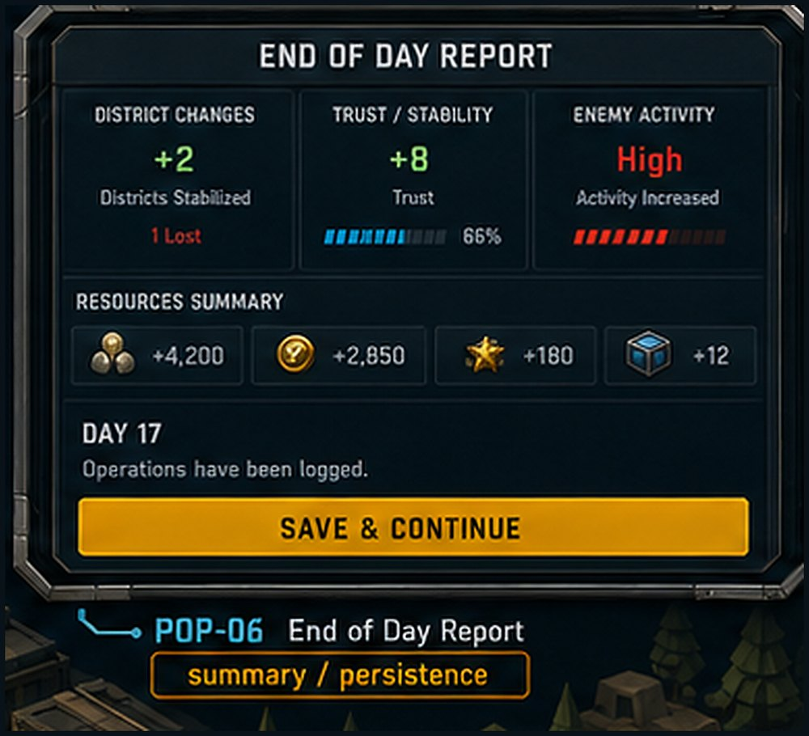

**Where shown:** Shown in Persistent Operation when the player ends a day/session or after operation event resolution.

**Game design link:** Implements GDD section 8.9 Operation Day Flow and 8.11 Persistent Mode Meters.

**Player/UX purpose:** Explain how the city changed and confirm operation progress has been saved.

**Text labels and meaning:**
- END OF DAY REPORT: summary title.
- District Changes +2: territory/stability change.
- Trust/Stability +8 and percentage bar: public/cooperation change.
- Enemy Activity High: threat trend.
- Resources Summary: money, supplies, intel, materials gained/lost.
- Day 17: operation timeline.
- Save & Continue: persistence action.

**Images/icons and meaning:**
- Meter bars and resource icons in report layout.
- Amber CTA to reinforce save/continue.

**Buttons and controls:**
- Save & Continue commits OperationSaveState and returns to dashboard or next day.
- Close may be disabled until save completes.

**Unity/Codex implementation:** Prefab EndOfDayReportPopup. Root parts: DeltaSummary, TrustStabilityPanel, EnemyActivityPanel, ResourceRow, SaveContinueButton. Save call should complete before routing.

**Runtime data bindings:**
- OperationDaySummary
- DistrictDelta[]
- TrustDelta
- ThreatDelta
- ResourceDelta[]
- SaveStatus

**Navigation / trigger:** Triggered by Next Day or operation session close in SCN-11.

### POP-07 - Pause / Options
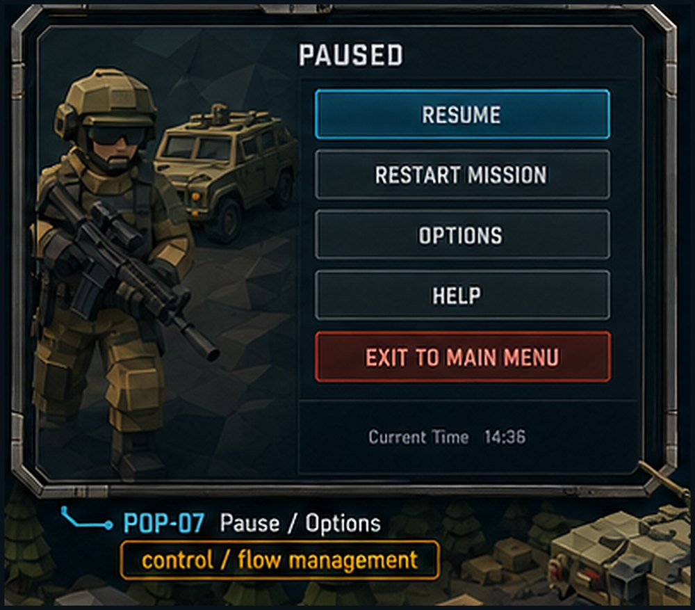

**Where shown:** Shown when the player pauses a tactical mission, operation dashboard, or custom setup where pause/options are allowed.

**Game design link:** Supports GDD section 11 Mobile UX and Controls by giving player control over flow, settings, and exits.

**Player/UX purpose:** Provide safe pause-state navigation without accidental mission loss.

**Text labels and meaning:**
- PAUSED: modal state.
- Resume, Restart Mission, Options, Help, Exit to Main Menu: available actions.
- Current Time: system/match time shown for route context.

**Images/icons and meaning:**
- Dimmed 2D isometric soldier/vehicle background to preserve game identity.
- Blue primary button and red destructive/exit button.

**Buttons and controls:**
- Resume closes pause and resumes time.
- Restart Mission confirms then reloads current MissionConfig.
- Options opens SCN-04 or settings overlay.
- Help opens control/objective help.
- Exit to Main Menu requires confirmation if progress may be lost.

**Unity/Codex implementation:** Prefab PauseMenuPopup. Root parts: Header, ButtonStack, CurrentTimeText, BackgroundArt. PauseGameService controls Time.timeScale or ECS simulation pause.

**Runtime data bindings:**
- CurrentSceneRoute
- CanRestart
- CanExitSafely
- MissionConfigId
- SaveStatus

**Navigation / trigger:** Opened from pause button/menu key. Options -> SCN-04 overlay. Exit -> SCN-02 after confirmation.

### POP-08 - Intel Reveal
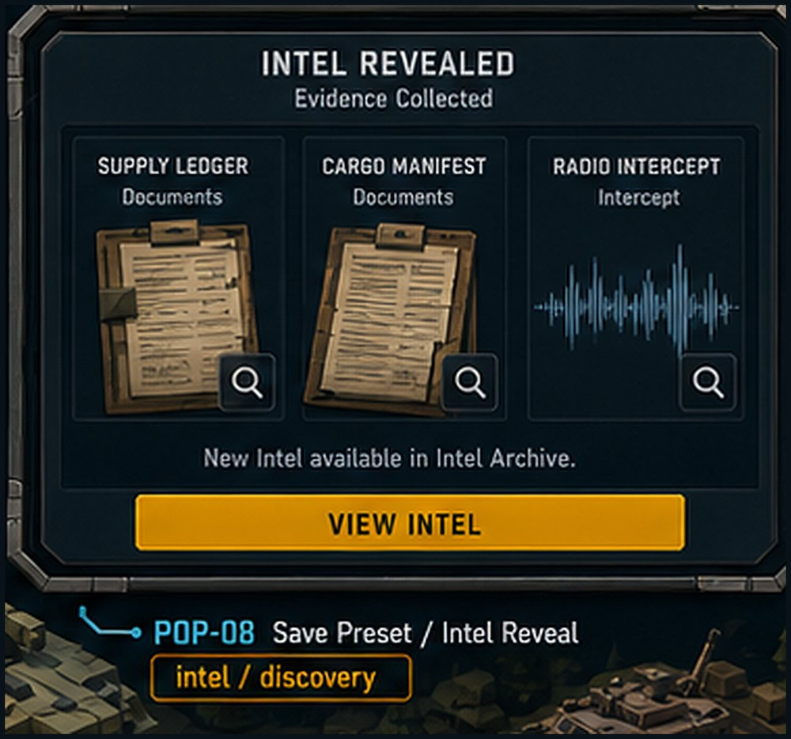

**Where shown:** Shown in Persistent Operation or intel-focused missions when new evidence has been collected.

**Game design link:** Supports GDD sections 4.3 Intelligence Before Force, 8.6 Hidden Cell Model, and 8.7 Player Actions.

**Player/UX purpose:** Reward scanning, patrols, raids, and captures with readable clues that increase intel confidence.

**Text labels and meaning:**
- INTEL REVEALED: discovery header.
- Evidence Collected: category label.
- Supply Ledger, Cargo Manifest, Radio Intercept: evidence cards.
- New Intel available in Intel Archive: destination prompt.
- View Intel: action button.

**Images/icons and meaning:**
- Document cards and audio waveform as fictional evidence.
- Magnifier icons for inspecting individual evidence.

**Buttons and controls:**
- Evidence card magnifiers open detail view.
- View Intel opens intel dossier/archive.
- Close may return to district or mission result.

**Unity/Codex implementation:** Prefab IntelRevealPopup. Root parts: Header, EvidenceCards, CardInspectButtons, ViewIntelButton. Evidence cards should use non-real-world fictional content.

**Runtime data bindings:**
- IntelEventId
- EvidenceItem[]
- DistrictId
- IntelConfidenceDelta
- ArchiveRoute

**Navigation / trigger:** Triggered by Drone Scan, Patrol, Raid success, CaptureIntel objective, or event reward.

### POP-09 - Ability / Upgrade Detail

**Where shown:** Shown from Mission Briefing reward/intel tiles, Loadout support slots, RTS HUD ability buttons, Unit Command Wheel special segments, Store product cards, Reward Unlock items, Intel Reveal follow-through, and Armory cards.

**Game design link:** Implements the availability and implementation specs added to every ability and upgrade track in `BalanceConfigs/Combat_Balance_Config_v0_1.json`.

**Player/UX purpose:** Explain exactly what an ability or upgrade does, where it unlocks, why it is locked or disabled, what resources/parts it uses, and which gameplay surface owns it.

**Text labels and meaning:**
- ABILITY / UPGRADE DETAIL: modal title.
- CONFIG TARGET: confirms the popup is showing a concrete ability or upgrade id.
- Target id, unlock moment, availability, prerequisite, effect rows, cooldown, charges, progress, and disabled reason: all config-driven fields.
- Exact values load from Balance Config; art loads from Visual Config: implementation rule shown in the target and enforced in code.

**Images/icons and meaning:**
- Content art comes from the selected visual catalog entry.
- Effect cards use ability/upgrade stat icons.
- Parts, GearModule, lock, warning, and close icons are standalone sprites.

**Buttons and controls:**
- Close X returns to the caller without changing selection.
- View Source routes to the relevant source surface when available: Saga node, Mission Briefing, Armory, or Store category.
- Disabled primary CTA shows the exact reason: locked, insufficient resource, unsupported active-combat mutation, mission-banned, no charges, cooldown, or missing service.

**Unity/Codex implementation:** Prefab AbilityUpgradeDetailPopup under ModalOverlay. Root parts: Scrim, ModalFrame, Header, ContentArtPanel, DetailRows, EffectCardList, UpgradeTargetRow, ActionButtons, DisabledReasonTooltip. Accepts `AbilityConfig` or `UpgradeTrackConfig` plus caller route.

**Runtime data bindings:**
- AbilityConfig or UpgradeTrackConfig
- AvailabilitySpec
- ImplementationSpec
- UnlockState
- PlayerInventory
- BlueprintPartsInventory
- GearModuleInventory
- VisualCatalogEntry
- CallerRoute

**Navigation / trigger:** Close -> caller route. View Source -> source route if valid. CTA remains disabled until the caller provides a valid non-combat action path.

## Reusable panel prefabs

### PREFAB-01 - Objective Tracker
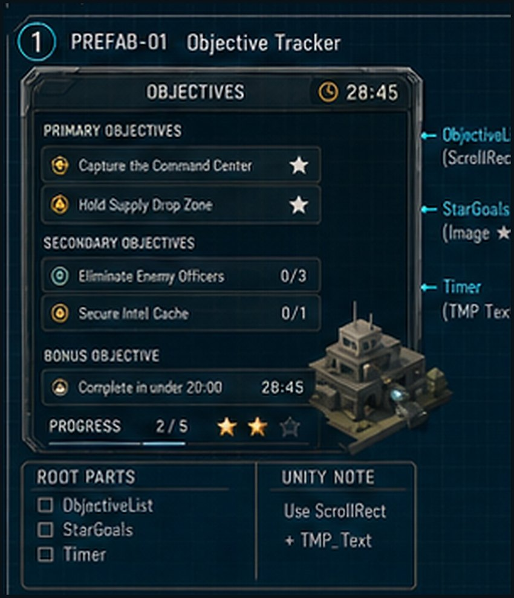

**Where shown:** Reusable in MatchScene HUD, Mission Briefing condensed previews, and tutorial overlays.

**Game design link:** Connected to Objective Manager, star scoring, and ObjectiveConfig types in GDD sections 7.6, 10.2, and 10.3.

**Player/UX purpose:** Show mandatory objectives, secondary objectives, bonus goals, timer, and progress without opening a full menu.

**Text labels and meaning:**
- OBJECTIVES title; Primary/Secondary/Bonus categories; timer; progress count; star indicators.

**Images/icons and meaning:**
- Small objective icons, star icons, progress bar, WarlineCapture-style dark module frame.

**Buttons and controls:**
- Optional objective rows can focus camera or open objective detail; otherwise read-only.

**Unity/Codex implementation:** Prefab ObjectiveTrackerPanel. Root parts: ObjectiveList ScrollRect, StarGoals Image row, Timer TMP_Text. Use object pooling for objective rows.

**Runtime data bindings:**
- ObjectiveRuntimeState[]
- StarGoalState[]
- MissionTimer

**Navigation / trigger:** Instantiated under MatchHUDCanvas/ObjectivePanel or BriefingCanvas/ObjectivePanel.

### PREFAB-02 - Squad Tray
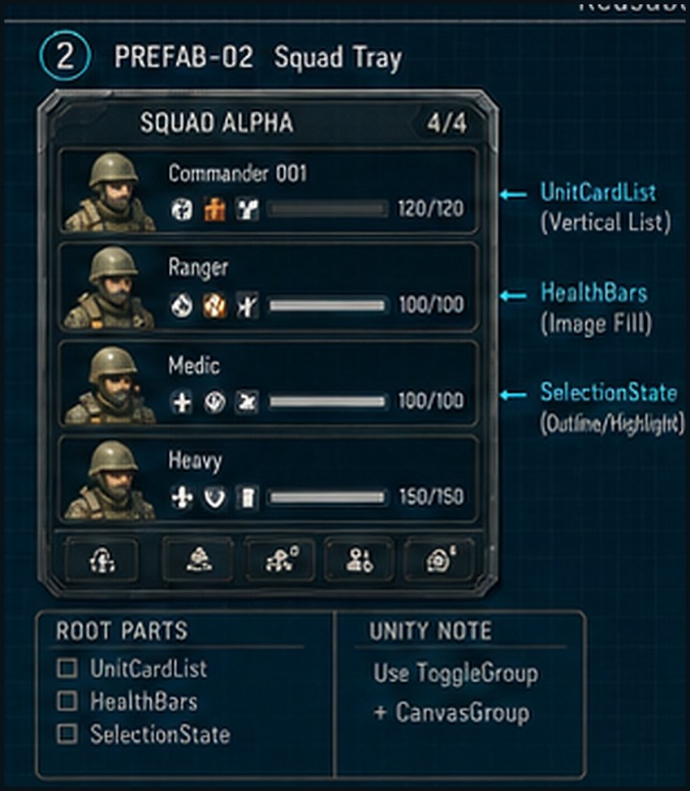

**Where shown:** Reusable bottom HUD panel during tactical missions and loadout previews.

**Game design link:** Connected to mobile-first unit selection and squad-based control in GDD sections 5.2 and 11.1.

**Player/UX purpose:** Let the player select and monitor squads quickly on a phone or tablet landscape layout.

**Text labels and meaning:**
- Squad name, 4/4 count, unit names/classes, HP values, small status icons.

**Images/icons and meaning:**
- Premium 2D isometric soldier portraits, health bars, selection outlines, ability/status icons.

**Buttons and controls:**
- Unit card selects/focuses squad; card long-press opens squad details; bottom micro-buttons filter, select all, or assign group when those helpers are implemented.

**Unity/Codex implementation:** Prefab SquadTrayPanel. Root parts: UnitCardList Vertical/Horizontal Layout, HealthBars Image Fill, SelectionState outline. Use ToggleGroup for selection state.

**Runtime data bindings:**
- SelectedSquadSet
- UnitHealthState[]
- SquadStatusEffects
- TransportBoardingState

**Navigation / trigger:** Instantiated under MatchHUDCanvas/SquadTray and updated by SelectionSystem.

### PREFAB-03 - Build Drawer
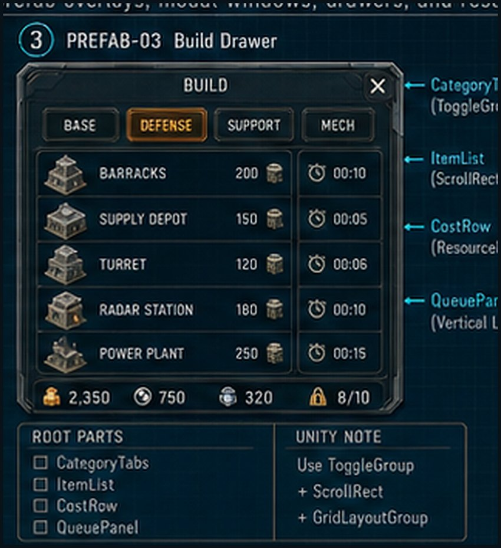

**Where shown:** Reusable drawer for MatchScene production, base setup, and potentially outpost construction.

**Game design link:** Connected to base building, production, economy, and mobile build drawer guidance in GDD sections 2 and 11.1.

**Player/UX purpose:** Show categorized build choices, cost rows, and queue status in a compact reusable drawer.

**Text labels and meaning:**
- BUILD title; category tabs; item names and costs; queue rows; resource/capacity strip.

**Images/icons and meaning:**
- 2D isometric building icons, lock states, WarlineCapture-style frame and tab art.

**Buttons and controls:**
- Tabs filter categories; item rows start build/queue; queue items can cancel; close X hides drawer.

**Unity/Codex implementation:** Prefab BuildDrawerPanel. Root parts: CategoryTabs ToggleGroup, ItemList ScrollRect/Grid, CostRow ResourceBar, QueuePanel Vertical List. Use GridLayoutGroup for item grid if enough space.

**Runtime data bindings:**
- BuildCatalog
- AllowedCategories
- FactionResources
- ProductionQueue
- UnlockState

**Navigation / trigger:** Used by SCN-09 and any base/outpost construction flow.
