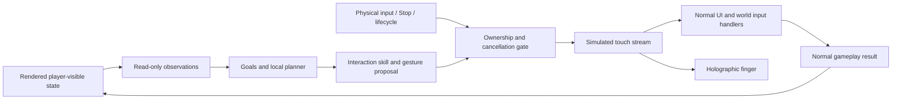

# Touch-only ARIA architecture

Status: implementation specification, 2026-09-18. Proposed type names are not claims of existing code. [PLAN.md](PLAN.md) owns scope; [ACCEPTANCE.md](ACCEPTANCE.md) owns proof.

## Boundaries

The only actuator output is touch data: contact identity, phase, screen position and timing. Observation and goal IDs are for reasoning; they cannot be passed to a command API to select, move or attack. The executor does not receive an EntityManager, Button reference, target Entity, build factory or camera command interface.

The normal game's own input handlers may produce command buffers and UI events. ARIA may not call those handlers or buffers directly. Do not call `Button.onClick.Invoke`, directly dispatch `ExecuteEvents`, set camera transforms, inject tactical orders, buy/spawn units or advance tutorial facts from ARIA. Old direct command execution and the new touch session must be mutually exclusive.

Audit the existing player-auto-AI setting as well as ARIA's legacy takeover. Watch must not turn on a separate faction autoplayer that wins through hidden orders while the finger performs cosmetic taps. Normal unit behaviors (path following, auto-engagement and paid delivery) remain unchanged and are distinguished from ARIA-issued orders in evidence. If an existing setup already enables independent full-faction automation, resolve and disclose ownership before offering Watch; do not silently change the selected match rules or count that controller's play as touch-only ARIA.

## Project integration baseline

Source reviewed at `c69865400` on 2026-09-18. Paths below are repository-relative.

| Existing owner | Planned integration / constraint |
|---|---|
| `Assets/Game/Scripts/Utilities/GamePointerInput.cs` | Primary-touch/Mouse reader; audit and unify physical versus synthetic source handling with all gameplay consumers |
| `Assets/Game/Scripts/UI/MainMenuPlayUI.cs` | UI/world click capture uses `Touchscreen.current`; preserve click-through protection |
| `Assets/Game/Scripts/UI/Screens/MatchHudMinimapInputUiSystemHelper.cs` | Independent touch reader; must use consistent ownership/contact mapping |
| `Assets/Game/Scripts/Systems/RtsSelectionInputCompositionSystemHelper.cs` and selection input helpers | Verify tap/group/hold-drag parity and true cancel behavior; do not inject their requests |
| `Assets/Game/Scripts/Systems/BuildingPlacementInputTickCompositionSystemHelper.cs` and placement input helpers | Verify cancel never commits placement and preview input matches human placement |
| `Assets/Game/Scripts/UI/Shell/Ecs/AssistantControlOwnerSystem.cs` | Existing three-action/30-second takeover is legacy; reconcile to one authoritative owner, not two concurrent controllers |
| `Assets/Game/Scripts/UI/Shell/Ecs/AssistantCommandIntentSystem.cs` | Existing direct actuation is forbidden during Watch sessions; isolate it and its pending intents |
| `Assets/Game/Scripts/UI/Screens/MatchHudAssistantUiSystemHelper.Commands.cs` | Reuse appropriate UI shell, not mission-specific Do It execution or direct button invocation |
| `Assets/Game/Scripts/Runtime/Missions/CampaignMissionGuidanceProjectionSystem.cs` and partials | Publish public instruction/goal semantics only; do not expose privileged facts or resolved target identities |
| `Assets/Game/Scripts/Editor/SkirmishGameplayProbe.cs` | Historical direct UI/world probes are not evidence of touch-only play |

Preserve [ECS/assembly rules](../../Architecture/gameplay_solid_ecs_contract.md) and [performance rules](../../Architecture/performance_regression_contract.md). Domain planning/state/scoring belongs in ECS data and systems, Burst-compatible where appropriate. Unity UI/InputSystem/audio/renderer integration belongs in narrow managed helpers. Do not introduce a general ARIA manager, service locator or updating MonoBehaviour to own the feature.

## Data contracts

| Proposed contract | Minimum fields and ownership |
|---|---|
| `AriaPlaySessionComponent` | Match/session identity, generation token, owner, phase, stop reason, active skill, assisted flag; one authoritative lifetime per match |
| `AriaObservationSnapshot` plus bounded rows | Version, frame/time, viewport/safe area, modal/layout/camera versions, locale, shown goals, visible controls/objects/statuses; immutable to planning |
| Public goal rows | Stable goal kind/ID, displayed text key, shown progress/constraints, visible evidence references; no privileged mission state |
| `AriaSkillStateComponent` | Skill/phase, expected visible outcome, deadlines, retry count, observation version and target observation token |
| Gesture proposal rows | Session/generation, preconditions, contact trajectories, duration, expected visible result; targets resolved to fresh screen coordinates |
| `AriaGestureSampleElement` | Accepted touch ID/phase/position/timestamp and source; single stream for input and hologram |
| `AriaCoachReadModelComponent` | Localized intent/status/reason keys and display values, ownership, capabilities and Stop visibility |
| Capability manifest | Mode/ruleset/content versions, required public goal/skill IDs, validated configurations and evidence identity |

Use small typed enums/IDs, bounded reusable buffers and dirty versions. Managed localized strings and Unity references stay in edge helpers, outside hot planning data. Any backing object mapping is private to the observation producer and cannot be used for actuation. These records are in-process architecture, not a new remote protocol.

## Perception and fair information

Publish semantic UI observations only after layout is settled. A visible control reports its actual clipped rect, interactable state and modal/raycast eligibility; a hidden prefab child is not an observation. Never infer interactability from a serialized button alone. Track viewport, canvas scale, safe area, modal and camera version so a layout change invalidates a prepared touch.

World observations must correspond to rendered, permitted player information: screen silhouette/pick region, allegiance, visible type/health/status at displayed precision, and visible map contacts. Frustum visibility is insufficient when terrain, fog or a UI panel occludes the object. Use the game's shared visibility/occlusion policy and validate it with rendered captures; unknown or ambiguous targets require navigation or inspection. No reading unseen enemy health, precise positions behind fog, secret convoy schedules, navmesh paths or hidden placement solutions. Query candidate validity only via normal visible placement feedback after a gesture.

Memory stores previously seen information with its age and uncertainty. Newly hidden objects are not tracked live. A remembered location may motivate panning, but cannot become a live attack target. Do not read named scenario coordinates or seeded enemy plans to choose actions.

A public goal schema bridges Campaign instructions and free-form match objectives. Its semantics must be exposed equivalently through the player's objective/rules UI. Use public verbs such as `SelectGroup`, `MoveToVisibleArea`, `Recruit`, `Build`, `Defend`, `AttackVisibleTarget`, `Scan`, `Board`, `Deliver`, `SecureArea` and `ProtectBase`. Mandatory versus optional goals reflect the displayed instruction. Do not map legacy enum values such as Stop or RadarPing into nonexistent buttons; inspect the current displayed control and goal.

The semantic model avoids OCR as a core dependency; it does not provide unrestricted language understanding. Text-only unknown instructions fail capability checks with a useful reason. Future language/vision reasoning must consume the same observations and propose the same bounded skills, with no extra information or actuator privileges.

## Ownership and input scheduling

One session owns the planner and one synthetic contact set. The physical input path is always observed independently of `Touchscreen.current` so a virtual device cannot hide the user's finger. Audit all InputSystem devices, UI pointer IDs, mouse/keyboard Editor input and manual camera consumers before choosing the final adapter.

Preferred implementation spike: an explicitly identified virtual touchscreen feeds the same UI/world input path as physical touch. Validate installed Input System 1.19 behavior locally; do not assume two Touchscreens work correctly with current primary-pointer readers. If shared input readers need a source arbiter, route **both** human and ARIA touch through it, preserve gestures and prove parity. A direct EventSystem or command fallback is not an alternative.

Required processing order is an integration invariant, not a claim about current Unity update order:

1. Receive physical input and critical session lifecycle events.
2. Process Stop/override/result/background signals and invalidate cancelled generations.
3. Recheck the proposal's current match, ownership, layout, modal and target eligibility.
4. Submit at most the current incremental synthetic contact updates; never enqueue a long future timeline into the InputSystem.
5. Let normal input processing and gameplay run; publish fresh observable outcomes.
6. Update hologram/coaching and advance the skill only after verifying the outcome.

Verify update ordering in the live Editor and IL2CPP device build. A late planner/job response is tagged with its original generation and discarded after cancellation. Stop never waits for a planner job, narration or optional network response. Worker computation must use bounded snapshots and be safely discardable.

## Cancellation and lifecycle

On Stop or physical intervention: invalidate ownership first, discard pending proposals/samples, cancel only ARIA's active contacts, clear its pointer capture/drag state through the normal cancellation path, withdraw hand and clear queued coach audio. Do not send a normal release that can invoke a click, confirm placement or finish a selection. Audit each receiving handler for `Canceled`; implement missing cancellation semantics for both real and synthetic touches.

The first physical gameplay contact is consumed until its end, then the next touch is manual. Stop is similarly captured so it cannot click through. A physical pause/settings command can be handled as a control action after cancelling ARIA; it must not produce an incidental world order. Passive mouse movement is not takeover; clicks/scroll/keyboard commands are. Hologram graphics never raycast. Synthetic contacts cannot activate Start/Stop, consent, store or account controls.

Match result, scene exit, background/focus loss, app pause, invalid session and unsupported state terminate automation. No ownership or pending input is restored from a save. For known temporary scripted camera/story transitions, cancel contacts and wait without interacting; retain reachable Stop. If player input is required for story choice, hand back. Tutorial Continue inside the current match is a normal teachable action when publicly required. Do not auto-skip comics.

Ending automation leaves accepted unit orders, deliveries, queues, resources and selection state as the game currently has them. Pending previews remain available for manual play unless the normal cancellation contract dismisses them. No rollback, forced camera restoration or silent tactical Stop.

## Planning, skills and recovery

Use hierarchical goals with bounded utility scoring: protect mandatory mission survival constraints, react to visible immediate danger, progress required objectives, then consider optional goals/economy. Choose compatible existing controls and skills. Skirmish strategies decide composition, reserve, attack/defense and retreat from visible evidence, using hysteresis to avoid switching orders every update.

Each skill follows `Observe → Explain/Aim → Gesture → Verify → Continue/Recover`. Store an expected **visible** result and separate acceptance from completion: a production queue increment accepts recruitment, while the delivered squad proves completion. A successful attack tap does not prove target destruction.

Initial recovery policy: re-observe after a failed/missed action; permit at most two corrective attempts for the same skill/target without observed progress. Change the approach only with new evidence. A global no-progress timer catches cycles across skills. Expected waits use their visible condition/timer and a phase-specific deadline, not the same short generic timeout. If no timer exists, show the observed condition without inventing an ETA; persistent unobservable waiting is a UX defect to fix.

Plan on dirty goal/resource/threat changes and a bounded tactical cadence, not every frame for every unit. Touches remain at human pace even if reasoning is fast. Emergency reactions may shorten explanation time but cannot issue invisible commands or superhuman bulk orders. Production/construction/upgrade actions verify visible affordability and capacity, then let the game's own validation decide.

## Diagnostics and performance

Log bounded action records: build/config identity, observation version, public goal, skill/reason, gesture phases, actual normal input hit/result, visible progress, retry and stop reason. Test-only validators may read authoritative results after actions, but their channels and setup mutations are isolated from the planner. Pin a planner seed if tie-breaking uses randomness; live control still replans instead of replaying traces.

Use pooled hand/rings, cached targets and dirty UI projection. No scene-wide search, text rebuild or renderer scan per frame. Profile observation, planning, touch, hologram and coaching separately at real supported army sizes; incremental processing must preserve all visible selectable objects rather than silently truncating observations. See [ACCEPTANCE.md](ACCEPTANCE.md) for targets and existing product budget authority.
