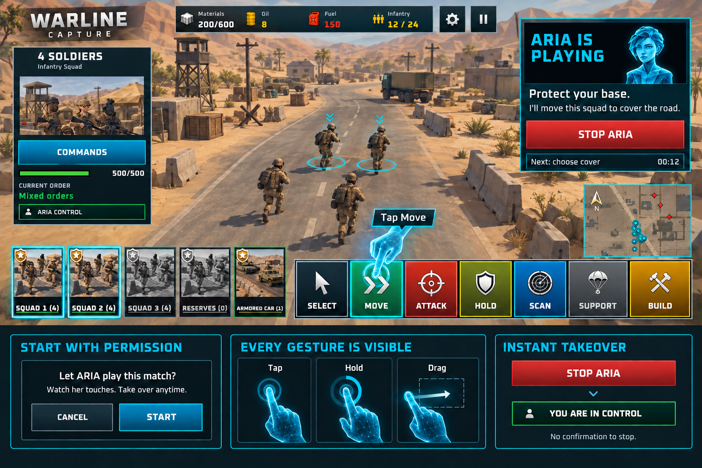

# ARIA demonstration presentation and interaction

Status: implementation design, 2026-09-18. The stored mockup establishes the cyan hand and ownership treatment; the rules below resolve behavior the static image cannot show.

Generated with the built-in image tool; exact prompts and source paths are in [PROMPTS.md](Mockups/PROMPTS.md). Preserve this board as a review artifact. Implement the hand/control assets separately; do not crop and ship its redrawn battlefield or generated text as game UI. Decorative values such as the mockup's small timer are not requirements.

## Panel states

| State | Player sees | Input and transition |
|---|---|---|
| Manual / ready | Existing objective/instruction plus full-width Watch ARIA play | Player opens confirmation; no ARIA touch yet |
| Confirming | Current-match scope, normal resource use, how to stop; Cancel / Start | Only genuine input can authorize Start; consume the initiating contact before ownership begins |
| Starting | ARIA is playing; one concise intent | Wait for usable gameplay view and current observations |
| Acting | Objective remains readable; short decision/gesture caption; cyan hand; Stop ARIA | Finger animates exactly where touches occur |
| Waiting | Concrete reason, visible progress or honest unknown duration; Stop ARIA | Hand withdraws; no repetitive tapping or fake progress |
| Recovering | Brief failed-action explanation and next attempt; Stop ARIA | Re-observe, retry within limits or hand back |
| Handed back | You are in control; optional short reason | No ARIA contacts or queued narration; new start needs confirmation |
| Finished | Normal win/loss/result flow | Stop and hand disappear; no queued click reaches the result screen |
| Unavailable | Concise support/readiness reason, no enabled Start | Never present a working-looking action for unsupported content |

Initial button copy: **Watch ARIA play** / **Stop ARIA**. Proposed conversational Farsi: **ببین آریا چطور بازی می‌کنه** / **کنترل رو پس بگیر**. Ownership: **آریا داره بازی می‌کنه** / **کنترل دست توئه**. Final copy must pass the project's Farsi review in context; do not generate voice from these drafts without the audio workflow.

Confirmation copy: “Let ARIA play this match? Watch her touches and take over anytime. She uses your match units and resources normally.” Keep any future competitive/reward policy explicit here before it changes rewards. The initial feature preserves current rewards.

## Layout rules

- Keep the current ARIA portrait, mission title/instruction and single-column full-width buttons. Content determines panel height. No hidden text under action buttons, excessive empty space, duplicate help buttons or panel-flashing state swaps.
- Stop remains accessible above gameplay modals. If the main panel is occluded/collapsed, use one compact persistent ownership/Stop strip inside the safe area. Do not show two competing Stop buttons or insert the removed camera-return button.
- Reserve the strip's footprint when laying out Build/production/transport popups; it cannot cover Confirm, Cancel, selected-unit artwork or the minimap. Stop must remain physically reachable during a drag.
- Use the established mobile touch-size/contrast requirements and verify on a real phone; pixels in a desktop screenshot are not physical touch-size evidence.
- English and RTL layouts follow the same state/gesture behavior. Button bounds come from the live layout; never mirror screen coordinates based only on language. Keep technical logs out of player copy.

## Holographic finger

Use a compact faceted cyan index-finger hand matching ARIA's portrait, with a precise contact ring at the real input point. The fingertip is the anchor; near screen edges rotate or reposition the palm without moving the contact. Essential labels must remain readable. Decorative graphics are non-interactive and excluded from observations.

| Gesture | Required visible behavior |
|---|---|
| Tap | Travel to target, short press, one contact pulse, release |
| Hold | Continuous contact with a restrained duration ring |
| Selection drag | Hold cue, moving pressed fingertip, short trail and the game's real growing selection rectangle |
| Camera/preview drag | Same continuous contact; real camera/preview follows the game's gesture |
| Pinch | Two exact contact indicators; avoid two large hands hiding the battlefield |
| Wait | No fake click animation; show the condition ARIA is monitoring |
| Cancellation | Stop submitting input immediately; hand fades/withdraws after cancellation, never delays it |

The first selection demonstration should prefer the existing squad/group tap control when it selects the intended group. Use hold-and-drag only when that is the appropriate real interaction. Never use a tap pulse to imply that tapping one soldier selects a rectangle or the whole group.

Manual yellow guidance remains the existing Show Me system. During ARIA control, prevent simultaneous competing attention animations for the same action; restore guidance from current mission state on handback, not a cached old highlight. Do not mutate tutorial completion to silence it.

## Pace and coaching

Initial tuning: approximately 0.6–1.2 seconds between simple menu actions, 2–4 seconds for a new tactical explanation, real hold/drag durations, and bounded faster reactions to danger. Keep the actual match clock and difficulty unchanged. Do not wait for a long narration clip while troops die; shorten or defer explanation.

Explain decisions, acceptance and waiting separately: “I'll cover the road with this squad,” “The squad is moving,” “They're in position; now we're waiting for the convoy.” If an action fails, use the actual visible reason. Never claim that a click succeeded before observing feedback.

Use localized authored intent/reason templates with current displayed values. Reuse approved matching voice where possible; otherwise show subtitles rather than playing the wrong language or unrelated line. Inventory new EN/FA recordings as a separate payload review; this plan does not authorize paid recording requests. Arbitrate mission/story/unit/coach audio through the existing priority system, and cancel queued coaching on handback/result/scene exit. Explain missing voice in development evidence, not as finished audio QA.

Reduced motion removes long travel trails and decorative pulses while preserving contact location and gesture meaning. Muted voice retains captions. Test readability and meaning with an unfamiliar player who then performs the demonstrated action themselves.
