# Coding packages and agent handoff

P0 contracts and the P1–P4 Operations-owned models/content are **implemented within their prototype scope**. That work, including Design-APPROVED O001–O003 and the historical Ops AriaWon captures, is **WIP/foundation**. P3's default launch still leaves `InvokesSharedSceneView` false. P4's automated Play Mode capture does not establish a manual player journey. The integration package is **P4R**, documented in [O001_PLAYER_READY_IMPLEMENTATION.md](O001_PLAYER_READY_IMPLEMENTATION.md). Player-ready is claimed only after shared launch, real D01 play, durable save/settle, return, and Manual plus Regular EN Aria through the same visible controls are actually wired. P5 and later remain **Planned**. The original architecture/acceptance requirements still apply. The implementation lead owns shared integration, scope and evidence; content-only work must not independently modify shared contracts.

## Dependency sequence

```mermaid
flowchart LR
  P0["P0: baseline and contracts"] --> P1["P1: city and profile transactions"]
  P0 --> P2["P2: neutral tactical rules"]
  P1 --> P3["P3: launch, return and recovery"]
  P2 --> P3
  P3 --> P4["P4: three-mission vertical slice"]
  P4 --> P4R["P4R: O001 shared runtime, input, saves and player acceptance"]
  P4R --> P5["P5: full objective/transport/ARIA set"]
  P5 --> P6["P6: six district layouts and builders"]
  P6 --> B12["B12: first 12 published entries"]
  B12 --> B30["B30: first 30 published entries"]
  B30 --> B60["B60: all 60 published entries"]
  B60 --> P7["P7: city-run and release acceptance"]
```

Map greyboxes for D01 and one second district begin during P2 so the rules are not designed around one layout. P4R completes O001's actual D01 environment and player path; P6 completes all six district maps. Shipping input, ARIA and durable checkpoint support must pass for O001 during P4R, not be deferred to the last package. Packages are dependency slices, not estimated calendar weeks.

| Package | Concrete implementation | Exit evidence / responsibility |
|---|---|---|
| P0 — source and schema | Recheck BASELINE on assigned branch; inventory dirty/shared files; add Operations contracts, ID grammar, config schemas, typed enums and assembly references | **Bookmark implemented:** `Game.Operations.Contracts` + `Game.Operations.Tests.Editor`; host marker `[OperationsP0Validation] result=Passed checks=13`; fixtures under `Assets/Tests/Editor/Operations/Fixtures/`; ledger in `P0_ROSTER_FEATURE_LEDGER.md`. Shared `SaveDataModel` / `OperationMapIdentityRules` / existing asmdefs were not edited. Windows Editor validation is Programmer 2 later, and only against the shadow worktree `D:\Projects\WarlineCapture-Operations` — never `D:\Projects\WarlineCapture`. See [P0_SHADOW_PROJECT.md](P0_SHADOW_PROJECT.md). |
| P1 — strategic core | ECS-shaped run/district state, commands, AP, six actions, offers/incidents, metric tick, milestones, rewards, serialized profile commit, save migration in `Game.Operations.Strategic` | **Bookmark implemented:** host marker `[OperationsP1Validation] result=Passed checks=18` via `Tools/Operations/check_p1.py`. Deterministic day trace, floor recovery, duplicate/conflict/crash commits, archived new-run rewards, incident site/route facts, and no account-wallet keys. Demo 2 meshes are not imported. `IComponentData` / `ISystem` and `SaveDataModel.operations` remain Game PM seams. Windows Editor validation is Programmer 2 later, shadow project only. See [P1_STRATEGIC_CORE.md](P1_STRATEGIC_CORE.md). |
| P2 — tactical foundation | **Implemented in `Game.Operations.Tactical`:** role binding, spawn ownership, Scan/Hold/Interact/Repair/Escort/Extract, objective graph, facts, finite wave schedules, and outcome precedence. Abstract D01 Old Quarter and D02 Civic Center greyboxes only — no Demo 2 scene import. See [P2_TACTICAL_RULES.md](P2_TACTICAL_RULES.md). | Host marker `[OperationsP2Validation] result=Passed checks=16`. Two-map fixtures, manual interaction checks, no mission-ID branching, compiler rejects bad graph/anchors/budgets. Unity Editor self-check remains on `D:\Projects\WarlineCapture-Operations` via `Tools/Operations/Invoke-OperationsP2Validation.ps1`. Do not open `D:\Projects\WarlineCapture`. |
| P3 — mode-loop model | **Implemented in `Game.Operations.Loop`:** mode-tagged launch request, reserve/refund, mission result/settlement, HUD/briefing/result read models and in-memory checkpoint journal. Shared scene/profile integration remains absent. See [P3_LAUNCH_RETURN.md](P3_LAUNCH_RETURN.md). | Host marker `[OperationsP3Validation] result=Passed checks=12` via `Tools/Operations/check_p3.py`. Model dashboard → deploy → tactical simulation → district result → return and interrupted model commits. This does not certify shipping UI, real disk recovery or player deployment. Windows Editor model checks use the Operations shadow and checked wrapper. |
| P4 — authored prototype slice | **Implemented in `Game.Operations.Content` + O001–O003 graphs:** localized copy, approach fixtures, district/day projections, planner/input APIs and a separate capture renderer. See [P4_VERTICAL_SLICE.md](P4_VERTICAL_SLICE.md). | Host markers: `[OperationsP4Validation] result=Passed checks=14` and `[OperationsAriaEvidenceValidation] result=Passed checks=8`. Regular EN automated Play Mode captures are recorded under `Design/AgentReports/Operations/host-aria-evidence/`. They verify loop API completion/rendering, not human touch or shipping Watch acceptance. |
| P4R — O001 player-ready integration | **Shared O001 launch enters MatchSceneView. Not a player-ready certification.** See [O001_PLAYER_READY_IMPLEMENTATION.md](O001_PLAYER_READY_IMPLEMENTATION.md). Dashboard district and Raid deploy the authored D01 session with `InvokesSharedSceneView` true. Match Select, Move, Attack, Scan, Hold, and Board are the play controls. Armed Regular EN Aria invokes those same buttons. Settlement is copied into `operationsEnvelope` and Continue returns to Ops. Design-APPROVED O001–O003 and historical AriaWon captures are WIP/foundation, not this gate. Real D01 art, shipping combat, the full save/ARIA matrix, and R6 remain open. | Host marker `[OperationsO001PlayerShellValidation] result=Passed checks=5` via `Tools/Operations/check_o001_player_ready.py`. The marker is not a player-ready certification. Programmer 2 runs `Tools/Operations/Invoke-OperationsO001PlayerReadyValidation.ps1` on `D:\Projects\WarlineCapture-Operations`. |
| P5 — remaining shared rules | Neutral civilian escort, evidence drop/transfer, Patrol/Rescue/Interdict/Seize/Defense/Breach/Airlift/Finale composition, all required input affordances and save adapters | Each of 12 families wins through manual and ARIA input in a fixture; campaign extraction/breach regressions; no fixture counts as an accepted catalog mission |
| P6 — authoring pipeline/maps | Six distinct layout/anchor packets; enemy/force semantic-key binding; mission asset builder, catalog/availability filtering, practice, field guide, director integration | All 60 definitions compile, but remain Planned until individual evidence; route/landing/capacity review on actual maps |
| B12 — opening library | Publish twelve accepted entries listed below, covering all districts and the vertical repair example | Per-entry acceptance, mandatory ARIA wins, no unsupported exposed mission/difficulty |
| B30 — district development | Complete slots 1–5 in all six districts | 30 individually accepted entries, service/recon/rescue/raid/logistics variety, no progression dead ends |
| B60 — district resolution | Complete slots 6–10 in all six districts, including local finales | Exactly 60 accepted entries; ARIA matrix and consequence/recovery evidence per mission |
| P7 — mode acceptance | Full 20–35-day pacing study, multiple city seeds, economy/incident balance, account migration, supported-device long sessions, city-run ARIA win | End-to-end stabilization with all six finales and two qualifying days; independent manual and ARIA evidence; release gates in ACCEPTANCE |

B12 is **O001/O002/O003, O011/O012, O021/O022, O031/O032, O041/O042, O051**. This intentionally includes the vertical-slice repair mission and defers O052 to B30. B30 is O001–O005, O011–O015, O021–O025, O031–O035, O041–O045, O051–O055. B60 adds every remaining catalog row. These are cumulative **published** counts; isolated engineering fixtures/prototypes are not released missions. All six district finales and city completion are unavailable until their dependencies are certified; early builds clearly label themselves a development slice.

## Demo 2 environment tasks within P2/P6

Use [D2-A01–A04](../../Demo2_Asset_Integration_Guide.md#7-delivery-packages-and-handoff). During P2 greyboxing, identify module needs and resolve source/GUID/ownership without waiting for all 120 Skirmish battles. P6 authors project-owned variants or reuses already qualified shared ones, then places district-specific Logistics/Utilities in D03 and Crossing in D04, with smaller D02/D05/D06 accents. A shared IB art pilot may supply qualified assets; an entire Skirmish gameplay package is not an art prerequisite. Existing desert assets remain the fallback while qualification is pending.

The map owner records typed roles, material overrides, surface/clearance and scoped bake/hash changes. Integration/QA closes D2-V1–V6 with each affected B12/B30/B60 mission's own gameplay/ARIA evidence. Perimeter meshes cannot increase enemy budgets; utility art cannot create new production/electrical mechanics. This work leaves P0–P7 order, O001–O060 and the first D01 three-mission slice intact.

## Work ownership for multiple assigned agents

| Lane | Files owned | Depends on | Must not independently change |
|---|---|---|---|
| Foundation | Operations contracts/config schemas/components; strategic systems and profile transaction design | P0 review | Mission timings, UI art, Campaign outcome/reward behavior |
| Shared tactical | Operations objective/fact/interaction systems and narrow shared capability extraction | Frozen P0 schema, roster manifest | Profile rewards, district rules, per-mission exceptions |
| Integration/UI/ARIA | Mode scene dispatch, UI gateway/binders, common interaction affordances, ARIA planning and legal input skills | Foundation/tactical contracts | Force budgets, success predicates, hidden visibility grants |
| District content | Assigned district's configs, role/anchor mapping, localization entries and data-driven fixtures | Accepted required systems and map packet | Shared enums/asmdefs/systems or generated master catalog without integration-owner review |
| QA | Isolated profiles, wrapper scripts/test fixtures, normal-play/ARIA recordings, evidence matrix | Exact pinned candidate build | Production saves, mission state during a claimed normal win, thresholds to manufacture success |

This is a handoff model for future assignments, not permission to concurrently edit the same shared files. One owner merges `SaveDataModel`, `SaveService`, map identity rules, shared launch files, asmdefs, localization catalog builders and the master mission catalog. Existing Skirmish work is coordinated before touching its in-progress files. Operations uses the dedicated shadow worktree `D:\Projects\WarlineCapture-Operations` with its own Library. Do not open or lock `D:\Projects\WarlineCapture`.

## Copy-ready programming assignment

> Implement Operations package [P-ID] or mission [O-ID] from Design/Roadmap/Operations. Read AGENTS.md, PLAN, BASELINE, STRATEGIC_RULES, ARCHITECTURE, MISSION_IMPLEMENTATION, the assigned district brief and ACCEPTANCE. Inspect current source and identify prerequisites that are still missing. Preserve uncommitted/unrelated work. Implement ECS gameplay in the owning systems; build assets through checked Editor tooling. Do not add per-mission controllers or weaken objectives. Make every required player action work through normal UI and expose its public semantics to ARIA. Validate normal play, ARIA actually playing and winning, persistence and result settlement using isolated profiles and checked Unity wrappers. Record exact build/content/seed/language/difficulty/input evidence and all failures. Update only the assigned status/evidence rows; do not claim 60 accepted missions from family-level tests. Report implemented changes, tests, material limitations and the next unmet gate.

For a content-only assignment, specify the exact district and mission IDs, allowed asset folders, required accepted rule packages, and the shared-file integration owner. If the mission needs a missing mechanic, stop publishing that entry and implement or request the named dependency; continue independent authoring work without pretending the dependency works.

## Status and evidence discipline

Per mission: `Planned → Authored → RuntimeVerified → ManualWon → AriaWon → PersistenceVerified → DeviceVerified → Accepted`. These are distinct claims; the CSV has separate evidence columns so one status does not erase an open gate. Add evidence under `Design/AgentReports/Operations/<build>/<mission>/<difficulty>/<seed>/` with config hashes, session/result IDs, input trace, screenshots/video, machine-readable facts, committed before/after district snapshot, and errors. A summary can reference shared architecture/device evidence only when the exact shared version matches.

Maintain an issue ledger: `ID | mission/family | seed | expected | observed | severity | owner | fix | affected modes | evidence | status`. Performance targets are inherited from current product technical contracts and a measured P4 device baseline. Do not inflate army sizes to match Skirmish; Operations complexity comes from objectives and persistence.

Release stopping conditions include ARIA unable to win a required mission, unreachable objective, unclear mandatory objective, broken input/visibility, repeated save consequence, unrecoverable interrupted match, irreversible district dead end, broken EN/FA controls, or a device failing the supported tier. Deferring a mission keeps it unavailable and keeps the accepted count below 60.
