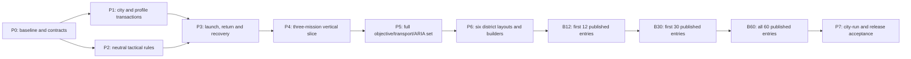

# Coding packages and agent handoff

All packages **Planned**. This documentation task does not launch implementation agents, change game assets, or claim validation passes. The owner can assign these packets to coding agents. The implementation lead owns integration, scope and evidence; content agents must not independently modify shared contracts.

## Dependency sequence

Map greyboxes for D01 and one second district begin during P2 so the rules are not designed around one layout. P6 completes all six; it is not the first time map contracts are tested. ARIA and checkpoint support begin with the first playable slice. Do not defer them to the last package. Packages are dependency slices, not estimated calendar weeks.

| Package | Concrete implementation | Exit evidence / responsibility |
|---|---|---|
| P0 — source and schema | Recheck BASELINE on assigned branch; inventory dirty/shared files; add Operations contracts, ID grammar, config schemas, typed enums and assembly references | Schema/assembly checks; migration fixtures; roster/feature availability ledger; no false existing-type assumptions |
| P1 — strategic core | ECS run/district state, commands, AP, six actions, offers/incidents, metric tick, milestones, rewards, serialized profile commit, save migration | Deterministic day traces; floor recovery; duplicate/conflict/crash transaction tests; no account-wallet leakage |
| P2 — tactical foundation | Role binding, spawn ownership, Scan/Hold/Interact/Repair/Escort/Extract rules, objective graph, facts, finite wave schedules and outcome precedence | Two-map fixtures, valid manual interactions, no mission-ID branching, compiler rejects bad graph/anchors/budgets |
| P3 — real mode loop | Mode-tagged scene launch, reserve/refund, true mission result, atomic settlement, Operations HUD/briefing/result, root/header/history behavior, checkpoint adapters | Dashboard → deploy → real mission → correct district result → return; app interruption at every commit boundary |
| P4 — vertical slice | O001, O002, O003 on D01; localized copy, two approaches, district changes, day report, ARIA objective planner/input skills | All three manual wins and ARIA visible-control wins; failures/partial/withdraw/recovery; one meaningful multi-day loop; device baseline |
| P5 — remaining shared rules | Neutral civilian escort, evidence drop/transfer, Patrol/Rescue/Interdict/Seize/Defense/Breach/Airlift/Finale composition, all required input affordances and save adapters | Each of 12 families wins through manual and ARIA input in a fixture; campaign extraction/breach regressions; no fixture counts as an accepted catalog mission |
| P6 — authoring pipeline/maps | Six distinct layout/anchor packets; enemy/force semantic-key binding; mission asset builder, catalog/availability filtering, practice, field guide, director integration | All 60 definitions compile, but remain Planned until individual evidence; route/landing/capacity review on actual maps |
| B12 — opening library | Publish twelve accepted entries listed below, covering all districts and the vertical repair example | Per-entry acceptance, mandatory ARIA wins, no unsupported exposed mission/difficulty |
| B30 — district development | Complete slots 1–5 in all six districts | 30 individually accepted entries, service/recon/rescue/raid/logistics variety, no progression dead ends |
| B60 — district resolution | Complete slots 6–10 in all six districts, including local finales | Exactly 60 accepted entries; ARIA matrix and consequence/recovery evidence per mission |
| P7 — mode acceptance | Full 20–35-day pacing study, multiple city seeds, economy/incident balance, account migration, supported-device long sessions, city-run ARIA win | End-to-end stabilization with all six finales and two qualifying days; independent manual and ARIA evidence; release gates in ACCEPTANCE |

B12 is **O001/O002/O003, O011/O012, O021/O022, O031/O032, O041/O042, O051**. This intentionally includes the vertical-slice repair mission and defers O052 to B30. B30 is O001–O005, O011–O015, O021–O025, O031–O035, O041–O045, O051–O055. B60 adds every remaining catalog row. These are cumulative **published** counts; isolated engineering fixtures/prototypes are not released missions. All six district finales and city completion are unavailable until their dependencies are certified; early builds clearly label themselves a development slice.

## Work ownership for multiple assigned agents

| Lane | Files owned | Depends on | Must not independently change |
|---|---|---|---|
| Foundation | Operations contracts/config schemas/components; strategic systems and profile transaction design | P0 review | Mission timings, UI art, Campaign outcome/reward behavior |
| Shared tactical | Operations objective/fact/interaction systems and narrow shared capability extraction | Frozen P0 schema, roster manifest | Profile rewards, district rules, per-mission exceptions |
| Integration/UI/ARIA | Mode scene dispatch, UI gateway/binders, common interaction affordances, ARIA planning and legal input skills | Foundation/tactical contracts | Force budgets, success predicates, hidden visibility grants |
| District content | Assigned district's configs, role/anchor mapping, localization entries and data-driven fixtures | Accepted required systems and map packet | Shared enums/asmdefs/systems or generated master catalog without integration-owner review |
| QA | Isolated profiles, wrapper scripts/test fixtures, normal-play/ARIA recordings, evidence matrix | Exact pinned candidate build | Production saves, mission state during a claimed normal win, thresholds to manufacture success |

This is a handoff model for future assignments, not permission to concurrently edit the same shared files. One owner merges `SaveDataModel`, `SaveService`, map identity rules, shared launch files, asmdefs, localization catalog builders and the master mission catalog. Existing Skirmish work is coordinated before touching its in-progress files. Worktrees, if used, require separate Unity project/library ownership under the repository's execution rules.

## Copy-ready programming assignment

> Implement Operations package [P-ID] or mission [O-ID] from Design/Roadmap/Operations. Read AGENTS.md, PLAN, BASELINE, STRATEGIC_RULES, ARCHITECTURE, MISSION_IMPLEMENTATION, the assigned district brief and ACCEPTANCE. Inspect current source and identify prerequisites that are still missing. Preserve uncommitted/unrelated work. Implement ECS gameplay in the owning systems; build assets through checked Editor tooling. Do not add per-mission controllers or weaken objectives. Make every required player action work through normal UI and expose its public semantics to ARIA. Validate normal play, ARIA actually playing and winning, persistence and result settlement using isolated profiles and checked Unity wrappers. Record exact build/content/seed/language/difficulty/input evidence and all failures. Update only the assigned status/evidence rows; do not claim 60 accepted missions from family-level tests. Report implemented changes, tests, material limitations and the next unmet gate.

For a content-only assignment, specify the exact district and mission IDs, allowed asset folders, required accepted rule packages, and the shared-file integration owner. If the mission needs a missing mechanic, stop publishing that entry and implement or request the named dependency; continue independent authoring work without pretending the dependency works.

## Status and evidence discipline

Per mission: `Planned → Authored → RuntimeVerified → ManualWon → AriaWon → PersistenceVerified → DeviceVerified → Accepted`. These are distinct claims; the CSV has separate evidence columns so one status does not erase an open gate. Add evidence under `Design/AgentReports/Operations/<build>/<mission>/<difficulty>/<seed>/` with config hashes, session/result IDs, input trace, screenshots/video, machine-readable facts, committed before/after district snapshot, and errors. A summary can reference shared architecture/device evidence only when the exact shared version matches.

Maintain an issue ledger: `ID | mission/family | seed | expected | observed | severity | owner | fix | affected modes | evidence | status`. Performance targets are inherited from current product technical contracts and a measured P4 device baseline. Do not inflate army sizes to match Skirmish; Operations complexity comes from objectives and persistence.

Release stopping conditions include ARIA unable to win a required mission, unreachable objective, unclear mandatory objective, broken input/visibility, repeated save consequence, unrecoverable interrupted match, irreversible district dead end, broken EN/FA controls, or a device failing the supported tier. Deferring a mission keeps it unavailable and keeps the accepted count below 60.
