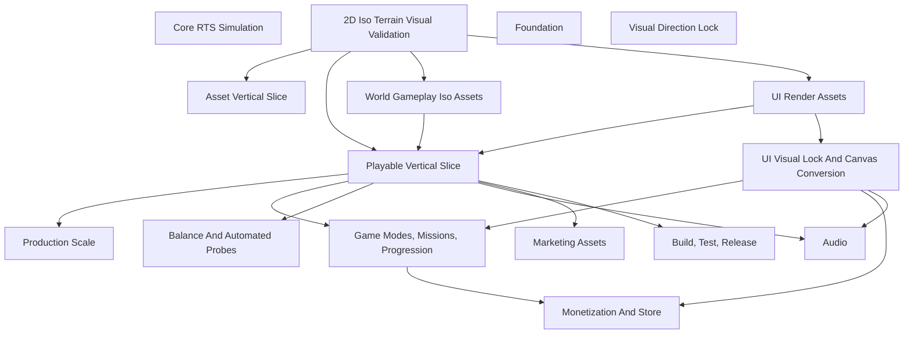
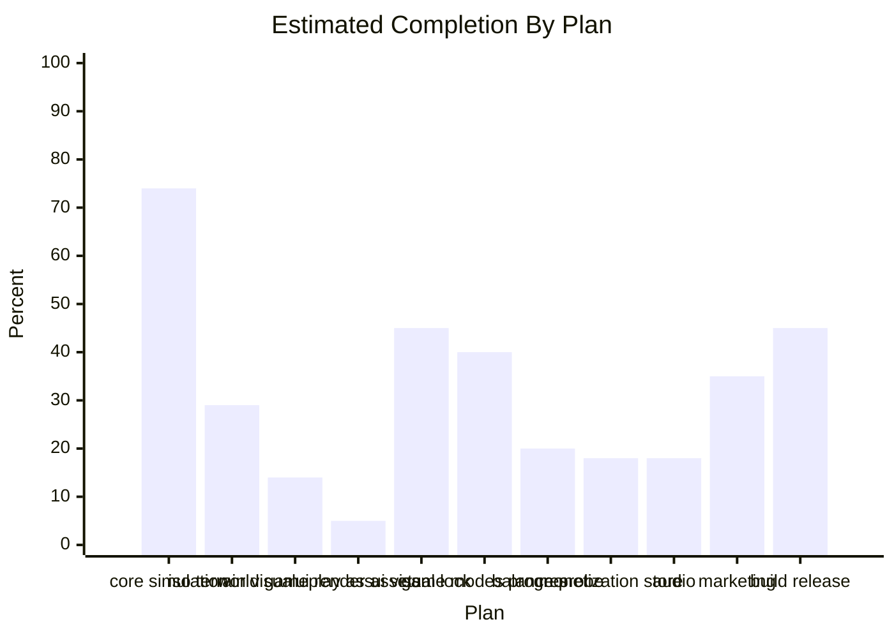

# WarlineCapture Project State Dashboard

Generated from `Design/WarlineCapture_Project_State_Source.json` on `2026-05-07`.

> Do not manually edit this dashboard. Update the JSON source and run `python3 Tools/ProjectState/generate_project_state_dashboard.py`.

## Quick Read

- Overall estimated completion: **33%**
- Estimated 100% planning date: **2027-03-31**
- Forecast range: **2027-02-28 to 2027-05-31**
- Forecast confidence: **low**
- Forecast update cadence: **weekly, plus after major accepted milestone reports**
- Forecast basis: Updated after accepted M01 gameplay + UI + assistant wiring slices (33% weighted dashboard). Forecast remains range-based given remaining dependency risk across final art/atlas production, M01-M05 gameplay, UI visual lock, QA/HCI, balance, audio, store, and release hardening.
- Plans tracked: **11**
- Roadmap stages tracked: **5**
- Done: **1**
- In progress: **5**
- On hold: **1**
- Blocked: **0**
- Planned: **4**

## Roadmap

| Stage | Status | Completion | Depends On | Summary |
| --- | --- | ---: | --- | --- |
| Foundation | Done | 75% | - | Core RTS simulation, Unity project structure, design docs, and first UI/visual systems exist. |
| Visual Direction Lock | In Progress | 41% | - | 2D isometric fictional Gulf direction, visual targets, metadata maps, validation scenes, and review captures are being formalized. |
| Asset Vertical Slice | In Progress | 8% | plan.iso_terrain_visual_validation | World gameplay asset requests are prepared; UI render asset requests follow after the in-game RTS request package. |
| Playable Vertical Slice | In Progress | 18% | plan.iso_terrain_visual_validation, plan.world_gameplay_assets, plan.ui_render_assets | M01/FG-L01 integrated playable route is underway: Gameplay/UI/Support gates are accepted, but QA/HCI Gate 4 is still pending integrated capture + log-health classification. |
| Production Scale | Planned | 8% | stage.playable_vertical_slice | Scale validated pipelines across FG-L02/FG-L03, Saga/Operation/Quick modes, UI surfaces, economy, balance, and content. |

## Plan Status

| Plan | Area | Status | Completion | Source |
| --- | --- | --- | ---: | --- |
| Core RTS Simulation | Gameplay | Done | 74% | `Design/GAME_DESIGN_REFERENCE.md` |
| 2D Iso Terrain Visual Validation | Art/Runtime | In Progress | 29% | `Design/WarlineCapture_2D_Isometric_Implementation_Validation_Plan.md` |
| World Gameplay Iso Assets | Art/Runtime | In Progress | 14% | `Assets/Game/Art/Generated/2DISO/Manifests/FG01_GameplayAssetVerticalSlice_Manifest.json` |
| Build, Test, Release | Engineering | In Progress | 45% | `README.md` |
| Marketing Assets | Marketing | In Progress | 35% | `Design/Marketing/README.md` |
| UI Visual Lock And Canvas Conversion | UI | In Progress | 45% | `Design/WarlineCapture_UIUX_Mockup_To_Canvas_Conversion_Plan.md` |
| UI Render Assets | UI/Art | On Hold | 5% | `Assets/Game/Art/UI/Generated/2DISO/Manifests/FG01_UIRenderAssetVerticalSlice_Manifest.json` |
| Audio | Audio | Planned | 18% | `Design/WarlineCapture_Audio_Design_Guidelines.md` |
| Game Modes, Missions, Progression | Product/Gameplay | Planned | 40% | `Design/WarlineCapture_Gameplay_Features_Detailed_Spec.md` |
| Monetization And Store | Product/UI | Planned | 18% | `Design/Monetization/WarlineCapture_Monetization_Strategy.md` |
| Balance And Automated Probes | QA/Gameplay | Planned | 20% | `Design/WarlineCapture_Balancing_Automated_Test_Plan.md` |

## Dependency Map

## Completion By Plan

## Detailed State

### Core RTS Simulation

- Status: **Done**
- Completion: **74%**
- Area: `Gameplay`
- Source: `Design/GAME_DESIGN_REFERENCE.md`
- Depends on: -
- Summary: Grid RTS simulation has units, buildings, resources, roads, production, AI, combat, transport, radar warnings, minimap, and Android build support.

**Done**
- Core unit/building/resource/road systems exist.
- AI economy, build, production, squad, targeting, and combat systems exist.
- Transport, base breach, radar warnings, minimap, runtime stats, and Android support exist.
- M01 EditMode playable runtime slice is accepted with focused test coverage and stable runtime ids.
- Assistant typed-command hooks are accepted for selection, move, and attack via the command executor boundary.

**In Progress**
- Aligning existing runtime simulation with new 2D isometric presentation and metadata map direction.

**On Hold**
- -

**Next**
- Bind metadata-backed iso map data to movement/pathing probes.
- Validate gameplay layers over FG-L01 visual direction.

### 2D Iso Terrain Visual Validation

- Status: **In Progress**
- Completion: **29%**
- Area: `Art/Runtime`
- Source: `Design/WarlineCapture_2D_Isometric_Implementation_Validation_Plan.md`
- Depends on: -
- Summary: FG-L01/FG-L02/FG-L03 metadata scenes exist, visual preview targets are embedded in Unity scenes, and clean/overlay review captures are generated.

**Done**
- Fictional Gulf map JSON files exist for FG-L01, FG-L02, and FG-L03.
- Unity builder creates all three usable iso map scenes.
- Generated reports show road graph, edge resolution, macro coverage, socket, and spawn validation passing.
- Visual validation preview planes are embedded in the generated scenes.
- Clean visual target, placeholder terrain, and metadata overlay captures are generated separately for FG-L01, FG-L02, and FG-L03.
- Unity builder now consumes authored macro-tile PNGs from the generated IsometricMaps/MacroTiles art root and reports placeholder fallbacks.

**In Progress**
- First FG-L01 terrain macro-tile request package.

**On Hold**
- Real macro-tile sprite production waits for FG-L01 visual target approval.

**Next**
- Produce first real macro tiles: straight road, intersection, command plaza, port edge, and seawall battery pad.
- Replace preview plane with real macro-tile sprites and repeat visual validation.

### World Gameplay Iso Assets

- Status: **In Progress**
- Completion: **14%**
- Area: `Art/Runtime`
- Source: `Assets/Game/Art/Generated/2DISO/Manifests/FG01_GameplayAssetVerticalSlice_Manifest.json`
- Depends on: 2D Iso Terrain Visual Validation
- Summary: In-game RTS runtime asset request package is prepared for the FG01 slice plus full production coverage for soldiers, vehicles, aircraft, sea units, buildings, explosions, fire, missiles, trails, and state VFX.

**Done**
- Gameplay asset lane added to implementation plan and art bible.
- Import folders and first FG01 gameplay asset manifest exist.
- Detailed in-game RTS asset request brief exists for the first vertical slice.
- First actual rifle soldier and APC in-game review sprites have been generated and copied into project asset folders.
- Full rifle soldier setup sheet generated and copied into the project with chroma source, transparent runtime sheet, normalized Unity grid sheet, and slicing metadata.
- Full production coverage backlog is now included for explosions, fire, missiles/trails, all aircraft, all soldier animation sets, all vehicle animation sets, sea units, and priority building states.

**In Progress**
- -

**On Hold**
- Actual asset generation/import should wait on FG-L01 visual target approval unless exploratory generation is explicitly approved.

**Next**
- Review the full rifle soldier setup sheet for style, scale, blue faction readability, and state/facing coverage.
- If approved, slice the Unity grid sheet into 32 sprites and create provisional Unity clips for idle, walk, run, aim, fire, reload, hit, and death.
- Generate full APC animation/facing setup, then batch the full coverage backlog by category.
- Import sprite sheets/frame sequences and bind manifests to visual config.
- Validate assets on FG-L01 at gameplay zoom.

### UI Render Assets

- Status: **On Hold**
- Completion: **5%**
- Area: `UI/Art`
- Source: `Assets/Game/Art/UI/Generated/2DISO/Manifests/FG01_UIRenderAssetVerticalSlice_Manifest.json`
- Depends on: 2D Iso Terrain Visual Validation
- Summary: Separate UI render asset lane exists for portraits, thumbnails, mode cards, mission art, unlock renders, and icons.

**Done**
- UI render lane added to implementation plan and art bible.
- Import folders and first FG01 UI render asset manifest exist.

**In Progress**
- -

**On Hold**
- High-quality render requests wait on FG-L01 visual target approval so UI art matches the approved direction.

**Next**
- Request rifle soldier portrait, APC thumbnail, transport helicopter thumbnail, command post unlock render, FG-L01 mission key art, and mode-card images.
- Validate UI renders inside target Canvas captures, not just standalone PNGs.

### UI Visual Lock And Canvas Conversion

- Status: **In Progress**
- Completion: **45%**
- Area: `UI`
- Source: `Design/WarlineCapture_UIUX_Mockup_To_Canvas_Conversion_Plan.md`
- Depends on: UI Render Assets
- Summary: UI target docs, layered workflow, prefab builders, and several generated UI assets/prefabs exist, but many surfaces still need layer-pack validation and rendered capture comparison.

**Done**
- UI/UX specs and target-to-canvas workflow exist.
- VisualLock and VisualLockLayered folders exist for multiple screens/popups.
- Several UI prefabs and generated assets are present.
- UI audit readiness report now separates interaction audit from final visual-lock acceptance and records the current full EditMode gate.
- PREFAB-04 assistant button target lock and production prefab are accepted for the M01 HUD entry surface.
- Assistant runtime binding (live panel data, typed Do It, result-flow Stop, takeover/release visibility) is accepted with focused tests.

**In Progress**
- Layer-pack gate and target-vs-capture requirements are being tightened.
- Popup and tactical HUD continuation work is underway.
- Integrated M01 capture matrix (16:9/20:9) is in progress for QA/HCI Gate 4 readability sign-off.

**On Hold**
- Gameplay-facing UI content art should wait for Phase 2C UI render assets.

**Next**
- Use layer-pack gate before more prefab implementation.
- Bind approved UI render assets into squad tray, mission briefing, reward unlock, mode cards, and build drawer.
- Run rendered capture comparisons for target surfaces.

### Game Modes, Missions, Progression

- Status: **Planned**
- Completion: **40%**
- Area: `Product/Gameplay`
- Source: `Design/WarlineCapture_Gameplay_Features_Detailed_Spec.md`
- Depends on: Playable Vertical Slice, UI Visual Lock And Canvas Conversion
- Summary: Saga, Persistent Operation, Quick Custom, objectives, rewards, progression, and mission grammar are specified but not complete as production game loops.

**Done**
- Mode direction and gameplay feature specs exist.
- Mission/content grammar and Saga chapter docs exist.
- Economy/reward design exists.
- Chapter 1 mission configs, objective/result scoring, reward grants, Saga node binding/unlocks, Mission Briefing reward previews, Mission Result reward rows, and initial Operation persistence-backed state are implemented.
- Operation action simulation now records operation supplies, completed action count, and pending event rows for dashboard and future Inbox/End-of-Day surfaces.
- Operation actions now use a configurable cost/delta/event layer and block supply-gated actions when operation supplies are too low.
- Operation action tuning now loads from the authored Resources-backed OperationActionConfigSet asset while preserving code defaults as a fallback.
- Operation district-specific action modifiers now provide the first authored district consequence and event-copy layer.
- Inbox, Events, and Command Feed route shells now bind to the saved Operation event ledger at runtime while preserving visual-lock fallback text.
- Operation event ledger entries now carry typed category, severity, district, action, day, and unread metadata for future filters and report surfaces.
- Scan actions now create saved intel evidence archive rows, and POP-08 Intel Reveal reads the latest evidence for the selected district.
- OperationIntelArchive now provides shared latest/count/read helpers, POP-08 marks viewed evidence read, and Inbox, Events, and Command Feed route shells display evidence confidence/read metadata.
- Persistent Operation district state now includes trust, security, infrastructure, enemy influence, heat, and civilian risk metrics; authored actions and district modifiers can mutate those secondary consequences.
- OperationDistrictEventRule now provides authored heat, civilian-risk, and enemy-influence threshold alerts with source metric/value metadata in the saved event ledger.
- Raid confirmation and End Day reports now bind secondary Operation metrics directly instead of using stability/threat proxy labels.
- Persistent Operation authored action tables now cover Repair, Evacuate, and Build Outpost in addition to Patrol, Scan, Aid, and Raid, including district-specific modifiers and typed event categories.
- District Detail now exposes a six-action Operation ActionGrid that binds Patrol, Drone Scan, Raid, Repair, Evacuate, and Build Outpost to live OperationService state.
- Operation dashboard and district detail cards now share a secondary-metric text contract for trust, security, infrastructure, enemy influence, heat, civilian risk, stability, and intel.
- RewardService now grants Operation rewards into saved Operation state, including operation supplies and targeted district trust, security, intel, and infrastructure.
- Mission Briefing, generated fallback reward previews, and Mission Result reward rows now display Operation rewards with readable labels and district targets.
- Every Chapter 1 mission now carries an authored Operation outcome reward: operation supply plus targeted North Bridge, Old Market, or Port Breach metric gains.
- Operation-launched mission sessions now prioritize Operation reward rows in Mission Briefing and Mission Result, while Saga-launched sessions keep default reward ordering.
- ProgressionService now provides the first commander XP table, derived commander level updates, and account combat-stat accumulation from mission results.
- RewardTrackService now provides deterministic commander-level reward milestones, persisted claimed-node ids, eligibility checks, and first claim grants.
- MissionHistoryService now archives recent local mission result summaries into saved profile data for the Commander Profile history tab.
- CommanderProfileScreenController now binds saved profile wallet, level, unlock, win/loss, combat-total, saved recent mission report data, reward-track eligibility, claimable reward-track row buttons with modal detail/claim feedback, local tab content, and a first-claim CTA into SCN-03 Commander Profile.

**In Progress**
- Aligning mission/map ids and UI surfaces with iso map direction.
- Final visual-lock presentation for every secondary metric.

**On Hold**
- Production mission validation waits for FG-L01 playable vertical slice.

**Next**
- Build Chapter 1 vertical slice against FG-L01.
- Wire objectives/results/rewards into UI surfaces with real content art.
- Create final visual-lock layouts for every secondary metric.

### Balance And Automated Probes

- Status: **Planned**
- Completion: **20%**
- Area: `QA/Gameplay`
- Source: `Design/WarlineCapture_Balancing_Automated_Test_Plan.md`
- Depends on: Playable Vertical Slice
- Summary: Balance config and report writer/test direction exist, but large-scale gameplay probes need the playable vertical slice.

**Done**
- Balance config exists.
- Balance report/test concepts exist.
- First opt-in Quick Custom probe, report writer, menu runner, and documented RunAll entry point exist.
- Shared BalanceProbeDefinition and BalanceMetricSample types now support both QuickCustom_Default_Medium and QuickCustom_Hard_Swarm.
- Chapter 1 mission reward configs now have a normal data-sanity gate for unique ids, positive amounts, required targets, and first-clear duplicate fallbacks.

**In Progress**
- -

**On Hold**
- 1,000-unit iso stress and economy probes wait on playable FG-L01.

**Next**
- Run opt-in movement/combat/economy probes after FG-L01 runtime binding.
- Classify reports and feed findings back into balance config.

### Monetization And Store

- Status: **Planned**
- Completion: **18%**
- Area: `Product/UI`
- Source: `Design/Monetization/WarlineCapture_Monetization_Strategy.md`
- Depends on: UI Visual Lock And Canvas Conversion, Game Modes, Missions, Progression
- Summary: Monetization principles, store catalog, and visual targets exist; production store UI and economy sanity checks are later work.

**Done**
- Strategy, store catalog, and visual targets exist.

**In Progress**
- -

**On Hold**
- Store production waits on core UI visual-lock and economy/reward pipeline maturity.

**Next**
- Bind store catalog to safe economy data.
- Create layered store UI and validate rendered captures.

### Audio

- Status: **Planned**
- Completion: **18%**
- Area: `Audio`
- Source: `Design/WarlineCapture_Audio_Design_Guidelines.md`
- Depends on: Playable Vertical Slice, UI Visual Lock And Canvas Conversion
- Summary: Audio direction and generation tooling exist, but production event integration is incomplete.

**Done**
- Audio guideline doc exists.
- Audio generation helper exists.

**In Progress**
- -

**On Hold**
- Final cues wait on locked gameplay/UI event lists.

**Next**
- Prioritize first vertical-slice cues for UI, movement, combat, construction, destruction, and alerts.

### Marketing Assets

- Status: **In Progress**
- Completion: **35%**
- Area: `Marketing`
- Source: `Design/Marketing/README.md`
- Depends on: Playable Vertical Slice
- Summary: Sample video and generative concept workflows exist; final marketing should wait for approved visual/gameplay slice.

**Done**
- Sample video workflow exists.
- Generative cinematic shot plan exists.

**In Progress**
- Marketing concepts track current design direction.

**On Hold**
- Final marketing captures wait on approved playable visual slice.

**Next**
- Refresh marketing visuals after FG-L01 looks and plays close to target.

### Build, Test, Release

- Status: **In Progress**
- Completion: **45%**
- Area: `Engineering`
- Source: `README.md`
- Depends on: Playable Vertical Slice
- Summary: Unity version, packages, Android support, and tests exist; release hardening depends on vertical-slice completion.

**Done**
- Unity project is set up.
- Android build support exists.
- EditMode/PlayMode tests exist.

**In Progress**
- Maintaining batch Unity validation for generated scenes and tests.

**On Hold**
- Release hardening waits on playable vertical slice scope.

**Next**
- Keep CI/build validation green as art/runtime/UI integrations land.
- Add targeted tests for new asset bindings and map adapters.
