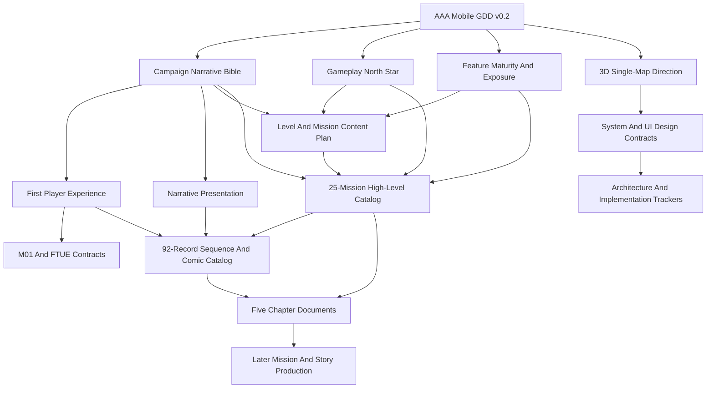
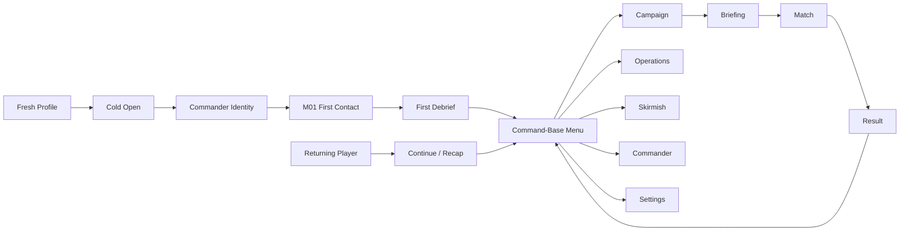
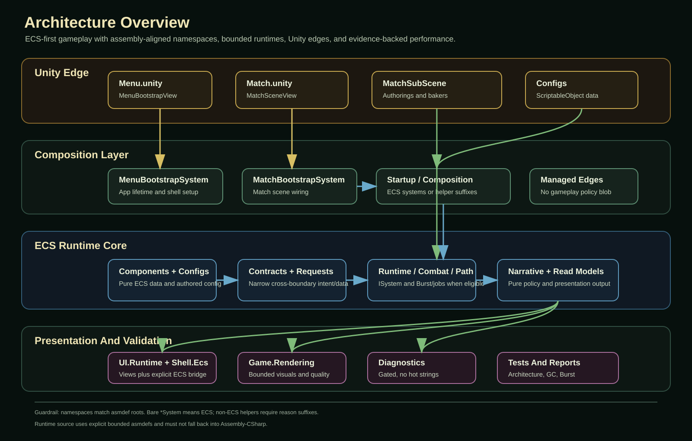

# WarlineCapture

Last documentation audit: 2026-07-10

`WarlineCapture` is a Unity 6 DOTS/ECS mobile-first 3D RTS project for large-scale grid-based movement, base building, tactical combat, district consequence systems, configurable AI, and Campaign/Operations/Skirmish game modes.

The current codebase has a substantial tactical simulation: units, buildings, resources, production, AI economy/building/production/squads/combat, transport, base breach, radar warnings, minimap, runtime stats, and Android build support. Individual systems have different maturity levels; use the [Gameplay Feature Maturity And Campaign Exposure Matrix](Design/Gameplay_Feature_Maturity_And_Campaign_Exposure_Matrix.md) instead of treating this summary as a campaign-readiness claim.

## Project Setup

- Unity editor version: `6000.5.2f1` (`ProjectSettings/ProjectVersion.txt`)
- Persistent app/menu scene: `Assets/Game/Scenes/Menu.unity`
- Match scene: `Assets/Game/Scenes/Match.unity`
- Match subscene: `Assets/Game/Scenes/Match/MatchSubScene.unity`
- Main gameplay code: `Assets/Game/Scripts`
- Main design docs: `Design`
- Demo scenes: `Assets/Game/Scenes/Demo.unity` and `Assets/Game/Scenes/Demo2.unity`
- Unity MCP status: Unity 6.5 starts the AI Assistant relay and exposes MCP tools through the editor bridge. Tool execution still requires an accepted Codex connection in `Project Settings > AI > Unity MCP Server`, and native Codex MCP tools may require a fresh Codex session after approval.

## Packages

- Unity Entities: `6.5.0`
- Unity Entities Graphics: `6.5.0`
- Unity Input System: `1.19.0`
- Universal Render Pipeline: `17.5.0`
- Unity Collections: `6.5.0`
- Unity Serialization: `6.5.0`
- Unity AI Assistant / MCP package: `2.13.0-pre.2`
- Unity Timeline: `1.8.12`

## Product Direction

WarlineCapture is being built around three major modes on one shared 3D operation-map simulation:

1. `Campaign`
   Curated mission nodes, chapter progression, mission briefings, loadouts, objectives, star scoring, rewards, and unlocks.

2. `Operations`
   Saved multi-day city operations where district security, public trust, infrastructure, hostile influence, intel confidence, civilian density, and heat evolve over time.

3. `Skirmish`
   Fast replayable battles using existing AI and economy knobs: enemy count, difficulty, resources, build/production speed, aggression, target priority, map seed, and win condition. Internal systems can keep Quick Custom naming where needed, but player-facing UI should move toward Skirmish.

The active production direction is full 3D single-map mobile RTS. Each mission or operation should play on one large 3D town/base map containing soldiers, civilians, hostile cells, vehicles, aircraft, buildings, objectives, deployment zones, and metadata-backed command layers. Planning, briefing, minimap, threat alerts, and deployment are UI/camera overlays over that same world, not separate strategic and tactical maps. The active source-of-truth doc is `Design/3D_SingleMap_Gameplay_Direction.md`; superseded 2.5D isometric and strategic/tactical split design docs have been moved out of the active design index.

The first Campaign is provisionally titled `Shattered Relay`. It follows a locally legitimate Field Commander and ARIA through terrorist attacks by the fictional Ash Line, restoration of Sahrin's infrastructure, hidden-network investigation, and later proxy-backed conventional escalation by the Vanguard Brigade. Fresh profiles enter this story and M01 before the full command-base menu; the complete first-launch route is owned by `Design/First_Player_Experience_And_Story_Onboarding_Design.md`.

### Current Product Maturity

| Area | Current status | Authority |
|---|---|---|
| Tactical Match simulation | Substantial implemented foundation with feature-specific gaps and readiness gates. | `Design/GAME_DESIGN_REFERENCE.md` and the feature maturity matrix. |
| ARIA match assistant | ECS-backed vertical slice complete and validated for the documented bounded feature set. | `Design/ARIA_Assistant_ECS_Design.md` and its implementation tracker. |
| Campaign story and content | Detailed high-level product, narrative, FPE, presentation, feature exposure, and 25-mission chapter design complete. | GDD v0.2 and the connected Campaign authorities below. |
| Campaign runtime product layer | Not yet a complete playable 25-mission product; objective/result/reward/progression/story-sequence/persistence work remains. | `Design/Gameplay_Features_High_Level_Spec.md` and feature maturity matrix. |
| Architecture and performance | Early-development hardening complete: 92 accepted tasks and 15 release-only certifications explicitly deferred. Release performance is not yet certified. | `Design/Architecture/architecture_performance_hardening_implementation_tracker.md` and `Design/Architecture/pre_release_performance_certification_backlog.md`. |
| Overall project percentage | Not currently authoritative because the project-state source still needs PM refresh. | `Design/Project_State_Source.json` and generated dashboard. |

## Source Of Truth

Use the root README as the project entry point. Use `Design/README.md` as the complete design index.

Key project documents:

- [Design Index](Design/README.md)
  Complete design map for product direction, design docs, visual locks, 3D single-map direction, audio, monetization, marketing, and update rules.
- [AAA Mobile GDD v0.2](Design/AAA_Mobile_Game_Design_Document_v0_2.md)
  Active product authority and document precedence.
- [Campaign Narrative Bible](Design/Campaign_Narrative_Bible.md)
  Active setting, factions, character casting, 25-mission story, Protocol Fragments, and ending authority.
- [Shattered Relay Story](Design/Shattered_Relay_Story.md)
  Complete standalone prose story with no design tables, mechanics, IDs, or implementation material.
- [First Player Experience And Story Onboarding](Design/First_Player_Experience_And_Story_Onboarding_Design.md)
  Active fresh-profile cold open, identity, direct M01 route, first debrief, and progressive menu disclosure.
- [Gameplay Feature Maturity And Campaign Exposure](Design/Gameplay_Feature_Maturity_And_Campaign_Exposure_Matrix.md)
  Active distinction between implemented, partial, scaffolded, designed, and campaign-ready features.
- [Narrative Presentation And Cutscene Design](Design/Narrative_Presentation_And_Cutscene_Design.md)
  Active sequence tiers, motion-comic direction, AI-assisted asset policy, continuity, accessibility, and Story Archive authority.
- [Campaign Mission High-Level Design Catalog](Design/Campaign_Mission_High_Level_Design_Catalog.md)
  Complete gameplay/story contract, readiness fallback, clue, consequence, and narrative handoff for all 25 missions.
- [Campaign Narrative Sequence And Comic Catalog](Design/Campaign_Narrative_Sequence_And_Comic_Catalog.md)
  Complete 92-record Campaign inventory covering prologue, identity, every mission brief/comms/debrief, chapter transitions, Protocol Fragments, epilogue, consequence emphasis, and postscript.
- [First-Launch Narrative Vision Slice Tracker](Design/NarrativeVision/FirstLaunch/IMPLEMENTATION_TRACKER.md)
- [First-Launch Runtime Presentation Specification](Design/NarrativeVision/FirstLaunch/RUNTIME_DIALOGUE_IMPLEMENTATION_SPEC.md)
  Step-by-step production and implementation tracker for reference art, style approval, storyboard, animatic, layered comic panels, reviewer mode, Skip-to-game, 3D handoff, and acceptance.
- [First-Launch Gate 6 Final-Art Review](Design/NarrativeVision/FirstLaunch/ArtReview/FinalArt/GATE6_REVIEW_PACKAGE.md)
  Current 22-panel review package, safe-area boards, storyboard comparisons, motion proof, provenance, and approval ledger.
- `Design/Project_State_Source.json`
  Machine-readable project state. Update this before regenerating dashboard output.
- `Design/Project_State_Dashboard.md`
  Generated project-state dashboard. Regenerate with `python3 Tools/ProjectState/generate_project_state_dashboard.py`; do not edit by hand.
- `Design/Agent_Coordination_Workflow.md`
  PM workflow for handoffs, validation gates, cross-lane contracts, lane ownership, and commit/push rules.
- `Design/Architecture/agent_pull_request_review_merge_workflow.md`
  Authoritative workflow for task worktrees, `codex/<task-id>-<slug>` branches, implementation ownership, independent review, risk-based validation, PR merge, and cleanup.
- `Design/Designer_Role_And_Documentation_Workflow.md`
  Designer workflow for README/design-index clarity, terminology alignment, source-of-truth hierarchy, and documentation pruning.
- `Design/Architecture/gameplay_solid_ecs_contract.md`
  Current gameplay architecture contract for ECS/SOLID boundaries, naming, UI view ownership, assembly boundaries, GC rules, and Burst/job direction.
- `Design/Architecture/ecs_burst_hot_path_refactor_roadmap.md`
  Active roadmap for Burst-compatible ECS hot paths, fewer main-thread snapshot copies, and ratcheted validation counts.
- `Design/GC_Allocation_Elimination_Plan.md`
  Match runtime managed-allocation cleanup plan. Allocation work is profiler evidence first, then one confirmed site/file at a time.
- `Design/Architecture/performance_regression_contract.md`
  Performance validation contract for warmup windows, frame-time metrics, GC allocation evidence, and platform-aware budgets.
- `Design/Architecture/architecture_performance_hardening_implementation_tracker.md`
  Completed early-development remediation program for assembly boundaries, ECS hot paths, GC evidence, performance, and residency gates.
- `Design/Architecture/pre_release_performance_certification_backlog.md`
  Inactive release-only certification backlog; activate near beta/release candidate stabilization, not during routine early development.
- `Design/UIUX_Target_To_Canvas_Workflow_Guide.md`
  Active workflow for converting accepted UI target locks into real Unity Canvas prefabs.
- `Design/UI_Screen_Reference_To_Icons_Panels_GreenKey_Workflow.md`
  Active green-key image-generation and chroma-key cleanup workflow for reusable UI icons, panels, and chrome sprites.
- `Design/UI_HQ_GreenKey_To_Final_Sprite_Workflow.md`
  Current high-quality green-key source-to-final-sprite cleanup and validation workflow.

Core design reading order starts in `Design/README.md`. The current high-priority design sources are:

- `Design/AAA_Mobile_Game_Design_Document_v0_2.md`
- `Design/Campaign_Narrative_Bible.md`
- `Design/Shattered_Relay_Story.md`
- `Design/First_Player_Experience_And_Story_Onboarding_Design.md`
- `Design/Gameplay_Feature_Maturity_And_Campaign_Exposure_Matrix.md`
- `Design/Narrative_Presentation_And_Cutscene_Design.md`
- `Design/Campaign_Mission_High_Level_Design_Catalog.md`
- `Design/Campaign_Narrative_Sequence_And_Comic_Catalog.md`
- `Design/NarrativeVision/FirstLaunch/IMPLEMENTATION_TRACKER.md`
- `Design/Gameplay_North_Star_And_Content_Grammar.md`
- `Design/3D_SingleMap_Gameplay_Direction.md`
- `Design/LargeScale_Grid_Movement_Design.md`
- `Design/3D_Operation_Map_Texture_Mask_Workflow.md`
- `Design/Architecture/operation_map_scene_split_and_generator_tracker.md`
- `Design/Skirmish_Mode_Implementation_Spec.md`
- `Design/Match_HUD_And_Gameplay_Implementation_Spec.md`
- `Design/Match_Selection_Implementation_Spec.md`
- `Design/Match_Unit_Command_Behavior_Spec.md`
- `Design/Architecture/tactical_follow_attack_cinematic_improvement_tracker.md`
- `Design/Field_Logistics_Oil_Fuel_Design.md`
- `Design/Resource_Logistics_Exchange_Design.md`
- `Design/M01_FirstContact_Production_Contract.md`
- `Design/FTUE_And_Command_Assistant_Design.md`
- `Design/ARIA_Assistant_ECS_Design.md`
- `Design/UIUX_Mockup_To_Canvas_Conversion_Plan.md`
- `Design/UIUX_MainMenu_Visual_Contract.md`

The first Campaign high-level design layer is complete: 5 chapter arcs, 25 individual mission contracts, 75 mission brief/comms/debrief beats, and 92 total planned sequence records. See [Campaign High-Level Coverage Status](Design/README.md#campaign-high-level-coverage-status) for the exact boundary between completed high-level design and remaining scripts, storyboards, art, detailed mission specs, and runtime work.

Current ARIA implementation status:

- The match HUD now has an ECS-backed ARIA assistant vertical slice: header button, panel goals/recommendations, prioritized alerts/reports, `Show Me`, `Do It`, bounded `Give Control`, `Stop`, narration subtitle fallback, assistant settings, and persisted takeover/narration preferences.
- Assistant gameplay logic is data-owned by ECS components, dynamic buffers, and systems. Unity UI, highlight, narration, and persistence code remain narrow helper boundaries, following `Design/Architecture/gameplay_solid_ecs_contract.md`.
- The rollout tracker is `Design/Architecture/aria_assistant_ecs_implementation_tracker.md`; its validation log records aggregate Unity coverage, match HUD visual checks, and steady-state assistant performance diagnostics.

## Design Documentation Tree

The linked hierarchy below is the maintained documentation map. The older `Design/VisualTargets/DesignDocumentationTree.svg` remains a historical orientation artifact and is not an active authority.

- [Design Index](Design/README.md)
  - Product And Campaign Authorities
    - [AAA Mobile Game Design v0.2](Design/AAA_Mobile_Game_Design_Document_v0_2.md)
    - [Campaign Narrative Bible](Design/Campaign_Narrative_Bible.md)
    - [Gameplay North Star And Content Grammar](Design/Gameplay_North_Star_And_Content_Grammar.md)
    - [First Player Experience And Story Onboarding](Design/First_Player_Experience_And_Story_Onboarding_Design.md)
    - [Gameplay Feature Maturity And Campaign Exposure](Design/Gameplay_Feature_Maturity_And_Campaign_Exposure_Matrix.md)
    - [Narrative Presentation And Cutscene Design](Design/Narrative_Presentation_And_Cutscene_Design.md)
    - [Campaign Mission High-Level Design Catalog](Design/Campaign_Mission_High_Level_Design_Catalog.md)
    - [Campaign Narrative Sequence And Comic Catalog](Design/Campaign_Narrative_Sequence_And_Comic_Catalog.md)
      - [First-Launch Narrative Vision Slice Tracker](Design/NarrativeVision/FirstLaunch/IMPLEMENTATION_TRACKER.md)
    - [3D Single-Map Gameplay Direction](Design/3D_SingleMap_Gameplay_Direction.md)
    - [Level And Mission Content Plan](Design/Level_And_Mission_Content_Plan.md)
      - [Chapter 1: First Response](Design/SagaChapters/Saga_Chapter01_First_Response.md)
      - [Chapter 2: Broken Grid](Design/SagaChapters/Saga_Chapter02_Broken_Grid.md)
      - [Chapter 3: Hidden Network](Design/SagaChapters/Saga_Chapter03_Hidden_Network.md)
      - [Chapter 4: Air And Armor](Design/SagaChapters/Saga_Chapter04_Air_And_Armor.md)
      - [Chapter 5: Citywide Command](Design/SagaChapters/Saga_Chapter05_Citywide_Command.md)
  - Supporting Product References
    - [Implemented Game Design Reference](Design/GAME_DESIGN_REFERENCE.md)
    - [Command Offensive Premise Alignment](Design/Command_Offensive_Premise_Alignment.md)
    - [AAA Mobile Technical Targets](Design/AAA_Mobile_Technical_Targets.md)
  - Product Gameplay
    - [Large-Scale Grid Movement Design](Design/LargeScale_Grid_Movement_Design.md)
    - [3D Operation Map Texture/Mask Workflow](Design/3D_Operation_Map_Texture_Mask_Workflow.md)
      - [Operation Map Scene Split, Per-Map Bake, And Generator Tracker](Design/Architecture/operation_map_scene_split_and_generator_tracker.md)
    - [Skirmish Mode Implementation Spec](Design/Skirmish_Mode_Implementation_Spec.md)
    - [Match HUD And Gameplay Implementation Spec](Design/Match_HUD_And_Gameplay_Implementation_Spec.md)
      - [Match Selection Implementation Spec](Design/Match_Selection_Implementation_Spec.md)
      - [Match Unit Command Behavior Spec](Design/Match_Unit_Command_Behavior_Spec.md)
      - [Tactical Follow Attack Cinematic Improvement Tracker](Design/Architecture/tactical_follow_attack_cinematic_improvement_tracker.md)
    - [Mission Result State Spec](Design/Mission_Result_State_Spec.md)
    - [M01 First Contact Production Contract](Design/M01_FirstContact_Production_Contract.md)
    - [FTUE And Command Assistant Design](Design/FTUE_And_Command_Assistant_Design.md)
      - [ARIA Assistant ECS Design](Design/ARIA_Assistant_ECS_Design.md)
      - [ARIA Assistant ECS Implementation Tracker](Design/Architecture/aria_assistant_ecs_implementation_tracker.md)
  - Runtime Architecture And Performance
    - [Gameplay SOLID/ECS Contract](Design/Architecture/gameplay_solid_ecs_contract.md)
    - [Architecture/Performance Hardening Tracker](Design/Architecture/architecture_performance_hardening_implementation_tracker.md)
      - [Pre-Release Performance Certification Backlog](Design/Architecture/pre_release_performance_certification_backlog.md)
    - [Performance Regression Contract](Design/Architecture/performance_regression_contract.md)
  - Systems And Economy
    - [Combat Catalog And Upgrade Design](Design/Combat_Catalog_And_Upgrade_Design.md)
      - [Combat Balance Config](Design/BalanceConfigs/Combat_Balance_Config_v0_1.json)
      - [Combat Visual Config](Design/VisualConfigs/Combat_Visual_Config_v0_1.json)
    - [Field Logistics Oil And Fuel Design](Design/Field_Logistics_Oil_Fuel_Design.md)
      - [Field Fabrication And Materials Design](Design/Field_Fabrication_Materials_Design.md)
      - [Field Fabrication And Materials Implementation Tracker](Design/Architecture/field_fabrication_materials_implementation_tracker.md)
      - [Resource Logistics Exchange Design](Design/Resource_Logistics_Exchange_Design.md)
      - [Resource Logistics Exchange Implementation Tracker](Design/Architecture/resource_logistics_exchange_implementation_tracker.md)
    - [Economy And Reward Design](Design/Economy_Reward_Design.md)
    - [Balancing Automated Test Plan](Design/Balancing_Automated_Test_Plan.md)
  - UI/UX And Visual Targets
    - [UI/UX Gameplay Element Alignment](Design/UIUX_Gameplay_Element_Alignment.md)
    - [UI/UX Implementation High-Level Spec](Design/UIUX_Implementation_High_Level_Spec.md)
      - [UI/UX Implementation Detailed Spec](Design/UIUX_Implementation_Detailed_Spec.md)
      - [Mockup To Canvas Conversion Plan](Design/UIUX_Mockup_To_Canvas_Conversion_Plan.md)
      - [Target To Canvas Workflow Guide](Design/UIUX_Target_To_Canvas_Workflow_Guide.md)
    - [Main Menu Visual Contract](Design/UIUX_MainMenu_Visual_Contract.md)
    - [UI/UX Runtime Optimization Plan](Design/UIUX_Runtime_Optimization_Plan.md)
    - [Visual Feedback And VFX Recommendations](Design/Visual_Feedback_VFX_Recommendations.md)
  - Production Support
    - [Art Asset Requirements Register](Design/Art_Asset_Requirements_Register.md)
    - [Audio Design Guidelines](Design/Audio_Design_Guidelines.md)
      - [Config-Driven Audio Implementation Spec](Design/Audio_Config_Driven_Implementation_Spec.md)
    - [Monetization Strategy](Design/Monetization/Monetization_Strategy.md)
      - [Store Catalog](Design/Monetization/Monetization_Store_Catalog.md)
      - [Monetization Visual Targets](Design/Monetization/Monetization_Visual_Targets.md)
    - [Marketing Workflow](Design/Marketing/README.md)
  - Project Operations
    - [Project State Source](Design/Project_State_Source.json)
      - [Project State Dashboard](Design/Project_State_Dashboard.md)
    - [Agent Coordination Workflow](Design/Agent_Coordination_Workflow.md)
    - [Designer Role And Documentation Workflow](Design/Designer_Role_And_Documentation_Workflow.md)
    - [Agent Task Board](Design/AgentTasks/README.md)

Do not duplicate the full `Design` inventory here. Visual-lock target notes, layered packages, production references, audio, monetization, marketing, art-generation, balance, and implementation-plan inventories are owned by `Design/README.md`.

## Slides

AI-native development case-study materials for this project live under `Slides/`:

- `Slides/AI_Native_Game_Development_2026_WarlineCapture.pdf`
- `Slides/AI_Native_Game_Development_2026_WarlineCapture.pptx`

## Project Status Snapshot

Status sources:

- Generated tracker: `Design/Project_State_Dashboard.md`
- Tracker source: `Design/Project_State_Source.json`
- Current lane tasks: `Design/AgentTasks/*_current.md`
- Recent handoffs and validation reports: `Design/AgentReports/`

The generated dashboard and tracker source currently need a PM refresh before the root README should quote percent complete, forecasts, or blocker state. `Design/Project_State_Source.json` still carries a `2026-05-21` estimate, and `Design/Progress_Tracker.png` is older than the generated dashboard and is not regenerated by `Tools/ProjectState/generate_project_state_dashboard.py`.

Until the project-state source and progress image are refreshed, use the lane current-task files plus recent reports as the actionable status source. Do not treat the old 33% estimate, old forecast, old Gate 4 blocker text, or old progress image as current.

Current premise direction:

- `Design/AAA_Mobile_Game_Design_Document_v0_2.md`
  Active product direction: story-first local command in fictional Sahrin, followed by Campaign, Operations, and Skirmish.
- `Design/Campaign_Narrative_Bible.md`
  Active fiction: Ash Line terrorist cells, Vanguard Brigade conventional escalation, civilian legitimacy, Commander/ARIA arcs, and the `Shattered Relay` mystery.
- `Design/Command_Offensive_Premise_Alignment.md`
  Supporting proactive-operation framing, subordinate to the v0.2 GDD and narrative bible.

## Agent And Contributor Entry Points

Active work is routed through the PM-controlled task board in `Design/AgentTasks`.

- Critical path: `Design/AgentTasks/M01_CRITICAL_PATH.md`
- Task-board index: `Design/AgentTasks/README.md`
- PM heartbeat: `Design/AgentTasks/pm_heartbeat.md`
- Gameplay: `Design/AgentTasks/gameplay_current.md`, `Design/AgentTasks/gameplay_heartbeat.md`
- UI: `Design/AgentTasks/ui_current.md`, `Design/AgentTasks/ui_heartbeat.md`
- Art/Atlas: `Design/AgentTasks/art-atlas_current.md`, `Design/AgentTasks/art-atlas_heartbeat.md`
- Designer: `Design/AgentTasks/designer_current.md`, `Design/AgentTasks/designer_heartbeat.md`
- Support/FTUE: `Design/AgentTasks/support-ftue_current.md`, `Design/AgentTasks/support-ftue_heartbeat.md`
- QA/HCI: `Design/AgentTasks/qa-hci_current.md`, `Design/AgentTasks/qa-hci_heartbeat.md`
- Visual Target: `Design/AgentTasks/visual-target_current.md`, `Design/AgentTasks/visual-target_heartbeat.md`

When continuing lane work, read the lane current-task file first and write completion, blocker, or approval-needed reports under `Design/AgentReports/` using the handoff template in `Design/Agent_Coordination_Workflow.md`.

Current work routing:

- The old M01 critical path is currently held for the 3D fresh-start reset unless PM/user explicitly reactivates it.
- Do not infer active work from old `Design/AgentReports/` history.
- Current assignments come from the relevant lane current-task file or a newer direct PM/user instruction.
- New tasks started after the PR workflow bootstrap reaches `main` use the authoritative pull request workflow; tasks already in progress at activation are grandfathered and may finish through their existing direct-`main` path.
- The implementation agent owns the feature branch, pushes it, and opens the PR but never merges it. The independent review/merge coordinator owns findings, integration gates, administrative tracker/evidence reconciliation, merge, and branch/worktree cleanup.
- Direct pushes remain technically open. GitHub branch protection/rulesets are not active through this bootstrap and may be enabled only after explicit user instruction.

## UI/UX Roadmap Summary

The previous visual-lock packs were archived under `Design/Archive/LegacyVisualLock_2026-05-22/`. New implementation-ready screen targets should be created under `Design/VisualLockLayered/` using the active 3D single-map direction.

UI flow navigation tree:

This first-launch flow is owned by `Design/First_Player_Experience_And_Story_Onboarding_Design.md`. `Design/VisualTargets/UIFlowNavigationTree.svg` remains a legacy full-route orientation artifact until regenerated from the current shell and FPE authority.

The target UI is a mobile landscape command-base app shell:

- `SafeAreaRoot`
- `HeaderBar`
- `ContentRoot`
- `FooterBar`
- `ModalOverlay`
- `TooltipLayer`

Roster inspection is handled by `SCN-19 Armory`. Loadout, Build Drawer, Store/Command Exchange, Commander Profile upgrades, Operations Armory, and reward details should route unit/building/support inspection there. The Armory inspection panel shows config-backed name, description, role, unlock state, level/tier, stats, abilities, upgrade track, parts, and source requirements; `POP-09` handles deeper ability/upgrade detail.

Tactical play should use a dedicated match HUD:

- `TopHUD`: objectives, threat feed, resources
- `BottomHUD`: squad tray, command bar, minimap, build toggle
- `ContextOverlay`: build drawer, command wheel, contextual actions
- `ModalOverlay`: pause, warning, confirmation, result, reward popups

UI implementation routing:

- Active UI priorities come from `Design/AgentTasks/ui_current.md`, `Design/AgentTasks/ui_heartbeat.md`, or a newer direct PM/user instruction. Do not treat this README as a fixed UI work queue.
- When a new screen is assigned, build it as a vertical slice: shell route, accepted target/layer pack, real Canvas prefab, navigation/data binding, capture comparison, focused tests, then optimization.
- Recommended product order still favors shell/main menu, Skirmish setup, match HUD, objective/result/reward popups, Campaign/briefing/loadout, then Operations and district screens, but PM routing wins.

Current UI execution rule:

- Build each screen as a vertical slice, not as a separate visual-only pass or a separate functionality-only pass.
- For each screen, popup, and reusable panel, first lock an accepted visual target from the original design references, then build a real Unity Canvas from separate panels, sprites, icons, text, and controls.
- Do not assume a fixed target resolution. Use the aspect and resolution requested for that surface, validate against the reference, and keep the accepted target plus layers together.
- Do not create new visual-lock targets by merely cropping, padding, stretching, or upscaling source JPGs. Source JPGs are references for content and layout; implementation-ready work needs an accepted target and separated layers under `Design/VisualLockLayered/<SurfaceId>/`.
- Each implementation-ready layer pack must include the target/reference image, separate layer PNGs, a layer manifest, contact sheet, notes, and prompt/source record.
- For generated sprites on key green, cut key green to `0` alpha, remove green fringe, crop to alpha bounds, clamp corners to the actual image size, and validate that no key-green or suspicious border-green pixels remain. Reusable icons belong in `Assets/Game/Art/UI/Icons`, panels/chrome in `Assets/Game/Art/UI/Panels`, and final approved one-off sprites in `Assets/Game/Art/UI/Final` when needed.
- Never ship a full-screen mockup image as the UI. Mockups are targets and references only.
- Validate each screen at common Android landscape aspects, including 16:9 and 20:9.
- Optimize each accepted screen before moving on: shared sprites, 9-sliced frames, atlas labels, correct import settings, disabled raycasts on decorative graphics, and no transparent placeholder `Image` components.
- Keep shared UI kit pieces reusable across screens: outer screen frame, thin button chrome, tab buttons, animated button states, sliders, toggles, dropdowns, Oxanium TMP text, and atlas/import validation.
- Do not reuse heavy section/panel borders for buttons. Buttons, tabs, segmented controls, dropdowns, and launch actions need their own thinner cleaner chrome.
- All new or modified runtime UI text must use TextMeshPro with `Oxanium-Medium SDF` unless PM explicitly approves an exception. Text should stay single-line unless the accepted target explicitly needs paragraph copy.
- Dropdowns must leave a clear gap from their left labels. Do not let the dropdown rect touch the label rect even if the visible text appears shorter.
- Skirmish-style numeric controls use a minus/value/plus stepper, not a generic equal-width segmented control. Large CTA labels such as `LAUNCH MISSION` stay Bold.
- Do not use text placeholders for mockup icons. Add proper replaceable icon sprites and keep them separate from panel/background art.
- Phase work should proceed screen by screen: target match, real canvas, navigation, runtime data, capture comparison, tests, then optimization.
- The reusable operational workflow for converting target UI references into real layered Canvas prefabs is saved in `Design/UIUX_Target_To_Canvas_Workflow_Guide.md`.

## Gameplay Roadmap Summary

The planned product layer above the current RTS simulation is the mode/session, objective, result, reward, progression, persistence, and district consequence layer. Active gameplay priorities come from `Design/AgentTasks/gameplay_current.md` or newer direct PM/user instruction.

Highest-priority gameplay capability areas:

- `GameModeConfig`, `ScenarioSetupConfig`, and launch request/payload data for Campaign, Operations, and Skirmish.
- Menu-to-match route requests through `MenuBootstrapSystem`, `MatchStartSystem`, `MatchBootstrapSystem`, and narrow startup systems.
- Objective ECS components, buffers, configs, and `ObjectiveSystem` slices.
- `MissionResultSystem`, star-goal configs, and `RewardSystem` slices.
- `ProfileProgressionSystem` plus shell-edge persistence for profile progress, unlocks, settings, and last Skirmish setup.
- Campaign chapter flow systems and config assets.
- `OperationDistrictSystem` plus district consequence configs/data.
- `AIProfileConfig`, `EncounterTemplateConfig`, and balance configs.

Recommended gameplay implementation order when PM assigns this layer:

1. Skirmish config and launch payload, using `Design/Skirmish_Mode_Implementation_Spec.md` as the active implementation contract. Runtime internals may keep QuickCustom naming until migration.
2. Launch payload routing through the current menu/match bootstrap split. Do not restore `GameBootstrap`.
3. First objective component/config/system slices.
4. Mission result, star scoring, and rewards.
5. Profile progression, unlocks, and save/load through shell-edge persistence.
6. Campaign Chapter 1 playable loop.
7. Operations district actions and end-of-day simulation.
8. AI profiles, encounter templates, and balance configs.

Initial objective types should include:

- Destroy all enemies.
- Survive duration.
- Build required structure.
- Produce required unit.
- Protect civilians.
- Keep unit losses below threshold.

Initial reward types should include:

- Commander XP.
- Money/resources.
- Unit unlock.
- Building unlock.
- Campaign stars.
- Operation trust/security/intel changes.

## Architecture

The gameplay architecture contract is `Design/Architecture/gameplay_solid_ecs_contract.md`. Existing mixed-responsibility code is migration debt; new gameplay work must move toward the contract instead of expanding legacy patterns.

Current architecture source files:

- `Design/Architecture/architecture_performance_hardening_implementation_tracker.md`
  Completed early-development architecture/performance remediation program and evidence source.
- `Design/Architecture/pre_release_performance_certification_backlog.md`
  Deferred release qualification for sustained Android, thermal, residency, streaming, map comparison, and full visual evidence.
- `Design/Architecture/gameplay_solid_ecs_contract.md`
  ECS/SOLID ownership, naming, UI view rules, service boundaries, assembly boundaries, GC rules, and Burst/job direction.
- `Design/Architecture/menu_match_bootstrap_split_roadmap.md`
  Completed split from one broad bootstrapper into menu/app and match-scene bootstrap boundaries.
- `Design/Architecture/ecs_burst_hot_path_refactor_roadmap.md`
  Active Burst/job and hot-path snapshot-copy roadmap.
- `Design/Architecture/systembase_to_isystem_inventory.md`
  Current `SystemBase` to `ISystem` migration inventory and managed-boundary exception list.
- `Design/Architecture/non_ecs_system_helper_naming_refactor_tracker.md`
  Active refactor tracker reserving bare `*System` names for ECS systems and renaming non-ECS helpers with reason suffixes.
- `Design/Architecture/game_scripts_namespace_migration_tracker.md`
  Completed namespace migration record and validation evidence for assembly-aligned root namespaces.
- `Design/Architecture/file_naming_architecture_contract.md`
  Naming contract for source files, runtime `*System` ownership, and project-name avoidance.
- `Design/GC_Allocation_Elimination_Plan.md`
  Active Match runtime GC allocation cleanup plan.
- `Design/Architecture/performance_regression_contract.md`
  Performance validation rules and metrics.

Current refactor note: the architecture/performance hardening tracker is the execution authority. Assembly separation and the game-script namespace migration are established guardrails; GC evidence, bounded hot-path work, managed-edge review, source-growth enforcement, and device residency remain active or tracked concerns. Treat the README and contracts as no-new-debt guidance; copy neither tracker percentages nor transient task status into this README.

Code and systems architecture overview:

Detailed architecture diagrams:

- [Assembly Boundaries](Design/Architecture/AssemblyBoundaries.svg)
- [Runtime Lifecycle](Design/Architecture/RuntimeLifecycle.svg)
- [ECS Data Flow](Design/Architecture/EcsDataFlow.svg)
- [UI Shell Architecture](Design/Architecture/UiShellArchitecture.svg)
- [UI Runtime Shell Transition Architecture](Design/Architecture/ui_runtime_shell_transition_architecture.svg)
- [Performance Hot Path](Design/Architecture/PerformanceHotPath.svg)
- [Architecture Guardrails](Design/Architecture/ArchitectureGuardrails.svg)

The monolithic [Code Systems Architecture](Design/Architecture/CodeSystemsArchitecture.svg) remains as a broad orientation map. Prefer the split diagrams above and the architecture source documents for current onboarding and reviews.

Current runtime assembly boundaries:

- Foundation and contracts:
  `Game.Catalog.Contracts`, `Game.Narrative.Contracts`, `Game.Rendering.Contracts`, `Game.Tactical.Contracts`, `Game.UI.Contracts`, and `Game.UI.Shell.Contracts.Ecs` contain narrow interfaces and data shared across boundaries.
- ECS data and authored configuration:
  `Game.Components` owns ECS components, buffers, and tags. `Game.Configs` owns ScriptableObject configuration and config projection data.
- Bounded domain implementations:
  `Game.Runtime.Combat`, `Game.Runtime.Pathfinding`, `Game.Narrative.Runtime`, and `Game.Rendering` isolate combat, pathfinding, pure narrative progression/routing, and rendering implementation from the broader runtime.
- Core gameplay runtime:
  `Game.Runtime` owns gameplay ECS behavior and depends inward on components, configs, bounded domain runtime assemblies, and contracts. It does not depend on concrete UI, composition, authoring, editor, or test assemblies.
- Presentation and shell integration:
  `Game.UI.Runtime` owns concrete Canvas views and UI presentation and does not depend on `Game.Runtime`. `Game.UI.Shell.Ecs` is the explicit ECS/UI integration bridge and may depend on both runtime and UI assemblies; `Game.UI.Shell.Contracts.Ecs` remains its narrow contract/data boundary.
- Composition and Unity edges:
  `Game.Composition` is the concrete menu/app and match-scene wiring root and may reference runtime, UI, rendering, narrative, authoring, and their contracts. `Game.Authoring` owns authorings and bakers. `Game.Editor` is editor-only tooling, while `Game.Tests.Editor` and `Game.Tests.PlayMode` are validation-only assemblies.

Runtime code must not fall back into the default `Assembly-CSharp` assembly. Add code under an appropriate existing `.asmdef` or add a focused bounded assembly definition when a new domain genuinely needs one. Runtime dependencies must stay directional: core gameplay may depend on data, config, contracts, and bounded domain implementations, but not concrete UI runtime, rendering implementation, composition, authoring, editor, or tests. Concrete cross-boundary binding belongs in `Game.Composition` or the explicit `Game.UI.Shell.Ecs` bridge, never as a reverse dependency into `Game.Runtime`.

Namespaces follow the assembly boundary. Every first-party game asmdef defines a matching `rootNamespace`, and source types use that block-scoped namespace, for example `Game.Runtime.Pathfinding` or `Game.UI.Runtime`. Folder nesting may add narrower child namespaces. The only game-script files intentionally without a namespace declaration are assembly-attribute-only `AssemblyInfo.cs` files. Do not introduce new global-namespace types or a namespace that implies ownership by a different assembly.

Current code ownership:

- `Assets/Game/Scripts/Components`
  ECS component data, buffers, and tags. Components hold data only.
- `Assets/Game/Scripts/Systems`
  ECS gameplay behavior and narrow managed domain systems.
- `Assets/Game/Scripts/Composition`
  App/menu lifetime, match-scene lifetime, scene-reference binding, and startup composition boundaries.
- `Assets/Game/Scripts/Authorings`
  Thin ECS authoring/baker adapters used by scenes/subscenes at bake time.
- `Assets/Game/Scripts/UI`
  Active Canvas `*View` reference holders, UI shell views, screen views, popup views, and UI contracts. UI Toolkit prototypes are design/migration artifacts unless a current plan explicitly enables them.
- `Assets/Game/Scripts/Rendering`
  Concrete rendering systems, visual quality systems, and rendering implementation boundaries.
- `Assets/Game/Scripts/Environment`
  Runtime-city/environment systems still being migrated toward narrow ECS/system ownership.
- `Assets/Game/Scripts/Configs`
  ScriptableObject config data for systems, authorings, rendering, and runtime setup.
- `Assets/Game/Scripts/Editor`
  Editor-only migration, capture, validation, and asset-generation utilities.

## Runtime Pattern

The target runtime pattern is ECS-first:

- Gameplay runtime behavior belongs in ECS components, buffers, tags, and systems.
- MonoBehaviours are allowed only at Unity edges: UI views, authoring/baking, bootstrap/reference views, editor tooling, and shell adapters.
- ScriptableObjects describe config only.
- Services cover external concerns such as logging, persistence, asset lookup, telemetry, and platform APIs. They do not own gameplay policy.
- Gameplay systems should prefer ECS data/event streams over direct service/static calls.
- Runtime gameplay code must not add singleton access patterns such as `static Instance`, global service locators, or singleton fallback lookups. Static code is acceptable only for pure, stateless math/data conversion helpers.
- Do not restore `BuildingPlacementSystem.Instance` or similar gameplay facades. Building placement and road/build composition should flow through ECS request/data components, buffers, and narrow `Building*` / `RoadBuild*` systems.
- New domain gameplay runtime types should end in `Entity`, `Component`, or `System`. Canvas/reference UI types may end in `View`. ScriptableObject data may end in `Config`. Unity conversion-edge types may end in `Authoring` or `Baker`.
- Bare `*System` is reserved for actual ECS systems: `ISystem`, `SystemBase`, or legacy ECS system bases. Plain non-ECS runtime helpers must use an approved reason suffix such as `UiSystemHelper`, `SceneSystemHelper`, `StartupSystemHelper`, `DiagnosticsSystemHelper`, `PresentationSystemHelper`, `CompositionSystemHelper`, or `UtilitySystemHelper`.
- Prefer `ISystem` for ECS gameplay/runtime behavior. `SystemBase` is allowed only for documented managed edges such as UI apply, GameObject/prefab presentation, camera/object references, config loading, bootstrap composition, editor tooling, and diagnostics flushing.
- Source filenames must not start with the project/product name. Use feature/domain prefixes and preserve Unity `.meta` files during moves or renames.
- Faction control logic must use `FactionIdentitySystem`; do not hard-code `Faction.Id == 0` as player control.

Multiple bootstrap and startup boundaries exist now. That split is intentional. Do not collapse them into one global bootstrapper and do not create a new broad bootstrapper to hide domain policy.

Bootstrap/reference ownership:

- `MenuBootstrapView`
  Persistent menu/app serialized reference holder.
- `MenuBootstrapSystem`
  Persistent app/menu lifetime, UI shell setup, app-level config/service registration, diagnostics setup, and match-loading handoff.
- `MatchSceneView`
  Match scene serialized reference holder. It is a raw reference binder, not a gameplay owner.
- `MatchBootstrapSystem`
  Match scene startup/shutdown, config projection, managed runtime update delegation, and match-scene reference wiring.
- `UIBootstrap`
  UI-shell edge startup only. It must not own gameplay policy.
- Domain startup/composition systems and helpers own narrow startup or composition slices. ECS owners keep bare `*System`; non-ECS startup/composition helpers use reason suffixes such as `StartupSystemHelper`, `SceneSystemHelper`, or `CompositionSystemHelper` while they remain managed.

Bootstrap boundaries may:

- read serialized scene/config references
- register services
- install feature modules
- connect the ECS world
- start the app lifecycle
- sequence narrow startup/composition systems

Bootstrap boundaries must not contain:

- mission-specific behavior
- unit spawning policy
- AI or combat policy
- camera/framing policy
- UI route rules
- gameplay asset-resolution policy
- static gameplay logging

When adding a new runtime system:

- prefer ECS data plus an ECS system
- use an authoring/baker only to convert Unity references into ECS data
- use a UI `*View` only for Canvas/reference binding; views may expose visual setters and wire UI events to ECS requests, but must not own gameplay policy, UI flow policy, validation, resource rules, production rules, selection rules, mission rules, AI rules, or state transitions
- assign UI child references through serialized fields; runtime UI must not discover controls by hierarchy strings such as `transform.Find("Frame/Title")`
- put clickable `Button` components on the conceptual clickable root, not on hidden child hotspot/proxy objects
- use `*Config` ScriptableObjects for configurable data
- use ECS-aligned startup systems or services only at the shell edge
- do not add static runtime service facades; use ECS event buffers or shell-injected services for diagnostics/logging
- do not add new `static Instance` singletons or `ResolveDependency<T>()` fallback locators
- do not add new gameplay-facing classes ending in `Controller`, `Presenter`, `Manager`, `Bridge`, `Port`, broad `Adapter`, `Facade`, `ServiceLocator`, or `Button`
- do not add plain non-ECS classes with bare `*System` names; convert to ECS or use an approved helper suffix from `Design/Architecture/non_ecs_system_helper_naming_refactor_tracker.md`
- do not add new gameplay-domain `*State`, `*Rules`, `*Builder`, `*Session`, or `*Element` types

`GameBootstrap` is retired and must not be restored. Existing bridge/controller/manager-style names and non-ECS bare `*System` helpers are legacy debt. Do not expand those patterns; retire them by domain slice when touching related behavior. The old `AILog` static facade has been retired and must not be reintroduced.

## Config Pattern

System settings should live in `ScriptableObject` configs, not in public serialized fields on runtime systems.

Current rule:

- each runtime system should have a config asset
- each authoring component should be a thin config-driven baker adapter
- scene and subscene objects should mostly hold config references, not duplicated inline values

When adding a new configurable system:

- add a config type under `Assets/Game/Scripts/Configs`
- create and assign the asset in the scene/subscene or bootstrap as appropriate
- avoid adding new public serialized fields directly on runtime systems or managed edge classes
- Unity serialized fields must use lower camel case, not PascalCase
- for configs and authorings, prefer lowercase serialized backing fields with PascalCase properties only when code-facing access is needed

## Scene And Subscene Rules

- `Menu.unity` / persistent app setup should use `MenuBootstrapView` plus `MenuBootstrapSystem` for app/menu lifetime.
- `Match.unity` / match-scene setup should use `MatchSceneView` plus `MatchBootstrapSystem` for match lifetime.
- `Game.unity` and legacy scene paths should not reintroduce `GameBootstrap` or another broad bootstrapper.
- `Assets/Game/Scenes/Match/MatchSubScene.unity` may contain ECS authoring components such as grid or initial-spawn authorings, because bakers need scene/subscene authoring data at bake time.
- Authorings in the subscene should remain thin and config-driven.
- Runtime scene references must flow through serialized view fields, ECS managed reference components such as `MatchSceneReferenceComponent`, or injected boundary systems. Do not add broad runtime scene scans.

## Performance Direction

The performance regression contract is `Design/Architecture/performance_regression_contract.md`. `FreezeDetect`, frame-gap logs, and per-system timing logs are diagnostic tools; they are not the performance gate by themselves.

Performance-sensitive gameplay, UI, and shell changes should be validated with focused scenarios, warmup windows, structured metrics, and explicit budgets.

The active performance architecture direction is:

- Match runtime hot paths target `0 B/frame` managed allocation after warmup.
- Allocation cleanup is profiler evidence first: capture `GC.Alloc` call stacks, lock the exact edit list from evidence, and fix one confirmed site/file at a time.
- Pure frequent gameplay simulation/data transforms should be evaluated for `ISystem`, Burst, and jobs when touched. The current direction is to keep increasing `ISystem` share and treat remaining `SystemBase` rows as managed-boundary exceptions or tracked migration debt.
- Burst belongs in pure ECS/data transforms, not in UI views, GameObject/prefab presentation, config loading, bootstrap composition, editor tooling, or diagnostics flushing.
- Hot ECS work should prefer chunk/job iteration over per-frame `ToEntityArray` / `ToComponentDataArray` snapshots, managed arrays, LINQ, closures, boxing, string formatting, or sync points.
- Frequent structural changes should go through `EntityCommandBuffer` unless same-frame playback is required and documented.
- Runtime content loading must be asynchronous, bounded, and owned by an explicit residency/presentation boundary with preload, cancellation, failure, and teardown behavior. Synchronous waits and unbounded gameplay-frame loading are prohibited.

Current accepted performance gates and evidence:

| Gate | Current authority |
|---|---|
| Editor Match frame time | Active p95 budget is `20 ms`; the current accepted canonical capture is `5.23 ms` average, `8.16 ms` p95, and `10.33 ms` p99 with zero measured allocation. |
| Match steady-state GC | Design target remains `0 B/frame` after warmup. The fail-closed evidence gate is at most `1,024` player-relevant bytes over 300 measured frames after 180 warmup frames; the current accepted capture passes at `930` bytes with production runtime probes at zero. |
| Android frame time | Exclusive p95 budgets are less than `33 ms` for baseline/recommended devices and less than `25 ms` for high-end devices. The representative Android baseline is `26.2 ms` p95, so the 30 FPS tier passes while the high-end target is not yet met. |
| Android package size | Clean ARM64 IL2CPP release budgets are APK `<= 463,359,198` bytes and AAB `<= 426,399,778` bytes, tied to immutable accepted artifact evidence. |
| Device memory | The measured same-device peak baseline is `1,054-1,075 MB`; acceptance requires at least a 10 percent reduction until an approved absolute budget exists. Texture, mesh, audio, driver, installed-size, and absolute peak limits remain measurement-required. |

Open performance acceptance work is device-evidence work, not permission for speculative broad rewrites: complete the bounded world-texture streaming visual/memory pilot, verify animation-texture CPU-copy and unload residency, capture installed and category memory budgets, close the remaining visual matrix, and preserve the accepted frame/GC/package gates. Use the hardening tracker and `Design/Architecture/performance_regression_accepted_baseline.json` for exact current status and artifact identities.

Required metric families:

- frame time: average, p95, p99, and max after warmup
- GC allocation: total and recurring per-frame allocation after warmup
- system timing: p95, p99, and max for named hot systems
- runtime counts: entities, visible presentation objects, markers, projectiles, and relevant UI objects
- scenario phase markers: boot, warmup, interaction, combat, completion, and steady state

Priority performance flows:

- boot to main menu
- menu-to-match loading and transition
- match steady state after warmup
- selection, move, attack, build drawer, transport, projectile/missile, minimap, and UI shell interaction flows
- AI steady state, combat orders, production, and battle/spike scenarios
- rendering, impostor, minimap projection, attack-trace, spawning, and diagnostics hot paths
- domain-specific stress cases for pathfinding, rendering budget, spawning, AI production, or UI route transitions

Recent project patterns also favor:

- serialized bootstrap/reference views and narrow composition systems instead of scene-wide object searches
- explicit dependency injection instead of singleton/bootstrap lookups
- config-driven setup instead of duplicated serialized scene data
- cached registries and direct references instead of `Find*` APIs

Avoid introducing:

- `FindObjectOfType`, `FindAnyObjectByType`, `FindObjectsByType`, `FindObjectsSortMode`, `GameObject.Find`, `Camera.main`, or similar global lookup patterns in gameplay code. Use serialized references, ECS managed reference components, or injected boundary systems instead.
- new runtime controller MonoBehaviours placed directly in the scene
- per-frame LINQ, closures, delegate churn, interface-enumeration boxing, or managed array churn in gameplay/runtime hot paths
- per-frame string interpolation or log construction in gameplay/runtime hot paths
- synchronous or unbounded asset loading during gameplay frames; use approved bounded residency/streaming owners instead
- instantiate/destroy churn during steady-state gameplay outside approved pooling or presentation paths

Editor PlayMode budgets catch large regressions only. Android device development builds are the primary mobile-performance gate, and Android release builds are the milestone acceptance gate. Headless or `-nographics` Unity runs can validate logic and rough timing, but they are not rendering-performance acceptance.

## Implementation Rules

Keep these rules for upcoming UI and gameplay work:

- Do not add broad UI controllers, presenters, or bridges for new product features. New screens should use small `*View` reference holders plus ECS/shell `*System` code.
- Do not add plain non-ECS helpers with bare `*System` names. If a helper is not an ECS system yet, give it the approved reason suffix and track it in the helper naming/refactor inventory.
- Do not replace the working tactical scene in one large change. Add route/screen infrastructure around it and migrate surfaces step by step.
- Do not separate visual lock from implementation for new UI screens. Each screen must be completed as a testable vertical slice before the next screen is started.
- Do not bake replaceable UI elements into large background art. Portraits, resources, buttons, icons, text, and panel chrome must remain separate Canvas elements.
- Do not let future screen generators fall back to generic panel borders for buttons or tabs. Use the thin shared button chrome and keep controls clear of section-title divider lines.
- Match each control family to the mockup before reuse: dropdowns, segmented difficulty buttons, numeric steppers, map stat cards, and CTA buttons each have their own proportions and borders.
- Use the current menu/match bootstrap split for route and match launch work. Do not restore `GameBootstrap.BeginGameplay()` or route new flow through a broad bootstrapper.
- Use data/config assets for scenarios, objectives, rewards, AI profiles, and balance. Avoid hard-coded mission IDs or reward values in UI scripts.
- Use visible objective and reward data. Win/loss and star goals should not be hidden rules.
- Persist abstract game state first: profile, Campaign progress, Operations state, settings, and last Skirmish setup. Do not persist raw ECS world state initially.
- Keep diagnostics opt-in or covered by `LogAssert`. Unexpected logs can fail Unity tests.
- Respect Android landscape and safe-area layout from the start.
- Use `Assets/Game/Textures/Logo.png` as the WarlineCapture logo source.
- Keep debug tools, test hooks, and direct-play shortcuts out of release-facing flows.
- Preserve `.meta` files and avoid project-name-prefixed source filenames when creating or moving code.

## Testing

- Edit mode tests: `Assets/Tests/Editor`
- Play mode tests: `Assets/Tests/PlayMode`
- Unity compile/import is the authoritative C# validation path for this project. `dotnet build WarlineCapture.sln` may be useful as a quick local sanity check, but it is not a replacement for Unity validation.
- Unity Android build entry: `BuildScript.BuildAndroid`

Recommended gates after meaningful changes:

1. Unity compile/import with no new errors or warnings.
2. Targeted EditMode tests for touched systems.
3. Explicit full editor validation when broad architecture or hot-path work is touched: `EcsBurstFullEditorValidationRunner.RunAllNonExplicitTests`. Use the Unity Test Runner full EditMode suite when its XML/reporting path is reliable.
4. Targeted PlayMode smoke test when scene/bootstrap behavior changes.
5. Assembly-boundary validation when adding/moving source or asmdefs: `ScriptArchitectureAlignmentContractTests.RunAssemblyBoundaryValidation`.
6. Burst/hot-path architecture validation when touching frequent ECS systems: `EcsBurstHotPathArchitectureTests.RunFocusedValidation`.
7. GC/profiler call-stack capture when doing Match allocation work, with before/after report updates.
8. Android build or device validation when launch flow, build settings, player assemblies, rendering quality, or mobile performance are affected.

## Notes

- `Library/`, `Temp/`, and other generated Unity folders are local/generated state.
- If a change affects baking, reimport the subscene and verify the baked entities in Unity.
