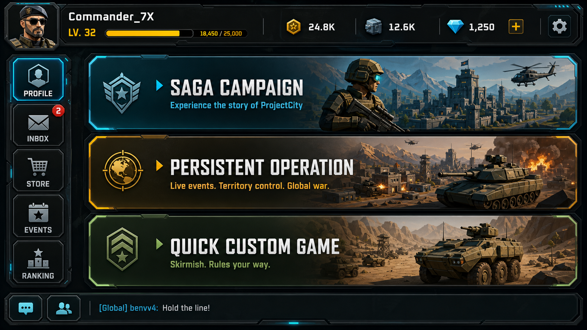

# WarlineCapture

`WarlineCapture` is a Unity 6 DOTS/ECS mobile-first RTS project for large-scale grid-based movement, base building, tactical combat, district consequence systems, configurable AI, and Saga/Operation/Quick Custom game modes.

The current codebase already has the core tactical simulation: units, buildings, roads, resources, production, AI economy/building/production/squads/combat, transport, base breach, radar warnings, minimap, runtime stats, and Android build support. The product direction is to wrap that simulation in a polished mobile RTS structure with readable tactical command, objective/result/reward flow, progression, persistence, and district consequence systems.

## Project Setup

- Unity editor version: `6000.4.0f1`
- Main scene: `Assets/Game/Scenes/Game.unity`
- Main subscene: `Assets/Game/Scenes/Game/GameSubScene.unity`
- Main gameplay code: `Assets/Game/Scripts`
- Main design docs: `Design`

## Packages

- Unity Entities: `6.4.0`
- Unity Entities Graphics: `6.4.0`
- Unity Input System: `1.19.0`
- Universal Render Pipeline: `17.4.0`

## Product Direction

WarlineCapture is being built around three major modes on one shared tactical simulation:

1. `Saga Campaign`
   Curated mission nodes, chapter progression, mission briefings, loadouts, objectives, star scoring, rewards, and unlocks.

2. `Persistent Operation`
   A saved multi-day city operation where district security, public trust, infrastructure, enemy influence, intel confidence, civilian density, and heat evolve over time.

3. `Quick Custom Game`
   Fast replayable skirmishes using existing AI and economy knobs: enemy count, difficulty, resources, build/production speed, aggression, target priority, map seed, and win condition.

The active production art direction is premium 2D isometric mobile RTS using large tactical terrain macro tiles with separate gameplay metadata. Strategic/zoomed-out map art is for mission choice, briefing context, minimap, route preview, and Operation/Saga overview; tactical/zoomed-in map packages are the playable combat ground and must resolve through metadata-backed map definitions. The current source-of-truth docs for this split are `Design/WarlineCapture_Strategic_Tactical_Map_Gameplay_Alignment.md`, `Design/WarlineCapture_M01_FirstContact_Production_Contract.md`, `Design/WarlineCapture_Chapter01_Tactical_Production_Implementation_Plan.md`, and `Design/WarlineCapture_MacroTile_Terrain_Production_Plan.md`.

## Source Of Truth

Use the root README as the project entry point. Use `Design/README.md` as the complete design index.

Key project documents:

- `Design/README.md`
  Complete design map for product direction, design docs, visual locks, 2D isometric production references, audio, monetization, marketing, and update rules.
- `Design/WarlineCapture_Project_State_Source.json`
  Machine-readable project state. Update this before regenerating dashboard output.
- `Design/WarlineCapture_Project_State_Dashboard.md`
  Generated project-state dashboard. Regenerate with `python3 Tools/ProjectState/generate_project_state_dashboard.py`; do not edit by hand.
- `Design/WarlineCapture_Agent_Coordination_Workflow.md`
  PM workflow for handoffs, validation gates, cross-lane contracts, lane ownership, and commit/push rules.
- `Design/WarlineCapture_Designer_Role_And_Documentation_Workflow.md`
  Designer workflow for README/design-index clarity, terminology alignment, source-of-truth hierarchy, and documentation pruning.

Core design reading order starts in `Design/README.md`. The current high-priority design sources are:

- `Design/WarlineCapture_Gameplay_North_Star_And_Content_Grammar.md`
- `Design/WarlineCapture_LargeScale_Grid_Movement_Design.md`
- `Design/WarlineCapture_Strategic_Tactical_Map_Gameplay_Alignment.md`
- `Design/WarlineCapture_M01_FirstContact_Production_Contract.md`
- `Design/WarlineCapture_FTUE_And_Command_Assistant_Design.md`
- `Design/WarlineCapture_UIUX_Mockup_To_Canvas_Conversion_Plan.md`
- `Design/WarlineCapture_2D_Isometric_Production_Direction.md`
- `Design/WarlineCapture_MacroTile_Terrain_Production_Plan.md`

Do not duplicate the full `Design` inventory here. Visual-lock target notes, layered packages, production references, audio, monetization, marketing, art-generation, balance, and implementation-plan inventories are owned by `Design/README.md`.

## Project Status Snapshot

Current generated tracker: `Design/WarlineCapture_Project_State_Dashboard.md`.
Source file: `Design/WarlineCapture_Project_State_Source.json`.

As of the latest PM review, the project remains estimated at **33% complete**. The generated dashboard was last built on `2026-05-07`; a newer PM forecast review on `2026-05-08` kept the same 33% estimate and the same low-confidence 100% planning forecast of `2027-03-31`, with a range of `2027-02-28` to `2027-05-31`.

Current roadmap state:

- Foundation is done enough for the current milestone.
- Visual Direction Lock, Asset Vertical Slice, and Playable Vertical Slice are in progress.
- Production Scale is planned and depends on the playable vertical slice.
- Plans tracked: 11 total; 1 done, 5 in progress, 1 on hold, 4 planned.

Current high-level blockers:

- Gate 4 QA/HCI remains blocked.
- UI still needs accepted route-driven capture and safe-area evidence before QA/HCI can complete the final rerun.
- Public launch proof, reason-code alignment, and marker/VFX readiness still need closure.
- Some generated dashboard blocker wording is stale; use the newer PM reports under `Design/AgentReports/` for current Gate 4 details until the source JSON is refreshed and the dashboard is regenerated.

Pending PM/user premise decision:

- `Design/WarlineCapture_Command_Offensive_Premise_Alignment.md`
  Proposed alignment for the proactive command-operation fantasy. Do not treat it as canonical product premise until PM/user explicitly accepts it.

## Agent And Contributor Entry Points

Active work is routed through the PM-controlled task board in `Design/AgentTasks`.

- Critical path: `Design/AgentTasks/M01_CRITICAL_PATH.md`
- Task-board index: `Design/AgentTasks/README.md`
- PM heartbeat: `Design/AgentTasks/pm_heartbeat.md`
- Designer heartbeat: `Design/AgentTasks/designer_heartbeat.md`
- Designer current task: `Design/AgentTasks/designer_current.md`

When continuing lane work, read the lane current-task file first and write completion, blocker, or approval-needed reports under `Design/AgentReports/` using the handoff template in `Design/WarlineCapture_Agent_Coordination_Workflow.md`.

Current production lock:

- M01 First Contact is the active playable-slice gate.
- M01 is infantry-only: one player rifle squad, one hostile patrol, select/move/attack/objective/result flow.
- No M02-M05 expansion, player vehicles, vehicle production, transport, base/build mechanics, or broad combat variety should start until PM marks M01 ready to expand.
- PM owns final acceptance and commit/push routing.

## UI/UX Roadmap Summary

The target UI is a mobile landscape app shell:

- `SafeAreaRoot`
- `HeaderBar`
- `ContentRoot`
- `FooterBar`
- `ModalOverlay`
- `TooltipLayer`

Tactical play should use a dedicated match HUD:

- `TopHUD`: objectives, threat feed, resources
- `BottomHUD`: squad tray, command bar, minimap, build toggle
- `ContextOverlay`: build drawer, command wheel, contextual actions
- `ModalOverlay`: pause, warning, confirmation, result, reward popups

Recommended UI implementation order:

1. Add app shell and route controller.
2. Replace first screen with Main Menu / Mode Select.
3. Add Quick Custom Game setup using existing AI settings.
4. Upgrade tactical HUD layout around existing systems.
5. Add objective tracker, mission result, reward, and pause popups.
6. Add Saga Map, Mission Briefing, and Loadout.
7. Add Persistent Operation dashboard and district screens.

Current UI execution rule:

- Build each screen as a vertical slice, not as a separate visual-only pass or a separate functionality-only pass.
- For each screen, popup, and reusable panel, first lock a high-quality generated landscape visual target from the original design references, then build a real Unity Canvas from separate panels, sprites, icons, text, and controls.
- Do not create new VisualLock targets by merely cropping, padding, stretching, or upscaling the source spec JPGs. Source JPGs are references for content and layout; the accepted target method is a new generated `1672 x 941` landscape target in the WarlineCapture AAA mobile RTS HUD style, with notes and the generation prompt saved beside it.
- Never ship a full-screen mockup image as the UI. Mockups are targets and references only.
- Validate each screen at common Android landscape aspects, including 16:9 and 20:9.
- Optimize each accepted screen before moving on: shared sprites, 9-sliced frames, atlas labels, correct import settings, disabled raycasts on decorative graphics, and no transparent placeholder `Image` components.
- Keep shared UI kit pieces reusable across screens: outer screen frame, thin button chrome, tab buttons, animated button states, sliders, toggles, dropdowns, Oxanium TMP text, and atlas/import validation.
- Do not reuse heavy section/panel borders for buttons. Buttons, tabs, segmented controls, dropdowns, and launch actions need their own thinner cleaner chrome.
- Page titles use `Oxanium-Bold SDF`; other screen/control text uses `Oxanium-Light SDF` and should stay single-line unless the target explicitly needs paragraph copy.
- Dropdowns must leave a clear gap from their left labels. Do not let the dropdown rect touch the label rect even if the visible text appears shorter.
- Quick Custom-style numeric controls use a minus/value/plus stepper, not a generic equal-width segmented control. Large CTA labels such as `LAUNCH MISSION` stay Bold.
- Do not use text placeholders for mockup icons. Add proper replaceable icon sprites and keep them separate from panel/background art.
- Phase work should proceed screen by screen: target match, real canvas, navigation, runtime data, capture comparison, tests, then optimization.
- The reusable operational workflow for converting target UI references into real layered Canvas prefabs is saved in `Design/WarlineCapture_UIUX_Target_To_Canvas_Workflow_Guide.md`.

## Gameplay Roadmap Summary

The missing gameplay layer is the mode/session layer above the current RTS simulation.

Highest-priority gameplay systems:

- `GameModeDefinition`
- `ScenarioSetup`
- `GameLaunchPayload`
- `QuickGameConfig`
- `ObjectiveManager`
- `MissionResultData`
- `StarGoalConfig`
- `RewardConfig`
- `PlayerProfileState`
- `SagaProgress`
- `OperationState`
- `DistrictState`
- `SaveService`
- `AIProfileDefinition`
- `EncounterTemplate`

Recommended gameplay implementation order:

1. Quick Custom gameplay config and launch payload.
2. `GameBootstrap.BeginGameplay(GameLaunchPayload payload)` while preserving the current no-argument path.
3. Objective Manager with the first objective types.
4. Mission result, star scoring, and rewards.
5. Player profile, unlocks, and save/load.
6. Saga Chapter 1 playable loop.
7. Persistent Operation state, district actions, and end-of-day simulation.
8. AI profiles, encounter templates, and balance configs.

Initial objective types should include:

- Destroy all enemies.
- Survive duration.
- Build required structure.
- Produce required unit.
- Protect civilians.
- Keep unit losses below threshold.

Initial reward types should include:

- Commander XP.
- Money/resources.
- Unit unlock.
- Building unlock.
- Saga stars.
- Operation trust/security/intel changes.

## Architecture

- `Assets/Game/Scripts/Components`
  ECS component data for grid state, movement, combat, visuals, spawning, roads, buildings, and occupancy.
- `Assets/Game/Scripts/Systems`
  ECS simulation systems for movement, pathfinding, engagement, combat, occupancy, health, visuals, and respawn.
- `Assets/Game/Scripts/Authorings`
  Thin ECS authoring/baker adapters used by the scene or subscene at bake time.
- `Assets/Game/Scripts/Bootstrap`
  Runtime bootstrap and bootstrap-owned services that replace scene controller MonoBehaviours.
- `Assets/Game/Scripts/UI`
  Runtime UI and controller logic owned by the bootstrap.
- `Assets/Game/Scripts/Environment`
  Runtime world-generation, blockers, decoration, and environment services.
- `Assets/Game/Scripts/Configs`
  ScriptableObject configs for scene systems, authorings, and runtime services.

## Runtime Pattern

The project no longer uses scene-placed controller MonoBehaviours for gameplay systems like selection, building placement, roads, day/night, city spawning, blockers, decorations, or UI orchestration.

Instead:

- `Assets/Game/Scripts/Bootstrap/GameBootstrap.cs` is the scene entry point.
- Bootstrap creates the runtime systems with `new`.
- Bootstrap passes required dependencies explicitly through `Init(...)` and `BindDependencies(...)`.
- Bootstrap drives per-frame behavior through its own `Update`, `LateUpdate`, and `OnGUI`.

When adding a new runtime system:

- do not add it as a new scene `MonoBehaviour` controller
- create it as a plain runtime class unless it must be an ECS authoring/baker
- initialize it from `GameBootstrap`
- pass dependencies explicitly instead of using global lookups

## Config Pattern

System settings should live in `ScriptableObject` configs, not in public serialized fields on runtime systems.

Current rule:

- each runtime system should have a config asset
- each authoring component should be a thin config-driven baker adapter
- scene and subscene objects should mostly hold config references, not duplicated inline values

When adding a new configurable system:

- add a config type under `Assets/Game/Scripts/Configs`
- create and assign the asset in the scene/subscene or bootstrap as appropriate
- avoid adding new public serialized fields directly on runtime controller classes
- Unity serialized fields must use lower camel case, not PascalCase
- for configs and authorings, prefer lowercase serialized backing fields with PascalCase properties only when code-facing access is needed

## Scene And Subscene Rules

- `Game.unity` should stay clean and use `GameBootstrap` as the runtime owner.
- `GameSubScene.unity` may still contain ECS authoring components such as grid or initial-spawn authorings, because bakers need scene/subscene authoring data at bake time.
- Authorings in the subscene should remain thin and config-driven.

## Performance Direction

Recent project patterns favor:

- bootstrap-owned runtime services instead of scene-wide object searches
- explicit dependency injection instead of singleton/bootstrap lookups
- config-driven setup instead of duplicated serialized scene data
- cached registries and direct references instead of `Find*` APIs

Avoid introducing:

- `FindObjectOfType`, `FindAnyObjectByType`, `FindObjectsByType`, `GameObject.Find`, `Camera.main`, or similar global lookup patterns in gameplay code
- new runtime controller MonoBehaviours placed directly in the scene

## Implementation Rules

Keep these rules for upcoming UI and gameplay work:

- Do not expand `MenuView.cs` for new product features. New screens should use small controllers under `Assets/Game/Scripts/UI/Screens`, `Shell`, `Popups`, or `Components`.
- Do not replace the working tactical scene in one large change. Add route/screen infrastructure around it and migrate surfaces step by step.
- Do not separate visual lock from implementation for new UI screens. Each screen must be completed as a testable vertical slice before the next screen is started.
- Do not bake replaceable UI elements into large background art. Portraits, resources, buttons, icons, text, and panel chrome must remain separate Canvas elements.
- Do not let future screen generators fall back to generic panel borders for buttons or tabs. Use the thin shared button chrome and keep controls clear of section-title divider lines.
- Match each control family to the mockup before reuse: dropdowns, segmented difficulty buttons, numeric steppers, map stat cards, and CTA buttons each have their own proportions and borders.
- Keep `GameBootstrap.BeginGameplay()` working while adding the payload-based launch path.
- Use data/config assets for scenarios, objectives, rewards, AI profiles, and balance. Avoid hard-coded mission IDs or reward values in UI scripts.
- Use visible objective and reward data. Win/loss and star goals should not be hidden rules.
- Persist abstract game state first: profile, Saga progress, Operation state, settings, and last Quick Custom setup. Do not persist raw ECS world state initially.
- Keep diagnostics opt-in or covered by `LogAssert`. Unexpected logs can fail Unity tests.
- Respect Android landscape and safe-area layout from the start.
- Use `Assets/Game/Textures/Logo.png` as the WarlineCapture logo source.
- Keep debug tools, test hooks, and direct-play shortcuts out of release-facing flows.

## Testing

- Edit mode tests: `Assets/Tests/Editor`
- Play mode tests: `Assets/Tests/PlayMode`
- Build check: `dotnet build WarlineCapture.sln`
- Unity Android build entry: `BuildScript.BuildAndroid`

Recommended gates after meaningful changes:

1. Targeted EditMode tests for touched systems.
2. Full EditMode suite.
3. Targeted PlayMode smoke test when scene/bootstrap behavior changes.
4. Android build when launch flow, build settings, or player assemblies change.

## Notes

- `Library/`, `Temp/`, and other generated Unity folders are local/generated state.
- If a change affects baking, reimport the subscene and verify the baked entities in Unity.
