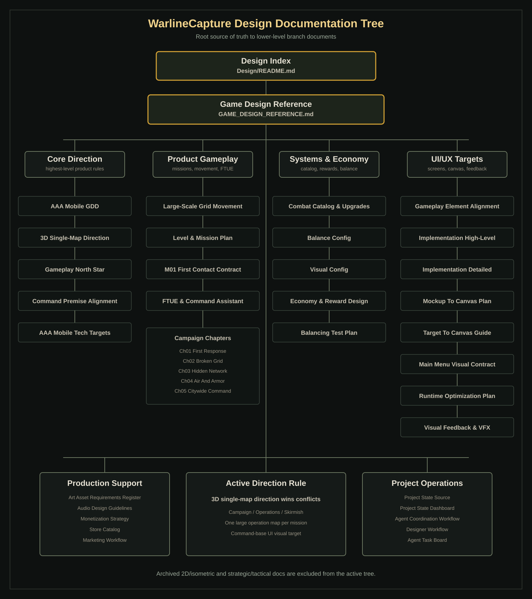
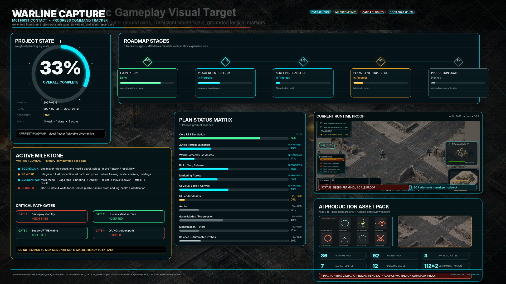
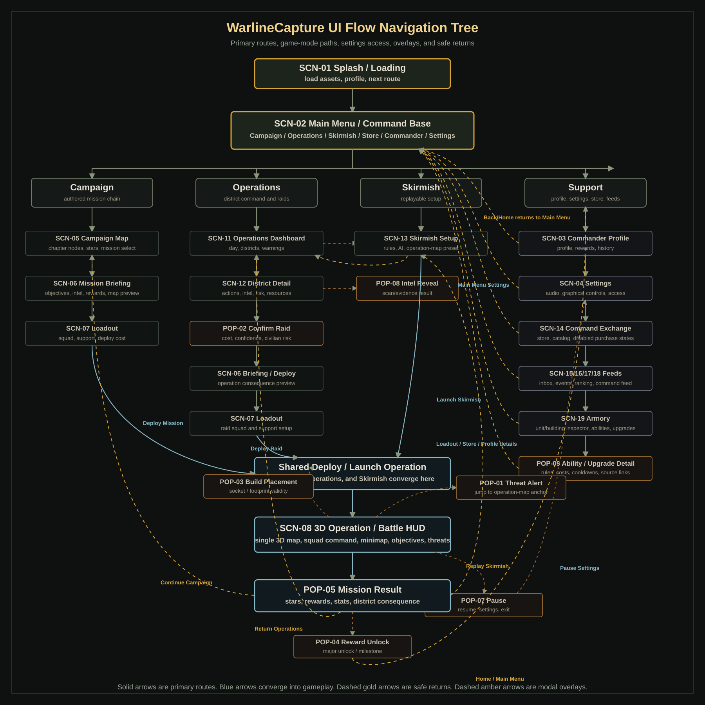
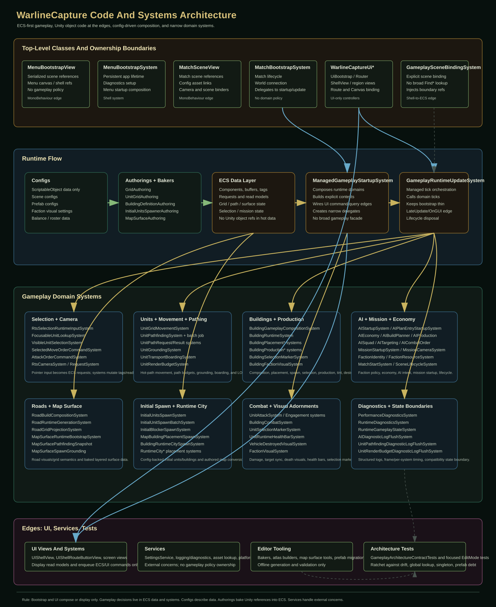

# WarlineCapture

`WarlineCapture` is a Unity 6 DOTS/ECS mobile-first 3D RTS project for large-scale grid-based movement, base building, tactical combat, district consequence systems, configurable AI, and Campaign/Operations/Skirmish game modes.

The current codebase already has the core tactical simulation: units, buildings, roads, resources, production, AI economy/building/production/squads/combat, transport, base breach, radar warnings, minimap, runtime stats, and Android build support. The product direction is to wrap that simulation in a polished 3D mobile RTS structure with readable command over one large operation map, objective/result/reward flow, progression, persistence, and district consequence systems.

## Project Setup

- Unity editor version: `6000.4.0f1`
- Main scene: `Assets/Game/Scenes/Game.unity`
- Main subscene: `Assets/Game/Scenes/Game/GameSubScene.unity`
- Main gameplay code: `Assets/Game/Scripts`
- Main design docs: `Design`

## Packages

- Unity Entities: `6.4.0`
- Unity Entities Graphics: `6.4.0`
- Unity Input System: `1.19.0`
- Universal Render Pipeline: `17.4.0`

## Product Direction

WarlineCapture is being built around three major modes on one shared 3D operation-map simulation:

1. `Campaign`
   Curated mission nodes, chapter progression, mission briefings, loadouts, objectives, star scoring, rewards, and unlocks.

2. `Operations`
   Saved multi-day city operations where district security, public trust, infrastructure, hostile influence, intel confidence, civilian density, and heat evolve over time.

3. `Skirmish`
   Fast replayable battles using existing AI and economy knobs: enemy count, difficulty, resources, build/production speed, aggression, target priority, map seed, and win condition. Internal systems can keep Quick Custom naming where needed, but player-facing UI should move toward Skirmish.

The active production direction is full 3D single-map mobile RTS. Each mission or operation should play on one large 3D town/base map containing soldiers, civilians, hostile cells, vehicles, aircraft, buildings, objectives, deployment zones, and metadata-backed command layers. Planning, briefing, minimap, threat alerts, and deployment are UI/camera overlays over that same world, not separate strategic and tactical maps. The active source-of-truth doc is `Design/3D_SingleMap_Gameplay_Direction.md`; superseded 2.5D isometric and strategic/tactical split design docs have been moved out of the active design index.

## Source Of Truth

Use the root README as the project entry point. Use `Design/README.md` as the complete design index.

Key project documents:

- `Design/README.md`
  Complete design map for product direction, design docs, visual locks, 3D single-map direction, audio, monetization, marketing, and update rules.
- `Design/Project_State_Source.json`
  Machine-readable project state. Update this before regenerating dashboard output.
- `Design/Project_State_Dashboard.md`
  Generated project-state dashboard. Regenerate with `python3 Tools/ProjectState/generate_project_state_dashboard.py`; do not edit by hand.
- `Design/Agent_Coordination_Workflow.md`
  PM workflow for handoffs, validation gates, cross-lane contracts, lane ownership, and commit/push rules.
- `Design/Designer_Role_And_Documentation_Workflow.md`
  Designer workflow for README/design-index clarity, terminology alignment, source-of-truth hierarchy, and documentation pruning.

Core design reading order starts in `Design/README.md`. The current high-priority design sources are:

- `Design/Gameplay_North_Star_And_Content_Grammar.md`
- `Design/3D_SingleMap_Gameplay_Direction.md`
- `Design/LargeScale_Grid_Movement_Design.md`
- `Design/3D_Operation_Map_Texture_Mask_Workflow.md`
- `Design/Skirmish_Mode_Implementation_Spec.md`
- `Design/Match_HUD_And_Gameplay_Implementation_Spec.md`
- `Design/Match_Selection_Implementation_Spec.md`
- `Design/Field_Logistics_Oil_Fuel_Design.md`
- `Design/M01_FirstContact_Production_Contract.md`
- `Design/FTUE_And_Command_Assistant_Design.md`
- `Design/UIUX_Mockup_To_Canvas_Conversion_Plan.md`
- `Design/UIUX_MainMenu_Visual_Contract.md`

## Design Documentation Tree

- [Design Index](Design/README.md)
  - [Game Design Reference](Design/GAME_DESIGN_REFERENCE.md)
    - [AAA Mobile Game Design](Design/AAA_Mobile_Game_Design_Document_v0_1.md)
    - [3D Single-Map Gameplay Direction](Design/3D_SingleMap_Gameplay_Direction.md)
    - [Gameplay North Star And Content Grammar](Design/Gameplay_North_Star_And_Content_Grammar.md)
    - [Command Offensive Premise Alignment](Design/Command_Offensive_Premise_Alignment.md)
    - [AAA Mobile Technical Targets](Design/AAA_Mobile_Technical_Targets.md)
  - Product Gameplay
    - [Large-Scale Grid Movement Design](Design/LargeScale_Grid_Movement_Design.md)
    - [3D Operation Map Texture/Mask Workflow](Design/3D_Operation_Map_Texture_Mask_Workflow.md)
    - [Skirmish Mode Implementation Spec](Design/Skirmish_Mode_Implementation_Spec.md)
    - [Match HUD And Gameplay Implementation Spec](Design/Match_HUD_And_Gameplay_Implementation_Spec.md)
    - [Match Selection Implementation Spec](Design/Match_Selection_Implementation_Spec.md)
    - [Mission Result State Spec](Design/Mission_Result_State_Spec.md)
    - [Level And Mission Content Plan](Design/Level_And_Mission_Content_Plan.md)
      - [Chapter 1: First Response](Design/SagaChapters/Saga_Chapter01_First_Response.md)
      - [Chapter 2: Broken Grid](Design/SagaChapters/Saga_Chapter02_Broken_Grid.md)
      - [Chapter 3: Hidden Network](Design/SagaChapters/Saga_Chapter03_Hidden_Network.md)
      - [Chapter 4: Air And Armor](Design/SagaChapters/Saga_Chapter04_Air_And_Armor.md)
      - [Chapter 5: Citywide Command](Design/SagaChapters/Saga_Chapter05_Citywide_Command.md)
    - [M01 First Contact Production Contract](Design/M01_FirstContact_Production_Contract.md)
    - [FTUE And Command Assistant Design](Design/FTUE_And_Command_Assistant_Design.md)
  - Systems And Economy
    - [Combat Catalog And Upgrade Design](Design/Combat_Catalog_And_Upgrade_Design.md)
      - [Combat Balance Config](Design/BalanceConfigs/Combat_Balance_Config_v0_1.json)
      - [Combat Visual Config](Design/VisualConfigs/Combat_Visual_Config_v0_1.json)
    - [Field Logistics Oil And Fuel Design](Design/Field_Logistics_Oil_Fuel_Design.md)
    - [Economy And Reward Design](Design/Economy_Reward_Design.md)
    - [Balancing Automated Test Plan](Design/Balancing_Automated_Test_Plan.md)
  - UI/UX And Visual Targets
    - [UI/UX Gameplay Element Alignment](Design/UIUX_Gameplay_Element_Alignment.md)
    - [UI/UX Implementation High-Level Spec](Design/UIUX_Implementation_High_Level_Spec.md)
      - [UI/UX Implementation Detailed Spec](Design/UIUX_Implementation_Detailed_Spec.md)
      - [Mockup To Canvas Conversion Plan](Design/UIUX_Mockup_To_Canvas_Conversion_Plan.md)
      - [Target To Canvas Workflow Guide](Design/UIUX_Target_To_Canvas_Workflow_Guide.md)
    - [Main Menu Visual Contract](Design/UIUX_MainMenu_Visual_Contract.md)
    - [UI/UX Runtime Optimization Plan](Design/UIUX_Runtime_Optimization_Plan.md)
    - [Visual Feedback And VFX Recommendations](Design/Visual_Feedback_VFX_Recommendations.md)
  - Production Support
    - [Art Asset Requirements Register](Design/Art_Asset_Requirements_Register.md)
    - [Audio Design Guidelines](Design/Audio_Design_Guidelines.md)
    - [Monetization Strategy](Design/Monetization/Monetization_Strategy.md)
      - [Store Catalog](Design/Monetization/Monetization_Store_Catalog.md)
      - [Monetization Visual Targets](Design/Monetization/Monetization_Visual_Targets.md)
    - [Marketing Workflow](Design/Marketing/README.md)
  - Project Operations
    - [Project State Source](Design/Project_State_Source.json)
      - [Project State Dashboard](Design/Project_State_Dashboard.md)
    - [Agent Coordination Workflow](Design/Agent_Coordination_Workflow.md)
    - [Designer Role And Documentation Workflow](Design/Designer_Role_And_Documentation_Workflow.md)
    - [Agent Task Board](Design/AgentTasks/README.md)

Do not duplicate the full `Design` inventory here. Visual-lock target notes, layered packages, production references, audio, monetization, marketing, art-generation, balance, and implementation-plan inventories are owned by `Design/README.md`.

## Slides

AI-native development case-study materials for this project live under `Slides/`:

- `Slides/AI_Native_Game_Development_2026_WarlineCapture.pdf`
- `Slides/AI_Native_Game_Development_2026_WarlineCapture.pptx`

## Project Status Snapshot

Current generated tracker: `Design/Project_State_Dashboard.md`.
Source file: `Design/Project_State_Source.json`.

As of the latest PM review, the project remains estimated at **33% complete**. The generated dashboard was last built on `2026-05-21` after the accepted 3D single-map redirection. The low-confidence 100% planning forecast remains `2027-03-31`, with a range of `2027-02-28` to `2027-05-31`.

Current roadmap state:

- Foundation is done enough for the current milestone.
- Visual Direction Lock, Asset Vertical Slice, and Playable Vertical Slice are in progress.
- Production Scale is planned and depends on the playable vertical slice.
- Plans tracked: 11 total; 1 done, 5 in progress, 1 on hold, 4 planned.

Current high-level blockers:

- Gate 4 QA/HCI remains blocked.
- UI still needs accepted route-driven capture and safe-area evidence before QA/HCI can complete the final rerun.
- Public launch proof, reason-code alignment, and marker/VFX readiness still need closure.
- Some generated dashboard blocker wording is stale; use the newer PM reports under `Design/AgentReports/` for current Gate 4 details until the source JSON is refreshed and the dashboard is regenerated.

Current premise direction:

- `Design/Command_Offensive_Premise_Alignment.md`
  Accepted proactive command-operation framing: the player is a field commander preparing and executing operations against fictional hostile cells embedded in civilian towns.

## Agent And Contributor Entry Points

Active work is routed through the PM-controlled task board in `Design/AgentTasks`.

- Critical path: `Design/AgentTasks/M01_CRITICAL_PATH.md`
- Task-board index: `Design/AgentTasks/README.md`
- PM heartbeat: `Design/AgentTasks/pm_heartbeat.md`
- Designer heartbeat: `Design/AgentTasks/designer_heartbeat.md`
- Designer current task: `Design/AgentTasks/designer_current.md`

When continuing lane work, read the lane current-task file first and write completion, blocker, or approval-needed reports under `Design/AgentReports/` using the handoff template in `Design/Agent_Coordination_Workflow.md`.

Current production lock:

- M01 First Contact is the active playable-slice gate.
- M01 is infantry-only: one player rifle squad, one hostile patrol, select/move/attack/objective/result flow.
- No M02-M05 expansion, player vehicles, vehicle production, transport, base/build mechanics, or broad combat variety should start until PM marks M01 ready to expand.
- PM owns final acceptance and commit/push routing.

## UI/UX Roadmap Summary

The previous visual-lock packs were archived under `Design/Archive/LegacyVisualLock_2026-05-22/`. New implementation-ready screen targets should be created under `Design/VisualLockLayered/` using the active 3D single-map direction.

UI flow navigation tree:

The target UI is a mobile landscape command-base app shell:

- `SafeAreaRoot`
- `HeaderBar`
- `ContentRoot`
- `FooterBar`
- `ModalOverlay`
- `TooltipLayer`

Roster inspection is handled by `SCN-19 Armory`. Loadout, Build Drawer, Store/Command Exchange, Commander Profile upgrades, Operations Armory, and reward details should route unit/building/support inspection there. The Armory inspection panel shows config-backed name, description, role, unlock state, level/tier, stats, abilities, upgrade track, parts, and source requirements; `POP-09` handles deeper ability/upgrade detail.

Tactical play should use a dedicated match HUD:

- `TopHUD`: objectives, threat feed, resources
- `BottomHUD`: squad tray, command bar, minimap, build toggle
- `ContextOverlay`: build drawer, command wheel, contextual actions
- `ModalOverlay`: pause, warning, confirmation, result, reward popups

Recommended UI implementation order:

1. Add app shell and route controller.
2. Replace first screen with the command-base Main Menu / Mode Select style.
3. Add Skirmish setup using existing AI settings.
4. Upgrade the 3D operation HUD layout around existing systems.
5. Add objective tracker, mission result, reward, and pause popups.
6. Add Campaign Map, Mission Briefing, and Loadout.
7. Add Operations dashboard and district screens.

Current UI execution rule:

- Build each screen as a vertical slice, not as a separate visual-only pass or a separate functionality-only pass.
- For each screen, popup, and reusable panel, first lock a high-quality generated landscape visual target from the original design references, then build a real Unity Canvas from separate panels, sprites, icons, text, and controls.
- Do not create new visual-lock targets by merely cropping, padding, stretching, or upscaling the source spec JPGs. Source JPGs are references for content and layout; the accepted target method is a new generated `1672 x 941` landscape target plus separated layers under `Design/VisualLockLayered/<SurfaceId>/`, with notes, manifest, contact sheet, and generation prompt saved beside it.
- Never ship a full-screen mockup image as the UI. Mockups are targets and references only.
- Validate each screen at common Android landscape aspects, including 16:9 and 20:9.
- Optimize each accepted screen before moving on: shared sprites, 9-sliced frames, atlas labels, correct import settings, disabled raycasts on decorative graphics, and no transparent placeholder `Image` components.
- Keep shared UI kit pieces reusable across screens: outer screen frame, thin button chrome, tab buttons, animated button states, sliders, toggles, dropdowns, Oxanium TMP text, and atlas/import validation.
- Do not reuse heavy section/panel borders for buttons. Buttons, tabs, segmented controls, dropdowns, and launch actions need their own thinner cleaner chrome.
- Page titles use `Oxanium-Bold SDF`; other screen/control text uses `Oxanium-Light SDF` and should stay single-line unless the target explicitly needs paragraph copy.
- Dropdowns must leave a clear gap from their left labels. Do not let the dropdown rect touch the label rect even if the visible text appears shorter.
- Skirmish-style numeric controls use a minus/value/plus stepper, not a generic equal-width segmented control. Large CTA labels such as `LAUNCH MISSION` stay Bold.
- Do not use text placeholders for mockup icons. Add proper replaceable icon sprites and keep them separate from panel/background art.
- Phase work should proceed screen by screen: target match, real canvas, navigation, runtime data, capture comparison, tests, then optimization.
- The reusable operational workflow for converting target UI references into real layered Canvas prefabs is saved in `Design/UIUX_Target_To_Canvas_Workflow_Guide.md`.

## Gameplay Roadmap Summary

The missing gameplay layer is the mode/session layer above the current RTS simulation.

Highest-priority gameplay systems:

- `GameModeDefinition`
- `ScenarioSetup`
- `GameLaunchPayload`
- `QuickGameConfig`
- `ObjectiveManager`
- `MissionResultData`
- `StarGoalConfig`
- `RewardConfig`
- `PlayerProfileState`
- `SagaProgress`
- `OperationState`
- `DistrictState`
- `SaveService`
- `AIProfileDefinition`
- `EncounterTemplate`

Recommended gameplay implementation order:

1. Skirmish gameplay config and launch payload, using `Design/Skirmish_Mode_Implementation_Spec.md` as the active implementation contract. Runtime internals may keep QuickCustom naming until migration.
2. `GameBootstrap.BeginGameplay(GameLaunchPayload payload)` while preserving the current no-argument path.
3. Objective Manager with the first objective types.
4. Mission result, star scoring, and rewards.
5. Player profile, unlocks, and save/load.
6. Campaign Chapter 1 playable loop.
7. Operations state, district actions, and end-of-day simulation.
8. AI profiles, encounter templates, and balance configs.

Initial objective types should include:

- Destroy all enemies.
- Survive duration.
- Build required structure.
- Produce required unit.
- Protect civilians.
- Keep unit losses below threshold.

Initial reward types should include:

- Commander XP.
- Money/resources.
- Unit unlock.
- Building unlock.
- Campaign stars.
- Operation trust/security/intel changes.

## Architecture

The gameplay architecture contract is `Design/Architecture/gameplay_solid_ecs_contract.md`. It is enforced by `Assets/Tests/Editor/GameplayArchitectureContractTests.cs` as a no-new-drift ratchet. Existing mixed-responsibility code is treated as migration debt; new gameplay work should follow the contract.

Code and systems architecture overview:

- `Assets/Game/Scripts/Components`
  ECS component data for grid state, movement, combat, visuals, spawning, roads, buildings, and occupancy.
- `Assets/Game/Scripts/Systems`
  ECS simulation systems for movement, pathfinding, engagement, combat, occupancy, health, visuals, respawn, mission runtime, and AI.
- `Assets/Game/Scripts/Authorings`
  Thin ECS authoring/baker adapters used by the scene or subscene at bake time.
- `Assets/Game/Scripts/Bootstrap`
  Composition-only startup code, ECS-aligned startup systems, service registries, and shell services. Bootstrap must not own gameplay policy.
- `Assets/Game/Scripts/UI`
  Canvas views and UI adapters. UI views display data and emit commands; they do not own gameplay rules.
- `Assets/Game/Scripts/Environment`
  Legacy/runtime environment services. New gameplay-facing environment behavior should move toward ECS data and systems.
- `Assets/Game/Scripts/Configs`
  ScriptableObject configs for scene systems, authorings, and runtime services.

## Runtime Pattern

The target runtime pattern is ECS-first:

- Gameplay runtime behavior belongs in ECS components, buffers, tags, and systems.
- MonoBehaviours are allowed for UI views, authoring/baking, bootstrap composition, editor tooling, and Unity shell adapters.
- ScriptableObjects describe config only.
- Services bridge external concerns such as logging, persistence, asset lookup, telemetry, and platform APIs.
- Gameplay systems should prefer ECS data/event streams over direct service/static calls.
- Runtime gameplay code must not add singleton access patterns such as `static Instance`, global service locators, or singleton fallback lookups. Static code is acceptable only for pure, stateless math/data conversion helpers.
- New domain gameplay runtime types should end in `Entity`, `Component`, or `System`. Canvas/reference UI types may end in `View`. ScriptableObject data may end in `Config`. Unity conversion-edge types may end in `Authoring` or `Baker`.

Bootstrap responsibility:

- read serialized scene/config references
- register services
- install feature modules
- connect the ECS world
- start the app lifecycle

Bootstrap must not contain:

- mission-specific behavior
- unit spawning policy
- AI or combat policy
- camera/framing policy
- UI route rules
- gameplay asset-resolution policy
- static gameplay logging

When adding a new runtime system:

- prefer ECS data plus an ECS system
- use an authoring/baker only to convert Unity references into ECS data
- use a UI `*View` only for Canvas/reference binding; views may expose visual setters and wire UI events to ECS requests, but must not own gameplay policy, UI flow policy, validation, resource rules, production rules, selection rules, mission rules, AI rules, or state transitions
- use `*Config` ScriptableObjects for configurable data
- use ECS-aligned startup systems or services only at the shell edge
- do not add static runtime service facades; use ECS event buffers or shell-injected services for diagnostics/logging
- do not add new `static Instance` singletons or `ResolveDependency<T>()` fallback locators
- do not add new gameplay-domain `*Port`, `*Presenter`, `*Controller`, `*Manager`, `*State`, `*Rules`, `*Builder`, `*Session`, or `*Element` types

Existing classes such as `GameBootstrap`, `BuildingPlacementSystem.Instance`, and mixed runtime managers are migration debt. Do not expand those patterns; retire them by domain slice when touching related behavior. The old `AILog` static facade has been retired and must not be reintroduced.

## Config Pattern

System settings should live in `ScriptableObject` configs, not in public serialized fields on runtime systems.

Current rule:

- each runtime system should have a config asset
- each authoring component should be a thin config-driven baker adapter
- scene and subscene objects should mostly hold config references, not duplicated inline values

When adding a new configurable system:

- add a config type under `Assets/Game/Scripts/Configs`
- create and assign the asset in the scene/subscene or bootstrap as appropriate
- avoid adding new public serialized fields directly on runtime controller classes
- Unity serialized fields must use lower camel case, not PascalCase
- for configs and authorings, prefer lowercase serialized backing fields with PascalCase properties only when code-facing access is needed

## Scene And Subscene Rules

- `Game.unity` should stay clean and use `GameBootstrap` as the runtime owner.
- `GameSubScene.unity` may still contain ECS authoring components such as grid or initial-spawn authorings, because bakers need scene/subscene authoring data at bake time.
- Authorings in the subscene should remain thin and config-driven.

## Performance Direction

The performance regression contract is `Design/Architecture/performance_regression_contract.md`. `FreezeDetect`, frame-gap logs, and per-system timing logs are diagnostic tools; they are not the performance gate by themselves.

Performance-sensitive gameplay, UI, and shell changes should be validated with focused scenarios, warmup windows, structured metrics, and explicit budgets.

Required metric families:

- frame time: average, p95, p99, and max after warmup
- GC allocation: total and recurring per-frame allocation after warmup
- system timing: p95, p99, and max for named hot systems
- runtime counts: entities, visible presentation objects, markers, projectiles, and relevant UI objects
- scenario phase markers: boot, warmup, interaction, combat, completion, and steady state

Priority performance flows:

- boot to main menu
- public M01 launch
- M01 select/move
- M01 attack/result
- tactical steady-state soak
- domain-specific stress cases for pathfinding, rendering budget, spawning, AI production, or UI route transitions

Recent project patterns also favor:

- bootstrap-owned runtime services instead of scene-wide object searches
- explicit dependency injection instead of singleton/bootstrap lookups
- config-driven setup instead of duplicated serialized scene data
- cached registries and direct references instead of `Find*` APIs

Avoid introducing:

- `FindObjectOfType`, `FindAnyObjectByType`, `FindObjectsByType`, `FindObjectsSortMode`, `GameObject.Find`, `Camera.main`, or similar global lookup patterns in gameplay code. Use serialized references, ECS managed reference components, or injected boundary systems instead.
- new runtime controller MonoBehaviours placed directly in the scene
- per-frame LINQ in gameplay/runtime hot paths
- per-frame string interpolation or log construction in gameplay/runtime hot paths
- runtime asset loading during gameplay frames
- instantiate/destroy churn during steady-state gameplay outside approved pooling or presentation paths

Editor PlayMode budgets catch large regressions only. Android device development builds are the primary mobile-performance gate, and Android release builds are the milestone acceptance gate. Headless or `-nographics` Unity runs can validate logic and rough timing, but they are not rendering-performance acceptance.

## Implementation Rules

Keep these rules for upcoming UI and gameplay work:

- Do not expand `MenuView.cs` for new product features. New screens should use small controllers under `Assets/Game/Scripts/UI/Screens`, `Shell`, `Popups`, or `Components`.
- Do not replace the working tactical scene in one large change. Add route/screen infrastructure around it and migrate surfaces step by step.
- Do not separate visual lock from implementation for new UI screens. Each screen must be completed as a testable vertical slice before the next screen is started.
- Do not bake replaceable UI elements into large background art. Portraits, resources, buttons, icons, text, and panel chrome must remain separate Canvas elements.
- Do not let future screen generators fall back to generic panel borders for buttons or tabs. Use the thin shared button chrome and keep controls clear of section-title divider lines.
- Match each control family to the mockup before reuse: dropdowns, segmented difficulty buttons, numeric steppers, map stat cards, and CTA buttons each have their own proportions and borders.
- Keep `GameBootstrap.BeginGameplay()` working while adding the payload-based launch path.
- Use data/config assets for scenarios, objectives, rewards, AI profiles, and balance. Avoid hard-coded mission IDs or reward values in UI scripts.
- Use visible objective and reward data. Win/loss and star goals should not be hidden rules.
- Persist abstract game state first: profile, Campaign progress, Operations state, settings, and last Skirmish setup. Do not persist raw ECS world state initially.
- Keep diagnostics opt-in or covered by `LogAssert`. Unexpected logs can fail Unity tests.
- Respect Android landscape and safe-area layout from the start.
- Use `Assets/Game/Textures/Logo.png` as the WarlineCapture logo source.
- Keep debug tools, test hooks, and direct-play shortcuts out of release-facing flows.

## Testing

- Edit mode tests: `Assets/Tests/Editor`
- Play mode tests: `Assets/Tests/PlayMode`
- Build check: `dotnet build WarlineCapture.sln`
- Unity Android build entry: `BuildScript.BuildAndroid`

Recommended gates after meaningful changes:

1. Targeted EditMode tests for touched systems.
2. Full EditMode suite.
3. Targeted PlayMode smoke test when scene/bootstrap behavior changes.
4. Android build when launch flow, build settings, or player assemblies change.

## Notes

- `Library/`, `Temp/`, and other generated Unity folders are local/generated state.
- If a change affects baking, reimport the subscene and verify the baked entities in Unity.
